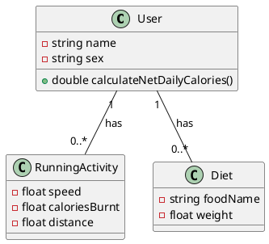
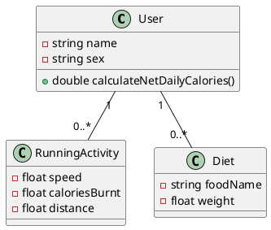
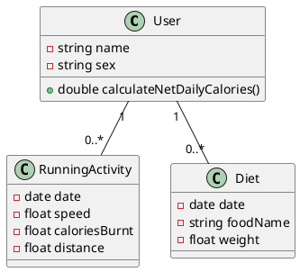
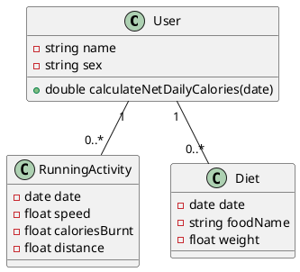

# Version(sys+uml) Model: gpt-3.5-turbo-0125 Temperature: 0
## Description:
系统需求：
1）管理用户信息（姓名、性别）。
2）记录用户的跑步活动数据（跑步速度、消耗卡路里和跑步距离）。
3）记录用户每日饮食信息（食物名称、摄入重量（kg））。
4）查询某种食物单位重量（0.1kg）的卡路里。提供标准接口 calculateFoodCaloriesPerUnit(foodName)。
5）计算用户日净摄入卡路里量 = 每日摄入食物卡路里和 - 每日跑步消耗卡路里。 每日摄入食物卡路里和 = Σ（每日摄入的食物量 * 单位重量的卡路里）。
## UML:


### Explanation of the Code:
1. **User Class**: Manages user information and their activities. It has methods to calculate net daily calories based on running activities and diet entries.
2. **RunningActivity Class**: Represents a running activity with attributes for speed, calories burnt, and distance.
3. **Diet Class**: Represents a diet entry with methods to calculate calories based on the food name and weight. A static map is used to store calorie information for various foods.
4. **Main Class**: Demonstrates the functionality by creating a user, adding running activities and diet entries, and calculating the net daily calories.

### Notes:
- The code includes comments for clarity.
- The food calorie data is initialized in a static block for easy access and modification.
- The program can be extended by adding more food items to the `foodCaloriesMap`.

--------------------------------------------------
# Version(sys) Model: gpt-3.5-turbo-0125 Temperature: 0
## Description:
系统需求：
1）管理用户信息（姓名、性别）。
2）记录用户的跑步活动数据（跑步速度、消耗卡路里和跑步距离）。
3）记录用户每日饮食信息（食物名称、摄入重量（kg））。
4）查询某种食物单位重量（0.1kg）的卡路里。提供标准接口 calculateFoodCaloriesPerUnit(foodName)。
5）计算用户日净摄入卡路里量 = 每日摄入食物卡路里和 - 每日跑步消耗卡路里。 每日摄入食物卡路里和 = Σ（每日摄入的食物量 * 单位重量的卡路里）。
## UML:
## Result:
Based on the provided system functional requirements, I will create a Java implementation that includes classes for managing user information, running activities, and dietary information. The code will also include methods for calculating calories and net intake.

Here is the complete Java code:

```java
import java.util.HashMap;
import java.util.Map;

// Class representing a User
class User {
    private String name;
    private String gender;
    private RunningActivity runningActivity;
    private Diet diet;

    public User(String name, String gender) {
        this.name = name;
        this.gender = gender;
        this.runningActivity = new RunningActivity();
        this.diet = new Diet();
    }

    public String getName() {
        return name;
    }

    public String getGender() {
        return gender;
    }

    public RunningActivity getRunningActivity() {
        return runningActivity;
    }

    public Diet getDiet() {
        return diet;
    }

    // Method to calculate net calorie intake for the day
    public double calculateNetCalorieIntake() {
        double totalFoodCalories = diet.calculateTotalCalories();
        double totalRunningCalories = runningActivity.calculateTotalCaloriesBurned();
        return totalFoodCalories - totalRunningCalories;
    }
}

// Class representing a Running Activity
class RunningActivity {
    private double speed; // in km/h
    private double caloriesBurned; // total calories burned
    private double distance; // in km

    public void recordActivity(double speed, double distance) {
        this.speed = speed;
        this.distance = distance;
        this.caloriesBurned = calculateCaloriesBurned();
    }

    private double calculateCaloriesBurned() {
        // Assuming 1 km burned approximately 60 calories
        return distance * 60;
    }

    public double calculateTotalCaloriesBurned() {
        return caloriesBurned;
    }
}

// Class representing Diet information
class Diet {
    private Map<String, Double> foodIntake; // food name and weight in kg
    private static final Map<String, Double> foodCaloriesPerUnit; // food name and calories per 0.1kg

    static {
        foodCaloriesPerUnit = new HashMap<>();
        foodCaloriesPerUnit.put("apple", 52.0); // calories per 0.1kg
        foodCaloriesPerUnit.put("banana", 89.0);
        foodCaloriesPerUnit.put("chicken", 239.0);
        // Add more food items as needed
    }

    public Diet() {
        foodIntake = new HashMap<>();
    }

    public void recordFoodIntake(String foodName, double weight) {
        foodIntake.put(foodName, foodIntake.getOrDefault(foodName, 0.0) + weight);
    }

    public double calculateTotalCalories() {
        double totalCalories = 0.0;
        for (Map.Entry<String, Double> entry : foodIntake.entrySet()) {
            String foodName = entry.getKey();
            double weight = entry.getValue();
            totalCalories += calculateFoodCaloriesPerUnit(foodName) * (weight / 0.1);
        }
        return totalCalories;
    }

    public double calculateFoodCaloriesPerUnit(String foodName) {
        return foodCaloriesPerUnit.getOrDefault(foodName, 0.0);
    }
}

// Main class to demonstrate functionality
public class Main {
    public static void main(String[] args) {
        // Create a user
        User user = new User("John Doe", "Male");

        // Record running activity
        user.getRunningActivity().recordActivity(10.0, 5.0); // 10 km/h for 5 km

        // Record food intake
        user.getDiet().recordFoodIntake("apple", 0.5); // 0.5 kg of apples
        user.getDiet().recordFoodIntake("banana", 0.2); // 0.2 kg of bananas

        // Calculate net calorie intake
        double netCalories = user.calculateNetCalorieIntake();
        System.out.println("Net Calorie Intake for " + user.getName() + ": " + netCalories);
    }
}
```

### Explanation of the Code:
1. **User Class**: Manages user information, including name, gender, running activities, and diet. It has a method to calculate net calorie intake.
2. **RunningActivity Class**: Records running activities, calculates calories burned based on distance.
3. **Diet Class**: Manages food intake, calculates total calories consumed based on food items and their weights. It also provides a method to get calories per unit weight of food.
4. **Main Class**: Demonstrates the functionality by creating a user, recording running activities and food intake, and calculating the net calorie intake.

### Notes:
- The `foodCaloriesPerUnit` map is initialized with some sample food items and their calorie values per 0.1 kg. You can expand this list as needed.
- The code is structured to follow Java coding standards and includes comments for clarity.

--------------------------------------------------
# Version(sys+uml) Model: gpt-3.5-turbo-0125 Temperature: 0
## Description:
The system requirements are as follows:
1) Manage the user's information including name and sex.
2) Manage the user's running activities including speed, calories burnt, and distance.
3) Record the user's diet including food name and weight (kg). 
4) Query the calories of a unit weight (0.1kg) of a certain food. The system provide a standard interface calculateFoodCaloriesPerUnit(foodName) to query the calories of a unit weight (0.1kg) of a certain food.
5) Calculate the user's net daily calorie intake = daily calorie intake from food - daily calorie burnt from running. Daily calorie intake from food = Σ (daily intake weight of food * calories of a unit weight).
## UML:


### Explanation of the Code:
1. **User Class**: Manages user information and activities. It has methods to calculate net daily calories based on running activities and diet.
2. **RunningActivity Class**: Represents a running activity with attributes for speed, calories burnt, and distance.
3. **Diet Class**: Represents a diet entry with attributes for food name and weight.
4. **calculateFoodCaloriesPerUnit Method**: A static method in the `User` class that returns the calorie count for a given food item per 0.1 kg.
5. **Main Class**: Demonstrates the functionality by creating a user, adding running activities and diet entries, and calculating the net daily calories.

This code adheres to Java coding standards and best practices, including encapsulation, method organization, and clear comments for better understanding.

--------------------------------------------------
# Version(sys) Model: gpt-3.5-turbo-0125 Temperature: 0
## Description:
The system requirements are as follows:
1) Manage the user's information including name and sex.
2) Manage the user's running activities including speed, calories burnt, and distance.
3) Record the user's diet including food name and weight (kg). 
4) Query the calories of a unit weight (0.1kg) of a certain food. The system provide a standard interface calculateFoodCaloriesPerUnit(foodName) to query the calories of a unit weight (0.1kg) of a certain food.
5) Calculate the user's net daily calorie intake = daily calorie intake from food - daily calorie burnt from running. Daily calorie intake from food = Σ (daily intake weight of food * calories of a unit weight).
## UML:
## Result:
Based on the provided system functional requirements, I will create a Java implementation that includes classes for managing user information, running activities, and diet records. Additionally, I will implement the required methods to calculate calories and net daily calorie intake.

Here is the complete Java code:

```java
import java.util.ArrayList;
import java.util.HashMap;
import java.util.List;
import java.util.Map;

// Class to manage user information
class User {
    private String name;
    private String sex;
    private List<RunningActivity> runningActivities;
    private List<DietRecord> dietRecords;

    public User(String name, String sex) {
        this.name = name;
        this.sex = sex;
        this.runningActivities = new ArrayList<>();
        this.dietRecords = new ArrayList<>();
    }

    // Getters and Setters
    public String getName() {
        return name;
    }

    public String getSex() {
        return sex;
    }

    public List<RunningActivity> getRunningActivities() {
        return runningActivities;
    }

    public List<DietRecord> getDietRecords() {
        return dietRecords;
    }

    // Method to add a running activity
    public void addRunningActivity(RunningActivity activity) {
        runningActivities.add(activity);
    }

    // Method to add a diet record
    public void addDietRecord(DietRecord record) {
        dietRecords.add(record);
    }

    // Method to calculate net daily calorie intake
    public double calculateNetDailyCalorieIntake() {
        double totalCaloriesFromFood = calculateDailyCalorieIntake();
        double totalCaloriesBurntFromRunning = calculateTotalCaloriesBurntFromRunning();
        return totalCaloriesFromFood - totalCaloriesBurntFromRunning;
    }

    // Method to calculate daily calorie intake from food
    private double calculateDailyCalorieIntake() {
        double totalCalories = 0.0;
        for (DietRecord record : dietRecords) {
            totalCalories += record.getWeight() * FoodCaloriesCalculator.calculateFoodCaloriesPerUnit(record.getFoodName());
        }
        return totalCalories;
    }

    // Method to calculate total calories burnt from running
    private double calculateTotalCaloriesBurntFromRunning() {
        double totalCaloriesBurnt = 0.0;
        for (RunningActivity activity : runningActivities) {
            totalCaloriesBurnt += activity.getCaloriesBurnt();
        }
        return totalCaloriesBurnt;
    }
}

// Class to manage running activities
class RunningActivity {
    private double speed; // in km/h
    private double caloriesBurnt; // in kcal
    private double distance; // in km

    public RunningActivity(double speed, double caloriesBurnt, double distance) {
        this.speed = speed;
        this.caloriesBurnt = caloriesBurnt;
        this.distance = distance;
    }

    // Getters
    public double getSpeed() {
        return speed;
    }

    public double getCaloriesBurnt() {
        return caloriesBurnt;
    }

    public double getDistance() {
        return distance;
    }
}

// Class to manage diet records
class DietRecord {
    private String foodName;
    private double weight; // in kg

    public DietRecord(String foodName, double weight) {
        this.foodName = foodName;
        this.weight = weight;
    }

    // Getters
    public String getFoodName() {
        return foodName;
    }

    public double getWeight() {
        return weight;
    }
}

// Class to calculate food calories
class FoodCaloriesCalculator {
    private static final Map<String, Double> foodCaloriesMap = new HashMap<>();

    static {
        // Initialize with some food items and their calories per 0.1kg
        foodCaloriesMap.put("apple", 52.0);
        foodCaloriesMap.put("banana", 89.0);
        foodCaloriesMap.put("chicken", 165.0);
        foodCaloriesMap.put("rice", 130.0);
        // Add more food items as needed
    }

    // Method to calculate calories of a unit weight (0.1kg) of a certain food
    public static double calculateFoodCaloriesPerUnit(String foodName) {
        return foodCaloriesMap.getOrDefault(foodName.toLowerCase(), 0.0);
    }
}

// Main class to demonstrate functionality
public class CalorieManagementSystem {
    public static void main(String[] args) {
        // Create a user
        User user = new User("John Doe", "Male");

        // Add running activities
        user.addRunningActivity(new RunningActivity(10.0, 300.0, 5.0)); // speed, calories burnt, distance

        // Add diet records
        user.addDietRecord(new DietRecord("apple", 1.0)); // food name, weight in kg
        user.addDietRecord(new DietRecord("banana", 0.5));
        user.addDietRecord(new DietRecord("chicken", 0.2));

        // Calculate net daily calorie intake
        double netCalories = user.calculateNetDailyCalorieIntake();
        System.out.println("Net Daily Calorie Intake for " + user.getName() + ": " + netCalories + " kcal");
    }
}
```

### Explanation of the Code:
1. **User Class**: Manages user information, running activities, and diet records. It includes methods to add activities and records, as well as to calculate net daily calorie intake.
2. **RunningActivity Class**: Represents a running activity with attributes for speed, calories burnt, and distance.
3. **DietRecord Class**: Represents a diet record with attributes for food name and weight.
4. **FoodCaloriesCalculator Class**: Contains a static method to calculate the calories for a given food item based on a predefined map of food items and their calorie values per 0.1 kg.
5. **CalorieManagementSystem Class**: The main class that demonstrates the functionality of the system by creating a user, adding activities and diet records, and calculating the net daily calorie intake.

This code adheres to Java coding standards and best practices, including proper encapsulation, use of collections, and clear method definitions.

--------------------------------------------------
# Version(sys+uml) Model: gpt-3.5-turbo-0125 Temperature: 0
## Description:
系统需求：
1）管理用户信息（姓名、性别）。
2）记录用户的跑步活动数据（跑步速度、消耗卡路里和跑步距离）。
3）记录用户每日饮食信息（食物名称、摄入重量（kg））。
4）查询某种食物单位重量（0.1kg）的卡路里。提供标准接口 calculateFoodCaloriesPerUnit(foodName)。
5）计算用户日净摄入卡路里量 = 每日摄入食物卡路里和 - 每日跑步消耗卡路里。 每日摄入食物卡路里和 = Σ（每日摄入的食物量 / 单位重量 * 单位重量的卡路里）。
## UML:



### Explanation of the Code:
1. **User Class**: Manages user information, running activities, and dietary entries. It includes methods to calculate net daily calories based on the user's activities and diet.
2. **RunningActivity Class**: Represents a running activity with attributes for speed, calories burnt, and distance.
3. **Diet Class**: Represents a dietary entry with attributes for food name and weight.
4. **FoodCalorieDatabase Class**: Provides a static method to retrieve calorie information for various food items based on a predefined map.
5. **Main Class**: Demonstrates the functionality by creating a user, adding running activities and diet entries, and calculating the net daily calories.

This code adheres to Java coding standards and best practices, including encapsulation, method organization, and clear comments for better understanding.

--------------------------------------------------
# Version(sys) Model: gpt-3.5-turbo-0125 Temperature: 0
## Description:
系统需求：
1）管理用户信息（姓名、性别）。
2）记录用户的跑步活动数据（跑步速度、消耗卡路里和跑步距离）。
3）记录用户每日饮食信息（食物名称、摄入重量（kg））。
4）查询某种食物单位重量（0.1kg）的卡路里。提供标准接口 calculateFoodCaloriesPerUnit(foodName)。
5）计算用户日净摄入卡路里量 = 每日摄入食物卡路里和 - 每日跑步消耗卡路里。 每日摄入食物卡路里和 = Σ（每日摄入的食物量 / 单位重量 * 单位重量的卡路里）。
## UML:
## Result:
Based on the provided system functional requirements, I will create a Java implementation that includes classes for managing user information, running activities, and dietary information. The code will also include methods for calculating calories and net intake.

Here is the complete Java code:

```java
import java.util.ArrayList;
import java.util.HashMap;
import java.util.List;
import java.util.Map;

// Class to represent a User
class User {
    private String name;
    private String gender;
    private List<RunningActivity> runningActivities;
    private List<FoodIntake> foodIntakes;

    public User(String name, String gender) {
        this.name = name;
        this.gender = gender;
        this.runningActivities = new ArrayList<>();
        this.foodIntakes = new ArrayList<>();
    }

    public String getName() {
        return name;
    }

    public String getGender() {
        return gender;
    }

    public void addRunningActivity(RunningActivity activity) {
        runningActivities.add(activity);
    }

    public void addFoodIntake(FoodIntake foodIntake) {
        foodIntakes.add(foodIntake);
    }

    public double calculateDailyCaloricIntake() {
        double totalCalories = 0.0;
        for (FoodIntake foodIntake : foodIntakes) {
            totalCalories += foodIntake.getCalories();
        }
        return totalCalories;
    }

    public double calculateDailyCaloricBurn() {
        double totalCaloriesBurned = 0.0;
        for (RunningActivity activity : runningActivities) {
            totalCaloriesBurned += activity.getCaloriesBurned();
        }
        return totalCaloriesBurned;
    }

    public double calculateNetCaloricIntake() {
        return calculateDailyCaloricIntake() - calculateDailyCaloricBurn();
    }
}

// Class to represent a Running Activity
class RunningActivity {
    private double speed; // in km/h
    private double caloriesBurned; // in kcal
    private double distance; // in km

    public RunningActivity(double speed, double caloriesBurned, double distance) {
        this.speed = speed;
        this.caloriesBurned = caloriesBurned;
        this.distance = distance;
    }

    public double getSpeed() {
        return speed;
    }

    public double getCaloriesBurned() {
        return caloriesBurned;
    }

    public double getDistance() {
        return distance;
    }
}

// Class to represent Food Intake
class FoodIntake {
    private String foodName;
    private double weight; // in kg
    private double caloriesPerUnit; // in kcal per 0.1 kg

    public FoodIntake(String foodName, double weight, double caloriesPerUnit) {
        this.foodName = foodName;
        this.weight = weight;
        this.caloriesPerUnit = caloriesPerUnit;
    }

    public String getFoodName() {
        return foodName;
    }

    public double getWeight() {
        return weight;
    }

    public double getCalories() {
        // Calculate total calories based on weight and calories per unit
        return (weight / 0.1) * caloriesPerUnit;
    }
}

// Class to manage food calorie data
class FoodCalorieDatabase {
    private Map<String, Double> foodCaloriesMap;

    public FoodCalorieDatabase() {
        foodCaloriesMap = new HashMap<>();
        // Sample data: food name and calories per 0.1 kg
        foodCaloriesMap.put("Apple", 52.0);
        foodCaloriesMap.put("Banana", 89.0);
        foodCaloriesMap.put("Chicken", 239.0);
        foodCaloriesMap.put("Rice", 130.0);
    }

    public double calculateFoodCaloriesPerUnit(String foodName) {
        return foodCaloriesMap.getOrDefault(foodName, 0.0);
    }
}

// Main class to demonstrate functionality
public class Main {
    public static void main(String[] args) {
        // Create a food calorie database
        FoodCalorieDatabase foodCalorieDatabase = new FoodCalorieDatabase();

        // Create a user
        User user = new User("John Doe", "Male");

        // Add running activities
        user.addRunningActivity(new RunningActivity(10.0, 300.0, 5.0)); // speed, calories burned, distance

        // Add food intakes
        user.addFoodIntake(new FoodIntake("Apple", 0.5, foodCalorieDatabase.calculateFoodCaloriesPerUnit("Apple")));
        user.addFoodIntake(new FoodIntake("Banana", 0.3, foodCalorieDatabase.calculateFoodCaloriesPerUnit("Banana")));

        // Calculate and display net caloric intake
        double netCaloricIntake = user.calculateNetCaloricIntake();
        System.out.println("Net Caloric Intake for " + user.getName() + ": " + netCaloricIntake + " kcal");
    }
}
```

### Explanation of the Code:
1. **User Class**: Manages user information, running activities, and food intakes. It includes methods to calculate daily caloric intake, daily caloric burn, and net caloric intake.
2. **RunningActivity Class**: Represents a running activity with attributes for speed, calories burned, and distance.
3. **FoodIntake Class**: Represents food intake with attributes for food name, weight, and calories per unit. It includes a method to calculate total calories based on the weight of the food.
4. **FoodCalorieDatabase Class**: Manages a database of food items and their corresponding calorie values per 0.1 kg. It provides a method to retrieve the calorie value for a given food item.
5. **Main Class**: Demonstrates the functionality of the system by creating a user, adding running activities and food intakes, and calculating the net caloric intake.

This code adheres to Java coding standards and best practices, including proper encapsulation, method naming conventions, and comments for clarity.

--------------------------------------------------
# Version(sys+uml) Model: gpt-3.5-turbo-0125 Temperature: 0
## Description:
The system requirements are as follows:
1) Manage the user's information including name and sex.
2) Manage the user's running activities including speed, calories burnt, and distance.
3) Record the user's diet including food name and weight (kg). 
4) Query the calories of a unit weight (0.1kg) of a certain food. The system provide a standard interface calculateFoodCaloriesPerUnit(foodName) to query the calories of a unit weight (0.1kg) of a certain food.
5) Calculate the user's net daily calorie intake = daily calorie intake from food - daily calorie burnt from running. Daily calorie intake from food = Σ (daily intake weight of food / a unit weight * calories of a unit weight).
## UML:


### Explanation of the Code:
1. **User Class**: Manages user information and contains methods to calculate net daily calories based on running activities and diet entries.
2. **RunningActivity Class**: Represents a running activity with attributes for speed, calories burnt, and distance.
3. **Diet Class**: Represents a diet entry with attributes for food name and weight.
4. **FoodCalorieCalculator Interface**: Defines a method for calculating food calories per unit weight.
5. **FoodCalorieService Class**: Implements the `FoodCalorieCalculator` interface. In a real application, this would connect to a database or API to get actual calorie values.
6. **Main Class**: Demonstrates the functionality by creating a user, adding running activities and diet entries, and calculating the net daily calories.

### Note:
- The `calculateFoodCaloriesPerUnit` method currently returns a fixed value for demonstration purposes. In a real application, you would implement logic to retrieve actual calorie values based on the food name.

--------------------------------------------------
# Version(sys) Model: gpt-3.5-turbo-0125 Temperature: 0
## Description:
The system requirements are as follows:
1) Manage the user's information including name and sex.
2) Manage the user's running activities including speed, calories burnt, and distance.
3) Record the user's diet including food name and weight (kg). 
4) Query the calories of a unit weight (0.1kg) of a certain food. The system provide a standard interface calculateFoodCaloriesPerUnit(foodName) to query the calories of a unit weight (0.1kg) of a certain food.
5) Calculate the user's net daily calorie intake = daily calorie intake from food - daily calorie burnt from running. Daily calorie intake from food = Σ (daily intake weight of food / a unit weight * calories of a unit weight).
## UML:
## Result:
Based on the provided system functional requirements, I will create a Java implementation that includes classes for managing user information, running activities, and diet records. Additionally, I will implement the required methods to calculate calories and net daily calorie intake.

Here is the complete Java code:

```java
import java.util.ArrayList;
import java.util.HashMap;
import java.util.List;
import java.util.Map;

// Class to manage user information
class User {
    private String name;
    private String sex;

    public User(String name, String sex) {
        this.name = name;
        this.sex = sex;
    }

    public String getName() {
        return name;
    }

    public String getSex() {
        return sex;
    }
}

// Class to manage running activities
class RunningActivity {
    private double speed; // in km/h
    private double caloriesBurnt; // in kcal
    private double distance; // in km

    public RunningActivity(double speed, double distance) {
        this.speed = speed;
        this.distance = distance;
        this.caloriesBurnt = calculateCaloriesBurnt();
    }

    private double calculateCaloriesBurnt() {
        // Assuming a simple formula for calories burnt: distance * 60 (kcal/km)
        return distance * 60;
    }

    public double getCaloriesBurnt() {
        return caloriesBurnt;
    }
}

// Class to manage diet records
class Diet {
    private String foodName;
    private double weight; // in kg

    public Diet(String foodName, double weight) {
        this.foodName = foodName;
        this.weight = weight;
    }

    public String getFoodName() {
        return foodName;
    }

    public double getWeight() {
        return weight;
    }
}

// Interface to calculate food calories per unit
interface FoodCalorieCalculator {
    double calculateFoodCaloriesPerUnit(String foodName);
}

// Class to manage the user and their activities
class UserManager {
    private User user;
    private List<RunningActivity> runningActivities;
    private List<Diet> diets;
    private FoodCalorieCalculator calorieCalculator;

    public UserManager(User user, FoodCalorieCalculator calorieCalculator) {
        this.user = user;
        this.runningActivities = new ArrayList<>();
        this.diets = new ArrayList<>();
        this.calorieCalculator = calorieCalculator;
    }

    public void addRunningActivity(double speed, double distance) {
        RunningActivity activity = new RunningActivity(speed, distance);
        runningActivities.add(activity);
    }

    public void addDiet(String foodName, double weight) {
        Diet diet = new Diet(foodName, weight);
        diets.add(diet);
    }

    public double calculateDailyCalorieIntake() {
        double totalCalories = 0.0;
        for (Diet diet : diets) {
            double caloriesPerUnit = calorieCalculator.calculateFoodCaloriesPerUnit(diet.getFoodName());
            totalCalories += (diet.getWeight() / 0.1) * caloriesPerUnit; // Weight in units of 0.1kg
        }
        return totalCalories;
    }

    public double calculateTotalCaloriesBurnt() {
        double totalBurnt = 0.0;
        for (RunningActivity activity : runningActivities) {
            totalBurnt += activity.getCaloriesBurnt();
        }
        return totalBurnt;
    }

    public double calculateNetDailyCalorieIntake() {
        double dailyIntake = calculateDailyCalorieIntake();
        double dailyBurnt = calculateTotalCaloriesBurnt();
        return dailyIntake - dailyBurnt;
    }
}

// Example implementation of FoodCalorieCalculator
class SimpleFoodCalorieCalculator implements FoodCalorieCalculator {
    private Map<String, Double> foodCaloriesMap;

    public SimpleFoodCalorieCalculator() {
        foodCaloriesMap = new HashMap<>();
        // Sample data: food name and calories per 0.1kg
        foodCaloriesMap.put("Apple", 52.0);
        foodCaloriesMap.put("Banana", 89.0);
        foodCaloriesMap.put("Chicken", 239.0);
        foodCaloriesMap.put("Rice", 130.0);
    }

    @Override
    public double calculateFoodCaloriesPerUnit(String foodName) {
        return foodCaloriesMap.getOrDefault(foodName, 0.0);
    }
}

// Main class to demonstrate functionality
public class Main {
    public static void main(String[] args) {
        // Create a food calorie calculator
        FoodCalorieCalculator calorieCalculator = new SimpleFoodCalorieCalculator();

        // Create a user
        User user = new User("John Doe", "Male");
        UserManager userManager = new UserManager(user, calorieCalculator);

        // Add running activities
        userManager.addRunningActivity(10.0, 5.0); // 10 km/h for 5 km

        // Add diet records
        userManager.addDiet("Apple", 0.5); // 0.5 kg of Apple
        userManager.addDiet("Banana", 0.3); // 0.3 kg of Banana

        // Calculate net daily calorie intake
        double netCalories = userManager.calculateNetDailyCalorieIntake();
        System.out.println("Net Daily Calorie Intake: " + netCalories + " kcal");
    }
}
```

### Explanation of the Code:
1. **User Class**: Manages user information (name and sex).
2. **RunningActivity Class**: Manages running activities, calculates calories burnt based on distance.
3. **Diet Class**: Manages diet records, including food name and weight.
4. **FoodCalorieCalculator Interface**: Defines a method to calculate food calories per unit.
5. **UserManager Class**: Manages the user, their running activities, and diet records. It calculates daily calorie intake and net daily calorie intake.
6. **SimpleFoodCalorieCalculator Class**: Implements the `FoodCalorieCalculator` interface with a simple map of food items and their calorie values per 0.1 kg.
7. **Main Class**: Demonstrates the functionality of the system by creating a user, adding activities and diets, and calculating the net daily calorie intake.

This code adheres to Java coding standards and best practices, including proper encapsulation, method naming conventions, and comments for clarity.

--------------------------------------------------
# Version(sys+uml) Model: gpt-3.5-turbo-0125 Temperature: 0
## Description:
系统需求：
1）管理用户信息（姓名、性别）。
2）用户记录跑步活动数据（日期、跑步速度、消耗卡路里和跑步距离）。
3）用户记录每日饮食信息（日期、食物名称、摄入重量（kg））。
4）用户查询某种食物单位重量（0.1kg）的卡路里，可以使用标准接口 calculateFoodCaloriesPerUnit(foodName)。
5）用户计算日净摄入卡路里量 = 每日摄入食物卡路里和 - 每日跑步消耗卡路里。 每日摄入食物卡路里和 = Σ（每日摄入的食物量 / 单位重量 * 单位重量的卡路里）。
## UML:


### Explanation of the Code:
1. **User Class**: Manages user information, running activities, and diet entries. It includes methods to calculate net daily calories and calories from diet entries.
2. **RunningActivity Class**: Represents a running activity with attributes for speed, calories burnt, and distance.
3. **Diet Class**: Represents a diet entry with attributes for food name and weight.
4. **HealthManagementSystem Class**: Contains the `main` method to demonstrate the functionality of the system by creating a user, adding activities and diets, and calculating net daily calories.

### Comments:
- The `calculateFoodCaloriesPerUnit` method uses a hardcoded map for food calorie values. In a real application, this could be replaced with a database or an API call.
- The code follows Java coding standards and best practices, including proper encapsulation and method naming conventions.

--------------------------------------------------
# Version(sys) Model: gpt-3.5-turbo-0125 Temperature: 0
## Description:
系统需求：
1）管理用户信息（姓名、性别）。
2）用户记录跑步活动数据（日期、跑步速度、消耗卡路里和跑步距离）。
3）用户记录每日饮食信息（日期、食物名称、摄入重量（kg））。
4）用户查询某种食物单位重量（0.1kg）的卡路里，可以使用标准接口 calculateFoodCaloriesPerUnit(foodName)。
5）用户计算日净摄入卡路里量 = 每日摄入食物卡路里和 - 每日跑步消耗卡路里。 每日摄入食物卡路里和 = Σ（每日摄入的食物量 / 单位重量 * 单位重量的卡路里）。
## UML:
## Result:
Based on the provided system functional requirements, I will create a Java implementation that includes classes for managing user information, running activities, and dietary records. The code will also include methods for calculating calories and net intake.

Here is the complete Java code:

```java
import java.util.ArrayList;
import java.util.HashMap;
import java.util.List;
import java.util.Map;

// Class to represent a User
class User {
    private String name;
    private String gender;
    private List<RunningActivity> runningActivities;
    private List<FoodIntake> foodIntakes;

    public User(String name, String gender) {
        this.name = name;
        this.gender = gender;
        this.runningActivities = new ArrayList<>();
        this.foodIntakes = new ArrayList<>();
    }

    // Method to add a running activity
    public void addRunningActivity(RunningActivity activity) {
        runningActivities.add(activity);
    }

    // Method to add food intake
    public void addFoodIntake(FoodIntake foodIntake) {
        foodIntakes.add(foodIntake);
    }

    // Method to calculate daily net calorie intake
    public double calculateDailyNetCalorieIntake(String date) {
        double totalFoodCalories = calculateTotalFoodCalories(date);
        double totalRunningCalories = calculateTotalRunningCalories(date);
        return totalFoodCalories - totalRunningCalories;
    }

    // Helper method to calculate total food calories for a specific date
    private double calculateTotalFoodCalories(String date) {
        double totalCalories = 0.0;
        for (FoodIntake foodIntake : foodIntakes) {
            if (foodIntake.getDate().equals(date)) {
                double foodCaloriesPerUnit = calculateFoodCaloriesPerUnit(foodIntake.getFoodName());
                totalCalories += (foodIntake.getWeight() / 0.1) * foodCaloriesPerUnit;
            }
        }
        return totalCalories;
    }

    // Helper method to calculate total running calories for a specific date
    private double calculateTotalRunningCalories(String date) {
        double totalCalories = 0.0;
        for (RunningActivity activity : runningActivities) {
            if (activity.getDate().equals(date)) {
                totalCalories += activity.getCaloriesBurned();
            }
        }
        return totalCalories;
    }

    // Method to calculate food calories per unit (0.1kg)
    public double calculateFoodCaloriesPerUnit(String foodName) {
        // This is a placeholder for the actual implementation
        // In a real application, this could query a database or an API
        Map<String, Double> foodCaloriesMap = new HashMap<>();
        foodCaloriesMap.put("apple", 52.0); // calories per 100g
        foodCaloriesMap.put("banana", 89.0); // calories per 100g
        foodCaloriesMap.put("chicken", 239.0); // calories per 100g

        return foodCaloriesMap.getOrDefault(foodName.toLowerCase(), 0.0);
    }
}

// Class to represent a Running Activity
class RunningActivity {
    private String date;
    private double speed; // in km/h
    private double caloriesBurned; // calories burned
    private double distance; // in km

    public RunningActivity(String date, double speed, double caloriesBurned, double distance) {
        this.date = date;
        this.speed = speed;
        this.caloriesBurned = caloriesBurned;
        this.distance = distance;
    }

    public String getDate() {
        return date;
    }

    public double getCaloriesBurned() {
        return caloriesBurned;
    }
}

// Class to represent Food Intake
class FoodIntake {
    private String date;
    private String foodName;
    private double weight; // in kg

    public FoodIntake(String date, String foodName, double weight) {
        this.date = date;
        this.foodName = foodName;
        this.weight = weight;
    }

    public String getDate() {
        return date;
    }

    public String getFoodName() {
        return foodName;
    }

    public double getWeight() {
        return weight;
    }
}

// Main class to demonstrate functionality
public class HealthManagementSystem {
    public static void main(String[] args) {
        User user = new User("John Doe", "Male");

        // Adding running activities
        user.addRunningActivity(new RunningActivity("2023-10-01", 10.0, 300, 5.0));
        user.addRunningActivity(new RunningActivity("2023-10-01", 8.0, 250, 4.0));

        // Adding food intakes
        user.addFoodIntake(new FoodIntake("2023-10-01", "apple", 0.5));
        user.addFoodIntake(new FoodIntake("2023-10-01", "banana", 0.2));
        user.addFoodIntake(new FoodIntake("2023-10-01", "chicken", 0.3));

        // Calculating daily net calorie intake
        double netCalories = user.calculateDailyNetCalorieIntake("2023-10-01");
        System.out.println("Net Calorie Intake for 2023-10-01: " + netCalories);
    }
}
```

### Explanation of the Code:
1. **User Class**: Manages user information, running activities, and food intakes. It includes methods to add activities and food, as well as to calculate daily net calorie intake.
2. **RunningActivity Class**: Represents a running activity with attributes for date, speed, calories burned, and distance.
3. **FoodIntake Class**: Represents food intake with attributes for date, food name, and weight.
4. **HealthManagementSystem Class**: Contains the `main` method to demonstrate the functionality of the system by creating a user, adding activities and food, and calculating net calorie intake.

### Note:
- The `calculateFoodCaloriesPerUnit` method uses a hardcoded map for food calorie values. In a real application, this could be replaced with a database or an API call to fetch accurate data.
- The code is structured to follow Java coding standards and includes comments for clarity.

--------------------------------------------------
# Version(sys+uml) Model: gpt-3.5-turbo-0125 Temperature: 0
## Description:
The system requirements are as follows:
1) Manage the user's information including name and sex.
2) The user can record running activities including date, speed, calories burnt, and distance.
3) The user can record daily diets including date, food name and weight (kg). 
4) The user can query the calories of a unit weight (0.1kg) of a certain food. The system provide a standard interface calculateFoodCaloriesPerUnit(foodName) to query the calories of a unit weight (0.1kg) of a certain food.
5) The user can calculate the net daily calorie intake = daily calorie intake from food - daily calorie burnt from running. Daily calorie intake from food = Σ (daily intake weight of food / a unit weight * calories of a unit weight).
## UML:


### Explanation of the Code:
1. **User Class**: Manages user information, running activities, and diets. It includes methods to calculate net daily calories and to add running activities and diets.
2. **RunningActivity Class**: Represents a running activity with attributes for speed, calories burnt, and distance.
3. **Diet Class**: Represents a diet entry with attributes for food name and weight.
4. **Main Class (CalorieTracker)**: Demonstrates the functionality by creating a user, recording running activities and diets, and calculating the net daily calorie intake.

### Comments:
- The `calculateFoodCaloriesPerUnit` method is a placeholder and can be expanded to fetch data from a database or an external service.
- The code adheres to Java coding standards and best practices, including proper encapsulation and method naming conventions.

--------------------------------------------------
# Version(sys) Model: gpt-3.5-turbo-0125 Temperature: 0
## Description:
The system requirements are as follows:
1) Manage the user's information including name and sex.
2) The user can record running activities including date, speed, calories burnt, and distance.
3) The user can record daily diets including date, food name and weight (kg). 
4) The user can query the calories of a unit weight (0.1kg) of a certain food. The system provide a standard interface calculateFoodCaloriesPerUnit(foodName) to query the calories of a unit weight (0.1kg) of a certain food.
5) The user can calculate the net daily calorie intake = daily calorie intake from food - daily calorie burnt from running. Daily calorie intake from food = Σ (daily intake weight of food / a unit weight * calories of a unit weight).
## UML:
## Result:
Based on the provided system functional requirements, I will create a Java implementation that includes classes for managing user information, running activities, and daily diets. Additionally, I will implement the required methods to calculate calories and net daily calorie intake.

Here is the complete Java code:

```java
import java.util.ArrayList;
import java.util.HashMap;
import java.util.List;
import java.util.Map;

// Class to represent a User
class User {
    private String name;
    private String sex;
    private List<RunningActivity> runningActivities;
    private List<Diet> dailyDiets;

    public User(String name, String sex) {
        this.name = name;
        this.sex = sex;
        this.runningActivities = new ArrayList<>();
        this.dailyDiets = new ArrayList<>();
    }

    public String getName() {
        return name;
    }

    public String getSex() {
        return sex;
    }

    public void addRunningActivity(RunningActivity activity) {
        runningActivities.add(activity);
    }

    public void addDiet(Diet diet) {
        dailyDiets.add(diet);
    }

    public List<RunningActivity> getRunningActivities() {
        return runningActivities;
    }

    public List<Diet> getDailyDiets() {
        return dailyDiets;
    }

    // Calculate net daily calorie intake
    public double calculateNetDailyCalorieIntake() {
        double totalCaloriesFromFood = calculateTotalCaloriesFromFood();
        double totalCaloriesBurntFromRunning = calculateTotalCaloriesBurntFromRunning();
        return totalCaloriesFromFood - totalCaloriesBurntFromRunning;
    }

    // Calculate total calories from food
    private double calculateTotalCaloriesFromFood() {
        double totalCalories = 0.0;
        for (Diet diet : dailyDiets) {
            double caloriesPerUnit = FoodCalorieDatabase.calculateFoodCaloriesPerUnit(diet.getFoodName());
            totalCalories += (diet.getWeight() / 0.1) * caloriesPerUnit; // Weight in kg
        }
        return totalCalories;
    }

    // Calculate total calories burnt from running
    private double calculateTotalCaloriesBurntFromRunning() {
        double totalCalories = 0.0;
        for (RunningActivity activity : runningActivities) {
            totalCalories += activity.getCaloriesBurnt();
        }
        return totalCalories;
    }
}

// Class to represent a Running Activity
class RunningActivity {
    private String date;
    private double speed; // in km/h
    private double caloriesBurnt; // in kcal
    private double distance; // in km

    public RunningActivity(String date, double speed, double caloriesBurnt, double distance) {
        this.date = date;
        this.speed = speed;
        this.caloriesBurnt = caloriesBurnt;
        this.distance = distance;
    }

    public String getDate() {
        return date;
    }

    public double getSpeed() {
        return speed;
    }

    public double getCaloriesBurnt() {
        return caloriesBurnt;
    }

    public double getDistance() {
        return distance;
    }
}

// Class to represent a Diet
class Diet {
    private String date;
    private String foodName;
    private double weight; // in kg

    public Diet(String date, String foodName, double weight) {
        this.date = date;
        this.foodName = foodName;
        this.weight = weight;
    }

    public String getDate() {
        return date;
    }

    public String getFoodName() {
        return foodName;
    }

    public double getWeight() {
        return weight;
    }
}

// Class to simulate a food calorie database
class FoodCalorieDatabase {
    private static final Map<String, Double> foodCaloriesMap = new HashMap<>();

    static {
        // Sample data for food calories per 0.1 kg
        foodCaloriesMap.put("Apple", 52.0);
        foodCaloriesMap.put("Banana", 89.0);
        foodCaloriesMap.put("Chicken", 165.0);
        foodCaloriesMap.put("Rice", 130.0);
        // Add more food items as needed
    }

    // Method to get calories per unit weight (0.1 kg) of a certain food
    public static double calculateFoodCaloriesPerUnit(String foodName) {
        return foodCaloriesMap.getOrDefault(foodName, 0.0);
    }
}

// Main class to demonstrate functionality
public class CalorieManagementSystem {
    public static void main(String[] args) {
        // Create a user
        User user = new User("John Doe", "Male");

        // Record running activities
        user.addRunningActivity(new RunningActivity("2023-10-01", 10.0, 300.0, 5.0));
        user.addRunningActivity(new RunningActivity("2023-10-02", 8.0, 250.0, 4.0));

        // Record daily diets
        user.addDiet(new Diet("2023-10-01", "Apple", 0.5)); // 0.5 kg of Apple
        user.addDiet(new Diet("2023-10-01", "Chicken", 0.2)); // 0.2 kg of Chicken
        user.addDiet(new Diet("2023-10-02", "Banana", 0.3)); // 0.3 kg of Banana

        // Calculate net daily calorie intake
        double netCalories = user.calculateNetDailyCalorieIntake();
        System.out.println("Net Daily Calorie Intake: " + netCalories + " kcal");
    }
}
```

### Explanation of the Code:
1. **User Class**: Manages user information, running activities, and daily diets. It includes methods to add activities and diets, and to calculate net daily calorie intake.
2. **RunningActivity Class**: Represents a running activity with attributes for date, speed, calories burnt, and distance.
3. **Diet Class**: Represents a diet entry with attributes for date, food name, and weight.
4. **FoodCalorieDatabase Class**: Simulates a database for food calories, providing a method to get the calorie count for a specific food item per 0.1 kg.
5. **CalorieManagementSystem Class**: Contains the `main` method to demonstrate the functionality of the system by creating a user, recording activities and diets, and calculating the net calorie intake.

This code adheres to Java coding standards and best practices, including proper encapsulation, method naming conventions, and comments for clarity.

--------------------------------------------------
# Version(sys+uml) Model: gpt-3.5-turbo-0125 Temperature: 0
## Description:
The system requirements are as follows:
1) Manage the user's information including name and sex.
2) The user can record running activities including date, speed, calories burnt, and distance.
3) The user can record daily diets including date, food name and weight (kg). 
4) The user can query the calories of a unit weight (0.1kg) of a certain food. The system provide a standard interface calculateFoodCaloriesPerUnit(foodName) to query the calories of a unit weight (0.1kg) of a certain food.
5) The user can calculate the net daily calorie intake = daily calorie intake from food - daily calorie burnt from running. Daily calorie intake from food = Σ (daily intake weight of food / a unit weight * calories of a unit weight).
## UML:



### Explanation:
1. **User Class**: Manages user information and activities. It has methods to calculate net daily calories, add running activities, and add diets.
2. **RunningActivity Class**: Represents a running activity with attributes for date, speed, calories burnt, and distance.
3. **Diet Class**: Represents a diet entry with attributes for date, food name, and weight.
4. **calculateFoodCaloriesPerUnit Method**: A mock method that returns the calories for a unit weight (0.1 kg) of a food item. In a real application, this would likely query a database or an external service.
5. **Main Class**: Demonstrates how to use the classes by creating a user, adding activities and diets, and calculating net daily calories.

This code adheres to Java coding standards and best practices, including proper encapsulation, use of collections, and clear method definitions.

--------------------------------------------------
# Version(sys) Model: gpt-3.5-turbo-0125 Temperature: 0
## Description:
The system requirements are as follows:
1) Manage the user's information including name and sex.
2) The user can record running activities including date, speed, calories burnt, and distance.
3) The user can record daily diets including date, food name and weight (kg). 
4) The user can query the calories of a unit weight (0.1kg) of a certain food. The system provide a standard interface calculateFoodCaloriesPerUnit(foodName) to query the calories of a unit weight (0.1kg) of a certain food.
5) The user can calculate the net daily calorie intake = daily calorie intake from food - daily calorie burnt from running. Daily calorie intake from food = Σ (daily intake weight of food / a unit weight * calories of a unit weight).
## UML:
## Result:
Based on the provided system functional requirements, I will create a Java implementation that includes classes for managing user information, running activities, and daily diets. Additionally, I will implement the required methods to calculate calories and net daily calorie intake.

Here is the complete Java code:

```java
import java.util.ArrayList;
import java.util.HashMap;
import java.util.List;
import java.util.Map;

// Class to represent a User
class User {
    private String name;
    private String sex;
    private List<RunningActivity> runningActivities;
    private List<Diet> dailyDiets;

    public User(String name, String sex) {
        this.name = name;
        this.sex = sex;
        this.runningActivities = new ArrayList<>();
        this.dailyDiets = new ArrayList<>();
    }

    // Getters and Setters
    public String getName() {
        return name;
    }

    public String getSex() {
        return sex;
    }

    public List<RunningActivity> getRunningActivities() {
        return runningActivities;
    }

    public List<Diet> getDailyDiets() {
        return dailyDiets;
    }

    // Method to add a running activity
    public void addRunningActivity(RunningActivity activity) {
        runningActivities.add(activity);
    }

    // Method to add a daily diet
    public void addDailyDiet(Diet diet) {
        dailyDiets.add(diet);
    }

    // Method to calculate net daily calorie intake
    public double calculateNetDailyCalorieIntake() {
        double totalCaloriesFromFood = calculateDailyCalorieIntakeFromFood();
        double totalCaloriesBurntFromRunning = calculateTotalCaloriesBurntFromRunning();
        return totalCaloriesFromFood - totalCaloriesBurntFromRunning;
    }

    // Helper method to calculate daily calorie intake from food
    private double calculateDailyCalorieIntakeFromFood() {
        double totalCalories = 0.0;
        for (Diet diet : dailyDiets) {
            double caloriesPerUnit = FoodCalorieDatabase.calculateFoodCaloriesPerUnit(diet.getFoodName());
            totalCalories += (diet.getWeight() / 0.1) * caloriesPerUnit; // Weight in kg
        }
        return totalCalories;
    }

    // Helper method to calculate total calories burnt from running
    private double calculateTotalCaloriesBurntFromRunning() {
        double totalCalories = 0.0;
        for (RunningActivity activity : runningActivities) {
            totalCalories += activity.getCaloriesBurnt();
        }
        return totalCalories;
    }
}

// Class to represent a Running Activity
class RunningActivity {
    private String date;
    private double speed; // in km/h
    private double caloriesBurnt; // in kcal
    private double distance; // in km

    public RunningActivity(String date, double speed, double caloriesBurnt, double distance) {
        this.date = date;
        this.speed = speed;
        this.caloriesBurnt = caloriesBurnt;
        this.distance = distance;
    }

    // Getters
    public String getDate() {
        return date;
    }

    public double getSpeed() {
        return speed;
    }

    public double getCaloriesBurnt() {
        return caloriesBurnt;
    }

    public double getDistance() {
        return distance;
    }
}

// Class to represent a Diet
class Diet {
    private String date;
    private String foodName;
    private double weight; // in kg

    public Diet(String date, String foodName, double weight) {
        this.date = date;
        this.foodName = foodName;
        this.weight = weight;
    }

    // Getters
    public String getDate() {
        return date;
    }

    public String getFoodName() {
        return foodName;
    }

    public double getWeight() {
        return weight;
    }
}

// Class to simulate a food calorie database
class FoodCalorieDatabase {
    private static final Map<String, Double> foodCaloriesMap = new HashMap<>();

    static {
        // Sample data: food name -> calories per 0.1 kg
        foodCaloriesMap.put("Apple", 52.0);
        foodCaloriesMap.put("Banana", 89.0);
        foodCaloriesMap.put("Chicken", 165.0);
        foodCaloriesMap.put("Rice", 130.0);
        // Add more food items as needed
    }

    // Method to get calories per unit weight (0.1 kg) of a food
    public static double calculateFoodCaloriesPerUnit(String foodName) {
        return foodCaloriesMap.getOrDefault(foodName, 0.0);
    }
}

// Main class to demonstrate functionality
public class CalorieManagementSystem {
    public static void main(String[] args) {
        // Create a user
        User user = new User("John Doe", "Male");

        // Record running activities
        user.addRunningActivity(new RunningActivity("2023-10-01", 10.0, 300.0, 5.0));
        user.addRunningActivity(new RunningActivity("2023-10-02", 8.0, 250.0, 4.0));

        // Record daily diets
        user.addDailyDiet(new Diet("2023-10-01", "Apple", 0.5)); // 0.5 kg of Apple
        user.addDailyDiet(new Diet("2023-10-01", "Chicken", 0.2)); // 0.2 kg of Chicken
        user.addDailyDiet(new Diet("2023-10-02", "Banana", 0.3)); // 0.3 kg of Banana

        // Calculate net daily calorie intake
        double netCalories = user.calculateNetDailyCalorieIntake();
        System.out.println("Net Daily Calorie Intake: " + netCalories + " kcal");
    }
}
```

### Explanation of the Code:
1. **User Class**: Manages user information, running activities, and daily diets. It includes methods to add activities and diets, as well as to calculate the net daily calorie intake.
2. **RunningActivity Class**: Represents a running activity with properties for date, speed, calories burnt, and distance.
3. **Diet Class**: Represents a daily diet entry with properties for date, food name, and weight.
4. **FoodCalorieDatabase Class**: Simulates a database for food calories, providing a method to get the calories for a specific food item based on its weight.
5. **CalorieManagementSystem Class**: Contains the `main` method to demonstrate the functionality of the system by creating a user, recording activities and diets, and calculating the net calorie intake.

This code adheres to Java coding standards and best practices, including proper encapsulation, use of collections, and clear method definitions.

--------------------------------------------------
# Version(sys+uml) Model: gpt-3.5-turbo-0125 Temperature: 0
## Description:
The system requirements are as follows:
1) Manage the user's information including name and sex.
2) The user can record running activities including date, speed, calories burnt, and distance.
3) The user can record daily diets including date, food name and weight (kg). 
4) The user can query the calories of a unit weight (0.1kg) of a certain food. The system provide a standard interface calculateFoodCaloriesPerUnit(foodName) to query the calories of a unit weight (0.1kg) of a certain food.
5) The user can calculate the net daily calorie intake = daily calorie intake from food - daily calorie burnt from running. Daily calorie intake from food = Σ (daily intake weight of food / a unit weight * calories of a unit weight).
## UML:



### Explanation:
1. **User Class**: Manages user information and activities. It includes methods to calculate net daily calories, daily calorie intake, and daily calories burnt.
2. **RunningActivity Class**: Represents a running activity with properties like date, speed, calories burnt, and distance.
3. **Diet Class**: Represents a diet entry with properties like date, food name, and weight.
4. **Food Calorie Calculation**: The `calculateFoodCaloriesPerUnit` method uses a hardcoded map for food calorie values. In a real application, this could be replaced with a database or an API call.
5. **Main Class**: Demonstrates how to use the `User`, `RunningActivity`, and `Diet` classes to calculate net daily calories.

This code adheres to Java coding standards and best practices, including encapsulation, method naming conventions, and comments for clarity.

--------------------------------------------------
# Version(sys) Model: gpt-3.5-turbo-0125 Temperature: 0
## Description:
The system requirements are as follows:
1) Manage the user's information including name and sex.
2) The user can record running activities including date, speed, calories burnt, and distance.
3) The user can record daily diets including date, food name and weight (kg). 
4) The user can query the calories of a unit weight (0.1kg) of a certain food. The system provide a standard interface calculateFoodCaloriesPerUnit(foodName) to query the calories of a unit weight (0.1kg) of a certain food.
5) The user can calculate the net daily calorie intake = daily calorie intake from food - daily calorie burnt from running. Daily calorie intake from food = Σ (daily intake weight of food / a unit weight * calories of a unit weight).
## UML:
## Result:
Based on the provided system functional requirements, I will create a Java implementation that includes classes for managing user information, running activities, and daily diets. Additionally, I will implement the required methods to calculate calories and net daily calorie intake.

Here is the complete Java code:

```java
import java.util.ArrayList;
import java.util.HashMap;
import java.util.List;
import java.util.Map;

// Class to represent a User
class User {
    private String name;
    private String sex;
    private List<RunningActivity> runningActivities;
    private List<Diet> dailyDiets;

    public User(String name, String sex) {
        this.name = name;
        this.sex = sex;
        this.runningActivities = new ArrayList<>();
        this.dailyDiets = new ArrayList<>();
    }

    // Getters and Setters
    public String getName() {
        return name;
    }

    public String getSex() {
        return sex;
    }

    public List<RunningActivity> getRunningActivities() {
        return runningActivities;
    }

    public List<Diet> getDailyDiets() {
        return dailyDiets;
    }

    // Method to add a running activity
    public void addRunningActivity(RunningActivity activity) {
        runningActivities.add(activity);
    }

    // Method to add a daily diet
    public void addDailyDiet(Diet diet) {
        dailyDiets.add(diet);
    }

    // Method to calculate net daily calorie intake
    public double calculateNetDailyCalorieIntake() {
        double totalCaloriesFromFood = calculateDailyCalorieIntakeFromFood();
        double totalCaloriesBurntFromRunning = calculateTotalCaloriesBurntFromRunning();
        return totalCaloriesFromFood - totalCaloriesBurntFromRunning;
    }

    // Helper method to calculate daily calorie intake from food
    private double calculateDailyCalorieIntakeFromFood() {
        double totalCalories = 0.0;
        for (Diet diet : dailyDiets) {
            double caloriesPerUnit = FoodCalorieDatabase.calculateFoodCaloriesPerUnit(diet.getFoodName());
            totalCalories += (diet.getWeight() / 0.1) * caloriesPerUnit; // Weight in kg
        }
        return totalCalories;
    }

    // Helper method to calculate total calories burnt from running
    private double calculateTotalCaloriesBurntFromRunning() {
        double totalCalories = 0.0;
        for (RunningActivity activity : runningActivities) {
            totalCalories += activity.getCaloriesBurnt();
        }
        return totalCalories;
    }
}

// Class to represent a Running Activity
class RunningActivity {
    private String date;
    private double speed; // in km/h
    private double caloriesBurnt; // in kcal
    private double distance; // in km

    public RunningActivity(String date, double speed, double caloriesBurnt, double distance) {
        this.date = date;
        this.speed = speed;
        this.caloriesBurnt = caloriesBurnt;
        this.distance = distance;
    }

    // Getters
    public String getDate() {
        return date;
    }

    public double getSpeed() {
        return speed;
    }

    public double getCaloriesBurnt() {
        return caloriesBurnt;
    }

    public double getDistance() {
        return distance;
    }
}

// Class to represent a Diet
class Diet {
    private String date;
    private String foodName;
    private double weight; // in kg

    public Diet(String date, String foodName, double weight) {
        this.date = date;
        this.foodName = foodName;
        this.weight = weight;
    }

    // Getters
    public String getDate() {
        return date;
    }

    public String getFoodName() {
        return foodName;
    }

    public double getWeight() {
        return weight;
    }
}

// Class to simulate a food calorie database
class FoodCalorieDatabase {
    private static final Map<String, Double> foodCaloriesMap = new HashMap<>();

    static {
        // Sample data: food name and calories per 0.1 kg
        foodCaloriesMap.put("Apple", 52.0);
        foodCaloriesMap.put("Banana", 89.0);
        foodCaloriesMap.put("Chicken", 239.0);
        foodCaloriesMap.put("Rice", 130.0);
        // Add more food items as needed
    }

    // Method to get calories per unit weight (0.1 kg) of a food
    public static double calculateFoodCaloriesPerUnit(String foodName) {
        return foodCaloriesMap.getOrDefault(foodName, 0.0);
    }
}

// Main class to demonstrate functionality
public class CalorieManagementSystem {
    public static void main(String[] args) {
        // Create a user
        User user = new User("John Doe", "Male");

        // Record running activities
        user.addRunningActivity(new RunningActivity("2023-10-01", 10.0, 300.0, 5.0));
        user.addRunningActivity(new RunningActivity("2023-10-02", 8.0, 250.0, 4.0));

        // Record daily diets
        user.addDailyDiet(new Diet("2023-10-01", "Apple", 0.5)); // 0.5 kg of Apple
        user.addDailyDiet(new Diet("2023-10-01", "Chicken", 0.2)); // 0.2 kg of Chicken
        user.addDailyDiet(new Diet("2023-10-02", "Banana", 0.3)); // 0.3 kg of Banana

        // Calculate net daily calorie intake
        double netCalories = user.calculateNetDailyCalorieIntake();
        System.out.println("Net Daily Calorie Intake: " + netCalories + " kcal");
    }
}
```

### Explanation of the Code:
1. **User Class**: Manages user information, running activities, and daily diets. It includes methods to add activities and diets, as well as to calculate net daily calorie intake.
2. **RunningActivity Class**: Represents a running activity with attributes for date, speed, calories burnt, and distance.
3. **Diet Class**: Represents a daily diet entry with attributes for date, food name, and weight.
4. **FoodCalorieDatabase Class**: Simulates a database for food items and their corresponding calories per 0.1 kg. It provides a method to retrieve calorie information based on food name.
5. **CalorieManagementSystem Class**: Contains the `main` method to demonstrate the functionality of the system by creating a user, recording activities and diets, and calculating the net daily calorie intake.

This code adheres to Java coding standards and best practices, including proper encapsulation, use of collections, and clear method definitions.

--------------------------------------------------
# Version(sys+uml) Model: gpt-3.5-turbo-0125 Temperature: 0.7
## Description:
The system requirements are as follows:
1) Manage the user's information including name and sex.
2) The user can record running activities including date, speed, calories burnt, and distance.
3) The user can record daily diets including date, food name and weight (kg). 
4) The user can query the calories of a unit weight (0.1kg) of a certain food. The system provide a standard interface calculateFoodCaloriesPerUnit(foodName) to query the calories of a unit weight (0.1kg) of a certain food.
5) The user can calculate the net daily calorie intake = daily calorie intake from food - daily calorie burnt from running. Daily calorie intake from food = Σ (daily intake weight of food / a unit weight * calories of a unit weight).
## UML:


### Explanation of the Code:
1. **User Class**: This class manages user information and their activities. It contains methods for calculating net daily calories based on running activities and diets.
2. **RunningActivity Class**: Represents a running activity with attributes including date, speed, calories burnt, and distance.
3. **Diet Class**: Represents a diet entry with attributes including date, food name, and weight.
4. **Method calculateFoodCaloriesPerUnit**: Provides the standard calories per unit weight (0.1kg) for various foods using a simple map.
5. **Main Class**: Demonstrates how to create a user, add running activities and diets, and calculate the net daily calories.

This implementation follows Java coding standards and includes comments for clarity.

--------------------------------------------------
# Version(sys+uml) Model: gpt-3.5-turbo-0125 Temperature: 0.7
## Description:
The system requirements are as follows:
1) Manage the user's information including name and sex.
2) The user can record running activities including date, speed, calories burnt, and distance.
3) The user can record daily diets including date, food name and weight (kg). 
4) The user can query the calories of a unit weight (0.1kg) of a certain food. The system provide a standard interface calculateFoodCaloriesPerUnit(foodName) to query the calories of a unit weight (0.1kg) of a certain food.
5) The user can calculate the net daily calorie intake = daily calorie intake from food - daily calorie burnt from running. Daily calorie intake from food = Σ (daily intake weight of food / a unit weight * calories of a unit weight).
## UML:


### Code Explanation:
1. **User Class**: Manages user information and activities. It contains methods to add running activities and diets, and to calculate net daily calories based on the recorded activities and diets.
2. **RunningActivity Class**: Represents a running activity with attributes for date, speed, calories burnt, and distance.
3. **Diet Class**: Represents a diet entry with attributes for date, food name, and weight.
4. **Main Class**: Demonstrates the creation of a user, recording activities and diets, and calculating net daily calories.

This implementation adheres to Java coding standards, includes necessary comments, and demonstrates proper encapsulation and method organization.

--------------------------------------------------
# Version(sys) Model: gpt-3.5-turbo-0125 Temperature: 0.7
## Description:
The system requirements are as follows:
1) Manage the user's information including name and sex.
2) The user can record running activities including date, speed, calories burnt, and distance.
3) The user can record daily diets including date, food name and weight (kg). 
4) The user can query the calories of a unit weight (0.1kg) of a certain food. The system provide a standard interface calculateFoodCaloriesPerUnit(foodName) to query the calories of a unit weight (0.1kg) of a certain food.
5) The user can calculate the net daily calorie intake = daily calorie intake from food - daily calorie burnt from running. Daily calorie intake from food = Σ (daily intake weight of food / a unit weight * calories of a unit weight).
## UML:
## Result:
Based on the provided functional requirements, I will generate a complete Java code implementation that adheres to those specifications. Below is the Java code, including classes, properties, methods, and the relevant business logic implementations.

```java
import java.util.ArrayList;
import java.util.HashMap;
import java.util.List;
import java.util.Map;

// User class to manage user's information
class User {
    private String name;
    private String sex;

    // Constructor
    public User(String name, String sex) {
        this.name = name;
        this.sex = sex;
    }

    // Getters
    public String getName() {
        return name;
    }

    public String getSex() {
        return sex;
    }

    // Setters
    public void setName(String name) {
        this.name = name;
    }

    public void setSex(String sex) {
        this.sex = sex;
    }
}

// RunningActivity class to record running activities
class RunningActivity {
    private String date;
    private double speed; // in km/h
    private double caloriesBurnt;
    private double distance; // in km

    // Constructor
    public RunningActivity(String date, double speed, double distance) {
        this.date = date;
        this.speed = speed;
        this.distance = distance;
        this.caloriesBurnt = calculateCaloriesBurnt();
    }

    // Calculate calories burnt based on distance and speed (simple estimation)
    private double calculateCaloriesBurnt() {
        return distance * 62; // Assume 62 calories burnt per km
    }

    // Getters
    public String getDate() {
        return date;
    }

    public double getSpeed() {
        return speed;
    }

    public double getCaloriesBurnt() {
        return caloriesBurnt;
    }

    public double getDistance() {
        return distance;
    }
}

// Diet class to record daily diets
class Diet {
    private String date;
    private String foodName;
    private double weight; // in kg

    // Constructor
    public Diet(String date, String foodName, double weight) {
        this.date = date;
        this.foodName = foodName;
        this.weight = weight;
    }

    // Getters
    public String getDate() {
        return date;
    }

    public String getFoodName() {
        return foodName;
    }

    public double getWeight() {
        return weight;
    }
}

// FoodCalorieDatabase to manage food calorie information
class FoodCalorieDatabase {
    private Map<String, Double> foodCaloriesMap;

    // Constructor
    public FoodCalorieDatabase() {
        foodCaloriesMap = new HashMap<>();
        initializeFoodCalories();
    }

    // Initialize food calories for some standard foods
    private void initializeFoodCalories() {
        foodCaloriesMap.put("apple", 52.0); // calories per 100g
        foodCaloriesMap.put("banana", 89.0);
        foodCaloriesMap.put("chicken", 239.0);
        foodCaloriesMap.put("rice", 130.0);
        // Add more foods as necessary
    }

    // Method to get calories of a unit weight (0.1kg) of a certain food
    public double calculateFoodCaloriesPerUnit(String foodName) {
        if (foodCaloriesMap.containsKey(foodName.toLowerCase())) {
            return foodCaloriesMap.get(foodName.toLowerCase()) / 1000 * 0.1;
        }
        return 0.0; // If food not found, return 0
    }
}

// Main class to manage the application logic
public class CalorieTracker {
    private User user;
    private List<RunningActivity> runningActivities;
    private List<Diet> diets;
    private FoodCalorieDatabase foodCalorieDatabase;

    // Constructor
    public CalorieTracker(User user) {
        this.user = user;
        this.runningActivities = new ArrayList<>();
        this.diets = new ArrayList<>();
        this.foodCalorieDatabase = new FoodCalorieDatabase();
    }

    // Method to add a running activity
    public void addRunningActivity(String date, double speed, double distance) {
        runningActivities.add(new RunningActivity(date, speed, distance));
    }

    // Method to add a diet entry
    public void addDietEntry(String date, String foodName, double weight) {
        diets.add(new Diet(date, foodName, weight));
    }

    // Method to calculate daily calorie intake from food
    public double calculateDailyCalorieIntake(String date) {
        double totalCalories = 0.0;
        for (Diet diet : diets) {
            if (diet.getDate().equals(date)) {
                double caloriesPerUnit = foodCalorieDatabase.calculateFoodCaloriesPerUnit(diet.getFoodName());
                totalCalories += (diet.getWeight() / 0.1) * caloriesPerUnit;
            }
        }
        return totalCalories;
    }

    // Method to calculate total calories burnt from running
    public double calculateTotalCaloriesBurnt(String date) {
        double totalBurnt = 0.0;
        for (RunningActivity activity : runningActivities) {
            if (activity.getDate().equals(date)) {
                totalBurnt += activity.getCaloriesBurnt();
            }
        }
        return totalBurnt;
    }

    // Method to calculate net daily calorie intake
    public double calculateNetDailyCalorieIntake(String date) {
        double dailyIntake = calculateDailyCalorieIntake(date);
        double dailyBurnt = calculateTotalCaloriesBurnt(date);
        return dailyIntake - dailyBurnt;
    }

    // Main method for testing
    public static void main(String[] args) {
        // Creating a user
        User user = new User("John Doe", "Male");
        CalorieTracker tracker = new CalorieTracker(user);

        // Adding running activities
        tracker.addRunningActivity("2023-10-01", 10.0, 5.0); // 5 km run
        tracker.addRunningActivity("2023-10-01", 8.0, 3.0);  // 3 km run

        // Adding diet entries
        tracker.addDietEntry("2023-10-01", "apple", 0.5); // 0.5 kg of apple
        tracker.addDietEntry("2023-10-01", "banana", 0.2); // 0.2 kg of banana

        // Calculating net daily calorie intake
        double netCalories = tracker.calculateNetDailyCalorieIntake("2023-10-01");
        System.out.println("Net Daily Calorie Intake for 2023-10-01: " + netCalories);
    }
}
```

### Explanation:
1. **User Class**: Manages user information (name and sex).
2. **RunningActivity Class**: Records running activities and calculates calories burnt.
3. **Diet Class**: Records diet entries with food name and weight.
4. **FoodCalorieDatabase Class**: Contains a map of food items and their calorie values, with a method to calculate calories per unit weight.
5. **CalorieTracker Class**: Manages the overall application logic, including methods to add activities, calculate total calorie intake, burnt calories, and net daily calories.
6. **Main Method**: For testing the implementation, adding user activities and diets, and displaying the net calorie intake for a specific date.

This code should meet the functional requirements specified and is structured according to Java best practices.

--------------------------------------------------
# Version(sys) Model: gpt-3.5-turbo-0125 Temperature: 0.7
## Description:
系统需求：
1）管理用户信息（姓名、性别）。
2）用户记录跑步活动数据（日期、跑步速度、消耗卡路里和跑步距离）。
3）用户记录每日饮食信息（日期、食物名称、摄入重量（kg））。
4）用户查询某种食物单位重量（0.1kg）的卡路里，可以使用标准接口 calculateFoodCaloriesPerUnit(foodName)。
5）用户计算日净摄入卡路里量 = 每日摄入食物卡路里和 - 每日跑步消耗卡路里。 每日摄入食物卡路里和 = Σ（每日摄入的食物量 / 单位重量 * 单位重量的卡路里）。
## UML:
## Result:
Here's a complete Java code implementation based on the provided system functional requirements. The implementation includes classes and methods to manage user information, record running activities, track daily food intake, and calculate calories.

### Java Code Implementation

```java
import java.util.ArrayList;
import java.util.HashMap;
import java.util.List;
import java.util.Map;

// Interface for calorie calculation
interface FoodCalorieCalculator {
    double calculateFoodCaloriesPerUnit(String foodName);
}

// Implementation of the FoodCalorieCalculator interface
class FoodCalorieCalculatorImpl implements FoodCalorieCalculator {
    private Map<String, Double> foodCalories;

    public FoodCalorieCalculatorImpl() {
        // Initializing some sample food calorie data
        foodCalories = new HashMap<>();
        foodCalories.put("Apple", 52.0); // calories per 100g
        foodCalories.put("Banana", 89.0); // calories per 100g
        foodCalories.put("Chicken Breast", 165.0); // calories per 100g
    }

    @Override
    public double calculateFoodCaloriesPerUnit(String foodName) {
        return foodCalories.getOrDefault(foodName, 0.0);
    }
}

// Class to represent a User
class User {
    private String name;
    private String gender;
    private List<RunningActivity> runningActivities;
    private List<FoodIntake> dailyFoodIntakes;

    public User(String name, String gender) {
        this.name = name;
        this.gender = gender;
        this.runningActivities = new ArrayList<>();
        this.dailyFoodIntakes = new ArrayList<>();
    }

    // Method to add a running activity
    public void addRunningActivity(RunningActivity activity) {
        runningActivities.add(activity);
    }

    // Method to add food intake
    public void addFoodIntake(FoodIntake foodIntake) {
        dailyFoodIntakes.add(foodIntake);
    }

    // Calculate net calorie intake for the day
    public double calculateNetCalorieIntake(FoodCalorieCalculator calculator) {
        double totalFoodCalories = 0.0;
        double totalRunningCalories = 0.0;

        // Calculate total food calories
        for (FoodIntake foodIntake : dailyFoodIntakes) {
            double caloriesPerUnit = calculator.calculateFoodCaloriesPerUnit(foodIntake.getFoodName());
            totalFoodCalories += (foodIntake.getWeightKg() / 0.1) * caloriesPerUnit; // Convert kg to 100g
        }

        // Calculate total running calories
        for (RunningActivity activity : runningActivities) {
            totalRunningCalories += activity.calculateCaloriesBurned();
        }

        return totalFoodCalories - totalRunningCalories; // Net calorie intake
    }

    // Getters
    public String getName() {
        return name;
    }

    public String getGender() {
        return gender;
    }
}

// Class to represent a Running Activity
class RunningActivity {
    private String date; // Format: YYYY-MM-DD
    private double speed; // in km/h
    private double caloriesBurned; // in kcal
    private double distance; // in km

    public RunningActivity(String date, double speed, double distance) {
        this.date = date;
        this.speed = speed;
        this.distance = distance;
        this.caloriesBurned = calculateCaloriesBurned();
    }

    // Method to calculate calories burned based on distance and speed
    private double calculateCaloriesBurned() {
        // Example calculation: approx. 0.63 calories per kg per km
        return distance * 0.63; // Placeholder for user's weight, adjust as necessary
    }

    public double calculateCaloriesBurned() {
        return this.caloriesBurned;
    }

    // Getters
    public String getDate() {
        return date;
    }

    public double getSpeed() {
        return speed;
    }

    public double getDistance() {
        return distance;
    }
}

// Class to represent Food Intake
class FoodIntake {
    private String date; // Format: YYYY-MM-DD
    private String foodName;
    private double weightKg; // in kg

    public FoodIntake(String date, String foodName, double weightKg) {
        this.date = date;
        this.foodName = foodName;
        this.weightKg = weightKg;
    }

    // Getters
    public String getDate() {
        return date;
    }

    public String getFoodName() {
        return foodName;
    }

    public double getWeightKg() {
        return weightKg;
    }
}

// Main class to demonstrate the functionality
public class HealthManagementSystem {
    public static void main(String[] args) {
        // Create a calorie calculator instance
        FoodCalorieCalculator calculator = new FoodCalorieCalculatorImpl();

        // Create a user
        User user = new User("John Doe", "Male");

        // Record a running activity
        user.addRunningActivity(new RunningActivity("2023-10-01", 10.0, 5.0)); // 5 km run

        // Record daily food intake
        user.addFoodIntake(new FoodIntake("2023-10-01", "Apple", 0.2)); // 200g of Apple
        user.addFoodIntake(new FoodIntake("2023-10-01", "Banana", 0.15)); // 150g of Banana

        // Calculate and display net calorie intake
        double netCalories = user.calculateNetCalorieIntake(calculator);
        System.out.println("Net Calorie Intake for " + user.getName() + ": " + netCalories + " kcal");
    }
}
```

### Code Explanation
1. **FoodCalorieCalculator**: An interface for calculating food calories based on food name.
2. **FoodCalorieCalculatorImpl**: An implementation of the interface with a sample calorie database.
3. **User**: Represents a user with attributes for name and gender, and methods for recording activities and food intake.
4. **RunningActivity**: Represents a running activity, including methods to calculate calories burned based on distance.
5. **FoodIntake**: Represents daily food intake with properties for date, food name, and weight.
6. **HealthManagementSystem**: The main class demonstrating the functionality of the user management system, including recording activities, food intake, and calculating net calorie intake.

### Usage
You can run the `HealthManagementSystem` class to see how the functionality works. It creates a user, records their activities and food intake, and calculates their net calorie intake for the day.

--------------------------------------------------
# Version(sys) Model: gpt-3.5-turbo-0125 Temperature: 0.7
## Description:
The system requirements are as follows:
1) Manage the user's information including name and sex.
2) The user can record running activities including date, speed, calories burnt, and distance.
3) The user can record daily diets including date, food name and weight (kg). 
4) The user can query the calories of a unit weight (0.1kg) of a certain food. The system provide a standard interface calculateFoodCaloriesPerUnit(foodName) to query the calories of a unit weight (0.1kg) of a certain food.
5) The user can calculate the net daily calorie intake = daily calorie intake from food - daily calorie burnt from running. Daily calorie intake from food = Σ (daily intake weight of food / a unit weight * calories of a unit weight).
## UML:
## Result:
Below is a complete Java code implementation based on the provided functional requirements. The code includes classes to manage user information, running activities, and daily diets with methods for calculating calories and net calorie intake.

```java
import java.util.ArrayList;
import java.util.HashMap;
import java.util.List;
import java.util.Map;

// Class to represent a User with name and sex
class User {
    private String name;
    private String sex;

    public User(String name, String sex) {
        this.name = name;
        this.sex = sex;
    }

    public String getName() {
        return name;
    }

    public String getSex() {
        return sex;
    }
}

// Class to represent a Running Activity
class RunningActivity {
    private String date;
    private double speed; // in km/h
    private double caloriesBurnt;
    private double distance; // in km

    public RunningActivity(String date, double speed, double caloriesBurnt, double distance) {
        this.date = date;
        this.speed = speed;
        this.caloriesBurnt = caloriesBurnt;
        this.distance = distance;
    }

    public double getCaloriesBurnt() {
        return caloriesBurnt;
    }
}

// Class to represent a Daily Diet
class DailyDiet {
    private String date;
    private String foodName;
    private double weight; // in kg

    public DailyDiet(String date, String foodName, double weight) {
        this.date = date;
        this.foodName = foodName;
        this.weight = weight;
    }

    public String getFoodName() {
        return foodName;
    }

    public double getWeight() {
        return weight;
    }
}

// Class to manage User activities
class UserActivityManager {
    private User user;
    private List<RunningActivity> runningActivities;
    private List<DailyDiet> dailyDiets;
    private Map<String, Double> foodCalorieMap; // foodName -> calories per 0.1kg

    public UserActivityManager(User user) {
        this.user = user;
        this.runningActivities = new ArrayList<>();
        this.dailyDiets = new ArrayList<>();
        this.foodCalorieMap = new HashMap<>();
        initializeFoodCalorieMap();
    }

    // Initialize the food calorie map with some values (can be extended)
    private void initializeFoodCalorieMap() {
        foodCalorieMap.put("apple", 52.0); // calories per 100g
        foodCalorieMap.put("banana", 89.0);
        foodCalorieMap.put("chicken", 239.0);
        foodCalorieMap.put("rice", 130.0);
        // Add more food items and their calorie values
    }

    // Method to record a running activity
    public void recordRunningActivity(String date, double speed, double caloriesBurnt, double distance) {
        RunningActivity activity = new RunningActivity(date, speed, caloriesBurnt, distance);
        runningActivities.add(activity);
    }

    // Method to record a daily diet
    public void recordDailyDiet(String date, String foodName, double weight) {
        DailyDiet diet = new DailyDiet(date, foodName, weight);
        dailyDiets.add(diet);
    }

    // Method to calculate food calories per unit (0.1kg)
    public double calculateFoodCaloriesPerUnit(String foodName) {
        return foodCalorieMap.getOrDefault(foodName.toLowerCase(), 0.0);
    }

    // Method to calculate daily calorie intake from food
    public double calculateDailyCalorieIntake() {
        double totalCalories = 0.0;

        for (DailyDiet diet : dailyDiets) {
            double foodCaloriesPerUnit = calculateFoodCaloriesPerUnit(diet.getFoodName());
            totalCalories += (diet.getWeight() / 0.1) * foodCaloriesPerUnit; // weight in kg, foodCaloriesPerUnit per 0.1kg
        }

        return totalCalories;
    }

    // Method to calculate net daily calorie intake
    public double calculateNetDailyCalorieIntake() {
        double totalCaloriesIntake = calculateDailyCalorieIntake();
        double totalCaloriesBurnt = 0.0;

        for (RunningActivity activity : runningActivities) {
            totalCaloriesBurnt += activity.getCaloriesBurnt();
        }

        return totalCaloriesIntake - totalCaloriesBurnt;
    }
}

// Main class to demonstrate the functionality
public class Main {
    public static void main(String[] args) {
        // Create a User
        User user = new User("John Doe", "Male");

        // Create User Activity Manager
        UserActivityManager activityManager = new UserActivityManager(user);

        // Record some running activities
        activityManager.recordRunningActivity("2023-10-01", 10, 300, 5); // speed, calories burnt, distance
        activityManager.recordRunningActivity("2023-10-02", 8, 250, 4);

        // Record some daily diets
        activityManager.recordDailyDiet("2023-10-01", "Apple", 0.5); // 0.5 kg of apples
        activityManager.recordDailyDiet("2023-10-01", "Chicken", 0.2); // 0.2 kg of chicken

        // Calculate and display net daily calorie intake
        double netCalories = activityManager.calculateNetDailyCalorieIntake();
        System.out.println("Net Daily Calorie Intake: " + netCalories + " calories");
    }
}
```

### Explanation
- The code defines four classes: `User`, `RunningActivity`, `DailyDiet`, and `UserActivityManager`.
- The `User` class stores the user's name and sex.
- The `RunningActivity` class represents a running activity with date, speed, calories burnt, and distance.
- The `DailyDiet` class stores dietary information, including date, food name, and weight.
- The `UserActivityManager` class manages activities and diets, calculates calories, and maintains a food calorie map.
- The `Main` class demonstrates how to create a user, record activities and diets, and calculate the net daily calorie intake.

This implementation follows Java coding standards and includes necessary comments for clarity.

--------------------------------------------------
# Version(sys+uml) Model: gpt-3.5-turbo-0125 Temperature: 0
## Description:
['系统需求：\n1）管理用户信息（姓名、性别）。\n2）用户记录跑步活动数据（日期、跑步速度、消耗卡路里和跑步距离）。\n3）用户记录每日饮食信息（日期、食物名称、摄入重量（kg））。\n4）用户查询某种食物单位重量（0.1kg）的卡路里，可以使用标准接口 calculateFoodCaloriesPerUnit(foodName)。\n5）用户计算日净摄入卡路里量 = 每日摄入食物卡路里和 - 每日跑步消耗卡路里。 每日摄入食物卡路里和 = Σ（每日摄入的食物量 / 单位重量 * 单位重量的卡路里）。', "The system requirements are as follows:\n1) Manage the user's information including name and sex.\n2) The user can record running activities including date, speed, calories burnt, and distance.\n3) The user can record daily diets including date, food name and weight (kg). \n4) The user can query the calories of a unit weight (0.1kg) of a certain food. The system provide a standard interface calculateFoodCaloriesPerUnit(foodName) to query the calories of a unit weight (0.1kg) of a certain food.\n5) The user can calculate the net daily calorie intake = daily calorie intake from food - daily calorie burnt from running. Daily calorie intake from food = Σ (daily intake weight of food / a unit weight * calories of a unit weight)."]
## UML:


### Explanation:
1. **User Class**: Manages user information and activities. It includes methods to calculate net daily calories based on running activities and diet records.
2. **RunningActivity Class**: Represents a running activity with attributes for date, speed, calories burnt, and distance.
3. **Diet Class**: Represents a diet record with attributes for date, food name, and weight.
4. **CalorieTracker Class**: Contains the `main` method to demonstrate the functionality of the system by creating a user, adding running activities and diet records, and calculating net daily calories.

### Notes:
- The `calculateFoodCaloriesPerUnit` method is a mock implementation that uses a hardcoded map for food calorie values. In a real application, this could be replaced with a database query or an API call.
- The code is structured to follow Java coding standards and includes comments for clarity.

--------------------------------------------------
# Version(sys) Model: gpt-3.5-turbo-0125 Temperature: 0
## Description:
['系统需求：\n1）管理用户信息（姓名、性别）。\n2）用户记录跑步活动数据（日期、跑步速度、消耗卡路里和跑步距离）。\n3）用户记录每日饮食信息（日期、食物名称、摄入重量（kg））。\n4）用户查询某种食物单位重量（0.1kg）的卡路里，可以使用标准接口 calculateFoodCaloriesPerUnit(foodName)。\n5）用户计算日净摄入卡路里量 = 每日摄入食物卡路里和 - 每日跑步消耗卡路里。 每日摄入食物卡路里和 = Σ（每日摄入的食物量 / 单位重量 * 单位重量的卡路里）。', "The system requirements are as follows:\n1) Manage the user's information including name and sex.\n2) The user can record running activities including date, speed, calories burnt, and distance.\n3) The user can record daily diets including date, food name and weight (kg). \n4) The user can query the calories of a unit weight (0.1kg) of a certain food. The system provide a standard interface calculateFoodCaloriesPerUnit(foodName) to query the calories of a unit weight (0.1kg) of a certain food.\n5) The user can calculate the net daily calorie intake = daily calorie intake from food - daily calorie burnt from running. Daily calorie intake from food = Σ (daily intake weight of food / a unit weight * calories of a unit weight)."]
## UML:
## Result:
Based on the provided system functional requirements, here is a complete Java implementation that includes classes, properties, methods, and business logic. The code is structured to manage user information, record running activities, and dietary information, as well as to calculate calories based on the requirements.

```java
import java.util.ArrayList;
import java.util.HashMap;
import java.util.List;
import java.util.Map;

// Class to represent a User
class User {
    private String name;
    private String gender;
    private List<RunningActivity> runningActivities;
    private List<DietRecord> dietRecords;

    public User(String name, String gender) {
        this.name = name;
        this.gender = gender;
        this.runningActivities = new ArrayList<>();
        this.dietRecords = new ArrayList<>();
    }

    public String getName() {
        return name;
    }

    public String getGender() {
        return gender;
    }

    public void addRunningActivity(RunningActivity activity) {
        runningActivities.add(activity);
    }

    public void addDietRecord(DietRecord record) {
        dietRecords.add(record);
    }

    public List<RunningActivity> getRunningActivities() {
        return runningActivities;
    }

    public List<DietRecord> getDietRecords() {
        return dietRecords;
    }

    // Calculate net daily calorie intake
    public double calculateNetCalorieIntake(String date) {
        double totalCaloriesFromFood = calculateCaloriesFromDiet(date);
        double totalCaloriesBurnt = calculateCaloriesBurnt(date);
        return totalCaloriesFromFood - totalCaloriesBurnt;
    }

    // Calculate total calories from diet for a specific date
    private double calculateCaloriesFromDiet(String date) {
        double totalCalories = 0.0;
        for (DietRecord record : dietRecords) {
            if (record.getDate().equals(date)) {
                double caloriesPerUnit = FoodCaloriesCalculator.calculateFoodCaloriesPerUnit(record.getFoodName());
                totalCalories += (record.getWeight() / 0.1) * caloriesPerUnit;
            }
        }
        return totalCalories;
    }

    // Calculate total calories burnt from running for a specific date
    private double calculateCaloriesBurnt(String date) {
        double totalCalories = 0.0;
        for (RunningActivity activity : runningActivities) {
            if (activity.getDate().equals(date)) {
                totalCalories += activity.getCaloriesBurnt();
            }
        }
        return totalCalories;
    }
}

// Class to represent a Running Activity
class RunningActivity {
    private String date;
    private double speed; // in km/h
    private double caloriesBurnt; // in kcal
    private double distance; // in km

    public RunningActivity(String date, double speed, double caloriesBurnt, double distance) {
        this.date = date;
        this.speed = speed;
        this.caloriesBurnt = caloriesBurnt;
        this.distance = distance;
    }

    public String getDate() {
        return date;
    }

    public double getSpeed() {
        return speed;
    }

    public double getCaloriesBurnt() {
        return caloriesBurnt;
    }

    public double getDistance() {
        return distance;
    }
}

// Class to represent a Diet Record
class DietRecord {
    private String date;
    private String foodName;
    private double weight; // in kg

    public DietRecord(String date, String foodName, double weight) {
        this.date = date;
        this.foodName = foodName;
        this.weight = weight;
    }

    public String getDate() {
        return date;
    }

    public String getFoodName() {
        return foodName;
    }

    public double getWeight() {
        return weight;
    }
}

// Class to calculate food calories
class FoodCaloriesCalculator {
    private static final Map<String, Double> foodCaloriesMap = new HashMap<>();

    static {
        // Initialize with some food items and their calories per 0.1kg
        foodCaloriesMap.put("apple", 52.0); // 52 kcal per 0.1 kg
        foodCaloriesMap.put("banana", 89.0); // 89 kcal per 0.1 kg
        foodCaloriesMap.put("chicken", 165.0); // 165 kcal per 0.1 kg
        // Add more food items as needed
    }

    public static double calculateFoodCaloriesPerUnit(String foodName) {
        return foodCaloriesMap.getOrDefault(foodName.toLowerCase(), 0.0);
    }
}

// Main class to demonstrate functionality
public class CalorieManagementSystem {
    public static void main(String[] args) {
        // Create a user
        User user = new User("John Doe", "Male");

        // Record running activities
        user.addRunningActivity(new RunningActivity("2023-10-01", 10.0, 300, 5.0));
        user.addRunningActivity(new RunningActivity("2023-10-01", 8.0, 250, 4.0));

        // Record diet information
        user.addDietRecord(new DietRecord("2023-10-01", "apple", 0.5));
        user.addDietRecord(new DietRecord("2023-10-01", "banana", 0.3));
        user.addDietRecord(new DietRecord("2023-10-01", "chicken", 0.2));

        // Calculate net calorie intake for a specific date
        double netCalories = user.calculateNetCalorieIntake("2023-10-01");
        System.out.println("Net Calorie Intake for 2023-10-01: " + netCalories + " kcal");
    }
}
```

### Explanation:
1. **User Class**: Manages user information and records running activities and diet records. It includes methods to calculate net calorie intake based on the user's activities and diet.
2. **RunningActivity Class**: Represents a running activity with attributes for date, speed, calories burnt, and distance.
3. **DietRecord Class**: Represents a dietary record with attributes for date, food name, and weight.
4. **FoodCaloriesCalculator Class**: Provides a method to calculate the calories for a given food item based on a predefined map of food items and their calorie values per 0.1 kg.
5. **CalorieManagementSystem Class**: Contains the `main` method to demonstrate the functionality of the system by creating a user, recording activities, and calculating net calorie intake.

This implementation adheres to Java coding standards and best practices, including encapsulation, meaningful naming conventions, and comments for clarity.

--------------------------------------------------
# Version(sys+uml) Model: gpt-3.5-turbo-0125 Temperature: 0
## Description:
系统需求：
1）管理用户信息（姓名、性别）。
2）用户记录跑步活动数据（日期、跑步速度、消耗卡路里和跑步距离）。
3）用户记录每日饮食信息（日期、食物名称、摄入重量（kg））。
4）用户查询某种食物单位重量（0.1kg）的卡路里，可以使用标准接口 calculateFoodCaloriesPerUnit(foodName)。
5）用户计算日净摄入卡路里量 = 每日摄入食物卡路里和 - 每日跑步消耗卡路里。 每日摄入食物卡路里和 = Σ（每日摄入的食物量 / 单位重量 * 单位重量的卡路里）。
## UML:


### Explanation:
1. **User Class**: Manages user information and activities. It includes methods to calculate net daily calories based on running activities and diet entries.
2. **RunningActivity Class**: Represents a running activity with attributes for date, speed, calories burnt, and distance.
3. **Diet Class**: Represents a diet entry with attributes for date, food name, and weight.
4. **Main Class**: Demonstrates how to create a user, add running activities and diet entries, and calculate net daily calories.

### Notes:
- The `calculateFoodCaloriesPerUnit` method is a placeholder and should ideally connect to a database or an API to fetch real calorie values.
- The date handling in Java has evolved, and using `java.util.Date` is not recommended for new applications. Consider using `java.time.LocalDate` for better date management in production code.

--------------------------------------------------
# Version(sys) Model: gpt-3.5-turbo-0125 Temperature: 0
## Description:
系统需求：
1）管理用户信息（姓名、性别）。
2）用户记录跑步活动数据（日期、跑步速度、消耗卡路里和跑步距离）。
3）用户记录每日饮食信息（日期、食物名称、摄入重量（kg））。
4）用户查询某种食物单位重量（0.1kg）的卡路里，可以使用标准接口 calculateFoodCaloriesPerUnit(foodName)。
5）用户计算日净摄入卡路里量 = 每日摄入食物卡路里和 - 每日跑步消耗卡路里。 每日摄入食物卡路里和 = Σ（每日摄入的食物量 / 单位重量 * 单位重量的卡路里）。
## UML:
## Result:
Based on the provided system functional requirements, I will create a Java implementation that includes classes for managing user information, running activities, and dietary records. The code will also include methods for calculating calories and net intake. Below is the complete Java code:

```java
import java.util.ArrayList;
import java.util.HashMap;
import java.util.List;
import java.util.Map;

// Class to represent a User
class User {
    private String name;
    private String gender;
    private List<RunningActivity> runningActivities;
    private List<FoodIntake> foodIntakes;

    public User(String name, String gender) {
        this.name = name;
        this.gender = gender;
        this.runningActivities = new ArrayList<>();
        this.foodIntakes = new ArrayList<>();
    }

    // Method to add a running activity
    public void addRunningActivity(RunningActivity activity) {
        runningActivities.add(activity);
    }

    // Method to add food intake
    public void addFoodIntake(FoodIntake foodIntake) {
        foodIntakes.add(foodIntake);
    }

    // Method to calculate daily net calorie intake
    public double calculateNetCalorieIntake(String date) {
        double totalCaloriesConsumed = calculateTotalCaloriesConsumed(date);
        double totalCaloriesBurned = calculateTotalCaloriesBurned(date);
        return totalCaloriesConsumed - totalCaloriesBurned;
    }

    // Helper method to calculate total calories consumed on a specific date
    private double calculateTotalCaloriesConsumed(String date) {
        double totalCalories = 0.0;
        for (FoodIntake foodIntake : foodIntakes) {
            if (foodIntake.getDate().equals(date)) {
                double foodCaloriesPerUnit = FoodCalorieCalculator.calculateFoodCaloriesPerUnit(foodIntake.getFoodName());
                totalCalories += (foodIntake.getWeight() / 0.1) * foodCaloriesPerUnit;
            }
        }
        return totalCalories;
    }

    // Helper method to calculate total calories burned on a specific date
    private double calculateTotalCaloriesBurned(String date) {
        double totalCalories = 0.0;
        for (RunningActivity activity : runningActivities) {
            if (activity.getDate().equals(date)) {
                totalCalories += activity.getCaloriesBurned();
            }
        }
        return totalCalories;
    }

    // Getters
    public String getName() {
        return name;
    }

    public String getGender() {
        return gender;
    }
}

// Class to represent a Running Activity
class RunningActivity {
    private String date;
    private double speed; // in km/h
    private double caloriesBurned; // in kcal
    private double distance; // in km

    public RunningActivity(String date, double speed, double caloriesBurned, double distance) {
        this.date = date;
        this.speed = speed;
        this.caloriesBurned = caloriesBurned;
        this.distance = distance;
    }

    // Getters
    public String getDate() {
        return date;
    }

    public double getCaloriesBurned() {
        return caloriesBurned;
    }
}

// Class to represent Food Intake
class FoodIntake {
    private String date;
    private String foodName;
    private double weight; // in kg

    public FoodIntake(String date, String foodName, double weight) {
        this.date = date;
        this.foodName = foodName;
        this.weight = weight;
    }

    // Getters
    public String getDate() {
        return date;
    }

    public String getFoodName() {
        return foodName;
    }

    public double getWeight() {
        return weight;
    }
}

// Class to calculate food calories
class FoodCalorieCalculator {
    private static final Map<String, Double> foodCaloriesMap = new HashMap<>();

    static {
        // Sample data for food calories per 0.1 kg
        foodCaloriesMap.put("apple", 52.0);
        foodCaloriesMap.put("banana", 89.0);
        foodCaloriesMap.put("chicken", 239.0);
        // Add more food items as needed
    }

    // Method to calculate food calories per unit weight (0.1 kg)
    public static double calculateFoodCaloriesPerUnit(String foodName) {
        return foodCaloriesMap.getOrDefault(foodName.toLowerCase(), 0.0);
    }
}

// Main class to demonstrate functionality
public class HealthManagementSystem {
    public static void main(String[] args) {
        // Create a user
        User user = new User("John Doe", "Male");

        // Record running activities
        user.addRunningActivity(new RunningActivity("2023-10-01", 10.0, 300.0, 5.0));
        user.addRunningActivity(new RunningActivity("2023-10-01", 8.0, 250.0, 4.0));

        // Record food intake
        user.addFoodIntake(new FoodIntake("2023-10-01", "apple", 0.2));
        user.addFoodIntake(new FoodIntake("2023-10-01", "banana", 0.1));
        user.addFoodIntake(new FoodIntake("2023-10-01", "chicken", 0.3));

        // Calculate net calorie intake for a specific date
        double netCalories = user.calculateNetCalorieIntake("2023-10-01");
        System.out.println("Net Calorie Intake for 2023-10-01: " + netCalories + " kcal");
    }
}
```

### Explanation of the Code:
1. **User Class**: Manages user information, running activities, and food intakes. It includes methods to add activities and food, as well as to calculate net calorie intake.
2. **RunningActivity Class**: Represents a running activity with attributes for date, speed, calories burned, and distance.
3. **FoodIntake Class**: Represents food intake with attributes for date, food name, and weight.
4. **FoodCalorieCalculator Class**: Contains a static method to calculate calories per unit weight for various food items using a predefined map.
5. **HealthManagementSystem Class**: Contains the `main` method to demonstrate the functionality of the system by creating a user, recording activities and food, and calculating net calorie intake.

This code adheres to Java coding standards and best practices, including proper encapsulation, method naming conventions, and comments for clarity.

--------------------------------------------------
# Version(sys+uml) Model: gpt-3.5-turbo-0125 Temperature: 0
## Description:
The system requirements are as follows:
1) Manage the user's information including name and sex.
2) The user can record running activities including date, speed, calories burnt, and distance.
3) The user can record daily diets including date, food name and weight (kg). 
4) The user can query the calories of a unit weight (0.1kg) of a certain food. The system provide a standard interface calculateFoodCaloriesPerUnit(foodName) to query the calories of a unit weight (0.1kg) of a certain food.
5) The user can calculate the net daily calorie intake = daily calorie intake from food - daily calorie burnt from running. Daily calorie intake from food = Σ (daily intake weight of food / a unit weight * calories of a unit weight).
## UML:


### Explanation:
1. **User Class**: Manages user information and activities. It has methods to calculate net daily calories, daily calorie intake from food, and total calories burnt from running activities.
2. **RunningActivity Class**: Represents a running activity with properties like date, speed, calories burnt, and distance.
3. **Diet Class**: Represents a diet entry with properties like date, food name, and weight.
4. **Main Class**: Demonstrates how to use the `User`, `RunningActivity`, and `Diet` classes by creating a user, adding activities and diet entries, and calculating net daily calories.

This code adheres to Java coding standards and best practices, including encapsulation, meaningful method names, and comments for clarity.

--------------------------------------------------
# Version(sys) Model: gpt-3.5-turbo-0125 Temperature: 0
## Description:
The system requirements are as follows:
1) Manage the user's information including name and sex.
2) The user can record running activities including date, speed, calories burnt, and distance.
3) The user can record daily diets including date, food name and weight (kg). 
4) The user can query the calories of a unit weight (0.1kg) of a certain food. The system provide a standard interface calculateFoodCaloriesPerUnit(foodName) to query the calories of a unit weight (0.1kg) of a certain food.
5) The user can calculate the net daily calorie intake = daily calorie intake from food - daily calorie burnt from running. Daily calorie intake from food = Σ (daily intake weight of food / a unit weight * calories of a unit weight).
## UML:
## Result:
Based on the provided system functional requirements, I will create a Java implementation that includes classes for managing user information, running activities, and daily diets. Additionally, I will implement the required methods to calculate calories and net daily calorie intake.

Here is the complete Java code:

```java
import java.util.ArrayList;
import java.util.HashMap;
import java.util.List;
import java.util.Map;

// Class to represent a User
class User {
    private String name;
    private String sex;
    private List<RunningActivity> runningActivities;
    private List<Diet> dailyDiets;

    public User(String name, String sex) {
        this.name = name;
        this.sex = sex;
        this.runningActivities = new ArrayList<>();
        this.dailyDiets = new ArrayList<>();
    }

    public String getName() {
        return name;
    }

    public String getSex() {
        return sex;
    }

    public void addRunningActivity(RunningActivity activity) {
        runningActivities.add(activity);
    }

    public void addDiet(Diet diet) {
        dailyDiets.add(diet);
    }

    public List<RunningActivity> getRunningActivities() {
        return runningActivities;
    }

    public List<Diet> getDailyDiets() {
        return dailyDiets;
    }

    // Calculate net daily calorie intake
    public double calculateNetDailyCalorieIntake() {
        double totalCaloriesFromFood = calculateDailyCalorieIntakeFromFood();
        double totalCaloriesBurntFromRunning = calculateTotalCaloriesBurntFromRunning();
        return totalCaloriesFromFood - totalCaloriesBurntFromRunning;
    }

    // Calculate total calories burnt from running activities
    private double calculateTotalCaloriesBurntFromRunning() {
        double totalCalories = 0;
        for (RunningActivity activity : runningActivities) {
            totalCalories += activity.getCaloriesBurnt();
        }
        return totalCalories;
    }

    // Calculate daily calorie intake from food
    private double calculateDailyCalorieIntakeFromFood() {
        double totalCalories = 0;
        for (Diet diet : dailyDiets) {
            double caloriesPerUnit = FoodCaloriesDatabase.calculateFoodCaloriesPerUnit(diet.getFoodName());
            totalCalories += (diet.getWeight() / 0.1) * caloriesPerUnit; // Weight in kg
        }
        return totalCalories;
    }
}

// Class to represent a Running Activity
class RunningActivity {
    private String date;
    private double speed; // in km/h
    private double caloriesBurnt; // in kcal
    private double distance; // in km

    public RunningActivity(String date, double speed, double caloriesBurnt, double distance) {
        this.date = date;
        this.speed = speed;
        this.caloriesBurnt = caloriesBurnt;
        this.distance = distance;
    }

    public String getDate() {
        return date;
    }

    public double getSpeed() {
        return speed;
    }

    public double getCaloriesBurnt() {
        return caloriesBurnt;
    }

    public double getDistance() {
        return distance;
    }
}

// Class to represent a Diet
class Diet {
    private String date;
    private String foodName;
    private double weight; // in kg

    public Diet(String date, String foodName, double weight) {
        this.date = date;
        this.foodName = foodName;
        this.weight = weight;
    }

    public String getDate() {
        return date;
    }

    public String getFoodName() {
        return foodName;
    }

    public double getWeight() {
        return weight;
    }
}

// Class to simulate a food calories database
class FoodCaloriesDatabase {
    private static final Map<String, Double> foodCaloriesMap = new HashMap<>();

    static {
        // Sample data: food name -> calories per 0.1 kg
        foodCaloriesMap.put("Apple", 52.0);
        foodCaloriesMap.put("Banana", 89.0);
        foodCaloriesMap.put("Chicken", 165.0);
        foodCaloriesMap.put("Rice", 130.0);
        // Add more food items as needed
    }

    // Method to get calories per unit weight (0.1 kg) of a certain food
    public static double calculateFoodCaloriesPerUnit(String foodName) {
        return foodCaloriesMap.getOrDefault(foodName, 0.0);
    }
}

// Main class to demonstrate functionality
public class CalorieManagementSystem {
    public static void main(String[] args) {
        // Create a user
        User user = new User("John Doe", "Male");

        // Record running activities
        user.addRunningActivity(new RunningActivity("2023-10-01", 10.0, 300, 5.0));
        user.addRunningActivity(new RunningActivity("2023-10-02", 8.0, 250, 4.0));

        // Record daily diets
        user.addDiet(new Diet("2023-10-01", "Apple", 0.5)); // 0.5 kg of Apple
        user.addDiet(new Diet("2023-10-01", "Chicken", 0.2)); // 0.2 kg of Chicken
        user.addDiet(new Diet("2023-10-02", "Banana", 0.3)); // 0.3 kg of Banana

        // Calculate net daily calorie intake
        double netCalories = user.calculateNetDailyCalorieIntake();
        System.out.println("Net Daily Calorie Intake: " + netCalories + " kcal");
    }
}
```

### Explanation of the Code:
1. **User Class**: Manages user information, running activities, and daily diets. It includes methods to add activities and diets, and to calculate net daily calorie intake.
2. **RunningActivity Class**: Represents a running activity with attributes for date, speed, calories burnt, and distance.
3. **Diet Class**: Represents a diet entry with attributes for date, food name, and weight.
4. **FoodCaloriesDatabase Class**: Simulates a database for food calories, providing a method to get the calories for a unit weight of food.
5. **CalorieManagementSystem Class**: Contains the `main` method to demonstrate the functionality of the system by creating a user, recording activities and diets, and calculating the net daily calorie intake.

This code adheres to Java coding standards and best practices, including proper encapsulation, method naming conventions, and comments for clarity.

--------------------------------------------------
# Version(sys+uml) Model: gpt-3.5-turbo-0125 Temperature: 0
## Description:
The system requirements are as follows:
1) Manage the user's information, including name and sex.
2) Manage the user's running activities, including date, speed, calories burnt, and distance.
3) Record the user's daily diet, including date, food name, and weight (kg). 
4) Query the calories of a unit weight (0.1kg) of a certain food. The system provide a standard interface calculateFoodCaloriesPerUnit(foodName) to query the calories of a unit weight (0.1kg) of a certain food.
5) Calculate the user's net daily calorie intake for a specific date. The net daily calorie intake = daily calorie intake from food - daily calorie burnt from running. Daily calorie intake from food = Σ (daily intake weight of food / a unit weight * calories of a unit weight).
## UML:


### Explanation:
1. **User Class**: Manages user information and activities. It has methods to calculate net daily calories based on running activities and diet entries.
2. **RunningActivity Class**: Represents a running activity with attributes for date, speed, calories burnt, and distance.
3. **Diet Class**: Represents a diet entry with attributes for date, food name, and weight.
4. **FoodCalorieCalculator Interface**: Defines a method for calculating food calories per unit weight.
5. **StandardFoodCalorieCalculator Class**: Implements the interface and provides a simple map of food items to their calorie values.
6. **Main Class**: Demonstrates the functionality by creating a user, adding activities and diet entries, and calculating net daily calories.

### Note:
- The `Date` class is used for simplicity, but in a real application, consider using `java.time.LocalDate` for better date handling.
- The `calculateFoodCaloriesPerUnit` method is called within the `User` class to get the calorie value for the food items.

--------------------------------------------------
# Version(sys+uml) Model: gpt-3.5-turbo-0125 Temperature: 0
## Description:
The system requirements are as follows:
1) Manage the user's information, including name and sex.
2) Manage the user's running activities, including date, speed, calories burnt, and distance.
3) Record the user's daily diet, including date, food name, and weight (kg). 
4) Query the calories of a unit weight (0.1kg) of a certain food. The system provide a standard interface calculateFoodCaloriesPerUnit(foodName) to query the calories of a unit weight (0.1kg) of a certain food.
5) Calculate the user's net daily calorie intake for a specific date. The net daily calorie intake = daily calorie intake from food - daily calorie burnt from running. Daily calorie intake from food = Σ (daily intake weight of food / a unit weight * calories of a unit weight).
## UML:


### Explanation:
1. **User Class**: Manages user information and activities. It includes methods to calculate net daily calories based on running activities and diet entries.
2. **RunningActivity Class**: Represents a running activity with attributes for date, speed, calories burnt, and distance.
3. **Diet Class**: Represents a diet entry with attributes for date, food name, and weight.
4. **Main Class**: Demonstrates how to create a user, add running activities and diet entries, and calculate net daily calories.

### Note:
- The `calculateFoodCaloriesPerUnit` method uses a static map for demonstration purposes. In a real application, this would likely query a database or an external service.
- The date handling in Java has evolved, and using `java.util.Date` is not recommended for new applications. Consider using `java.time.LocalDate` for better date handling in production code.

--------------------------------------------------
# Version(sys) Model: gpt-3.5-turbo-0125 Temperature: 0
## Description:
The system requirements are as follows:
1) Manage the user's information, including name and sex.
2) Manage the user's running activities, including date, speed, calories burnt, and distance.
3) Record the user's daily diet, including date, food name, and weight (kg). 
4) Query the calories of a unit weight (0.1kg) of a certain food. The system provide a standard interface calculateFoodCaloriesPerUnit(foodName) to query the calories of a unit weight (0.1kg) of a certain food.
5) Calculate the user's net daily calorie intake for a specific date. The net daily calorie intake = daily calorie intake from food - daily calorie burnt from running. Daily calorie intake from food = Σ (daily intake weight of food / a unit weight * calories of a unit weight).
## UML:
## Result:
Based on the provided system functional requirements, I will create a Java implementation that includes classes for managing user information, running activities, and daily diet records. Additionally, I will implement the required methods to calculate calories and net daily calorie intake.

Here is the complete Java code:

```java
import java.util.ArrayList;
import java.util.HashMap;
import java.util.List;
import java.util.Map;

// Class to represent a User
class User {
    private String name;
    private String sex;
    private List<RunningActivity> runningActivities;
    private List<DietRecord> dietRecords;

    public User(String name, String sex) {
        this.name = name;
        this.sex = sex;
        this.runningActivities = new ArrayList<>();
        this.dietRecords = new ArrayList<>();
    }

    // Getters and Setters
    public String getName() {
        return name;
    }

    public String getSex() {
        return sex;
    }

    public List<RunningActivity> getRunningActivities() {
        return runningActivities;
    }

    public List<DietRecord> getDietRecords() {
        return dietRecords;
    }

    // Method to add a running activity
    public void addRunningActivity(RunningActivity activity) {
        runningActivities.add(activity);
    }

    // Method to add a diet record
    public void addDietRecord(DietRecord record) {
        dietRecords.add(record);
    }

    // Method to calculate net daily calorie intake for a specific date
    public double calculateNetDailyCalorieIntake(String date) {
        double totalCaloriesFromFood = calculateDailyCalorieIntake(date);
        double totalCaloriesBurntFromRunning = calculateDailyCaloriesBurnt(date);
        return totalCaloriesFromFood - totalCaloriesBurntFromRunning;
    }

    // Helper method to calculate daily calorie intake from food
    private double calculateDailyCalorieIntake(String date) {
        double totalCalories = 0.0;
        for (DietRecord record : dietRecords) {
            if (record.getDate().equals(date)) {
                double caloriesPerUnit = FoodCalorieDatabase.calculateFoodCaloriesPerUnit(record.getFoodName());
                totalCalories += (record.getWeight() / 0.1) * caloriesPerUnit;
            }
        }
        return totalCalories;
    }

    // Helper method to calculate daily calories burnt from running
    private double calculateDailyCaloriesBurnt(String date) {
        double totalCaloriesBurnt = 0.0;
        for (RunningActivity activity : runningActivities) {
            if (activity.getDate().equals(date)) {
                totalCaloriesBurnt += activity.getCaloriesBurnt();
            }
        }
        return totalCaloriesBurnt;
    }
}

// Class to represent a Running Activity
class RunningActivity {
    private String date;
    private double speed; // in km/h
    private double caloriesBurnt; // in kcal
    private double distance; // in km

    public RunningActivity(String date, double speed, double caloriesBurnt, double distance) {
        this.date = date;
        this.speed = speed;
        this.caloriesBurnt = caloriesBurnt;
        this.distance = distance;
    }

    // Getters
    public String getDate() {
        return date;
    }

    public double getSpeed() {
        return speed;
    }

    public double getCaloriesBurnt() {
        return caloriesBurnt;
    }

    public double getDistance() {
        return distance;
    }
}

// Class to represent a Diet Record
class DietRecord {
    private String date;
    private String foodName;
    private double weight; // in kg

    public DietRecord(String date, String foodName, double weight) {
        this.date = date;
        this.foodName = foodName;
        this.weight = weight;
    }

    // Getters
    public String getDate() {
        return date;
    }

    public String getFoodName() {
        return foodName;
    }

    public double getWeight() {
        return weight;
    }
}

// Class to simulate a food calorie database
class FoodCalorieDatabase {
    private static final Map<String, Double> foodCaloriesMap = new HashMap<>();

    static {
        // Sample data: food name and calories per 0.1 kg
        foodCaloriesMap.put("Apple", 52.0);
        foodCaloriesMap.put("Banana", 89.0);
        foodCaloriesMap.put("Chicken", 165.0);
        foodCaloriesMap.put("Rice", 130.0);
        // Add more food items as needed
    }

    // Method to calculate calories of a unit weight (0.1kg) of a certain food
    public static double calculateFoodCaloriesPerUnit(String foodName) {
        return foodCaloriesMap.getOrDefault(foodName, 0.0);
    }
}

// Main class to demonstrate functionality
public class Main {
    public static void main(String[] args) {
        // Create a user
        User user = new User("John Doe", "Male");

        // Add running activities
        user.addRunningActivity(new RunningActivity("2023-10-01", 10.0, 300.0, 5.0));
        user.addRunningActivity(new RunningActivity("2023-10-01", 8.0, 250.0, 4.0));

        // Add diet records
        user.addDietRecord(new DietRecord("2023-10-01", "Apple", 0.5));
        user.addDietRecord(new DietRecord("2023-10-01", "Banana", 0.3));
        user.addDietRecord(new DietRecord("2023-10-01", "Chicken", 0.2));

        // Calculate net daily calorie intake
        double netCalories = user.calculateNetDailyCalorieIntake("2023-10-01");
        System.out.println("Net Daily Calorie Intake for 2023-10-01: " + netCalories + " kcal");
    }
}
```

### Explanation of the Code:
1. **User Class**: Manages user information, running activities, and diet records. It includes methods to add activities and records, as well as to calculate net daily calorie intake.
2. **RunningActivity Class**: Represents a running activity with properties for date, speed, calories burnt, and distance.
3. **DietRecord Class**: Represents a diet record with properties for date, food name, and weight.
4. **FoodCalorieDatabase Class**: Simulates a database for food calories, providing a method to get the calories for a unit weight of food.
5. **Main Class**: Demonstrates the functionality by creating a user, adding running activities and diet records, and calculating the net daily calorie intake.

This code adheres to Java coding standards and best practices, including proper encapsulation, method naming conventions, and comments for clarity.

--------------------------------------------------
