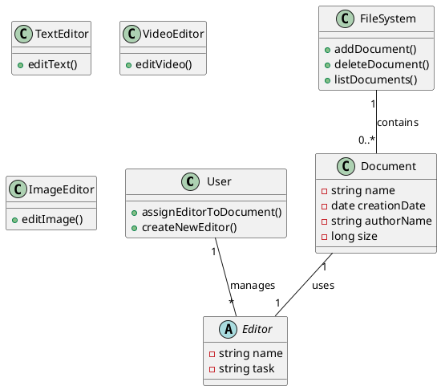
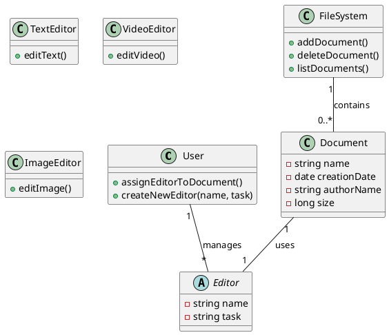

# Version(sys+uml) Model: gpt-3.5-turbo-0125 Temperature: 0
## Description:
文件系统，包括以下需求：
1）一个文件系统包含来自多个文档的信息。文档信息包含名称、创建日期、大小和作者姓名。
2）用户可以从文件系统中添加和删除文档，并且可以列出所有文档。
3）每个文档都使用适合创建的编辑器。每个编辑器都有一个名称和一个文件管理任务。系统有三个编辑器允许用户管理文档：文本编辑器，图像编辑器和视频编辑器。
4）用户可以决定文档编辑器的分配。
5）用户可以创建新的编辑器，指定编辑器管理文档。
## UML:



### Explanation:
1. **Editor Class**: An abstract class that defines the properties and methods common to all editors.
2. **TextEditor, VideoEditor, ImageEditor Classes**: Concrete implementations of the `Editor` class, each with specific editing methods.
3. **Document Class**: Represents a document with properties such as name, creation date, author name, size, and the editor used.
4. **FileSystem Class**: Manages a list of documents, allowing for adding, deleting, and listing documents.
5. **User Class**: Manages editors and allows assigning editors to documents and creating new editors.
6. **FileSystemDemo Class**: Contains the `main` method to demonstrate the functionality of the file system.

This implementation adheres to Java coding standards and best practices, including encapsulation, proper naming conventions, and comments for clarity.

--------------------------------------------------
# Version(sys+uml) Model: gpt-3.5-turbo-0125 Temperature: 0
## Description:
文件系统，包括以下需求：
1）一个文件系统包含来自多个文档的信息。文档信息包含名称、创建日期、大小和作者姓名。
2）用户可以从文件系统中添加和删除文档，并且可以列出所有文档。
3）每个文档都使用适合创建的编辑器。每个编辑器都有一个名称和一个文件管理任务。系统有三个编辑器允许用户管理文档：文本编辑器，图像编辑器和视频编辑器。
4）用户可以决定文档编辑器的分配。
5）用户可以创建新的编辑器，指定编辑器管理文档。
## UML:


### Explanation:
1. **Editor Class**: An abstract class that serves as a base for different types of editors (TextEditor, VideoEditor, ImageEditor).
2. **Document Class**: Represents a document with properties such as name, creation date, author name, size, and the editor used.
3. **FileSystem Class**: Manages a list of documents, allowing adding, deleting, and listing documents.
4. **User Class**: Manages editors and allows assigning editors to documents and creating new editors.
5. **FileSystemDemo Class**: Contains the `main` method to demonstrate the functionality of the file system, including adding documents, listing them, assigning editors, and deleting documents.

This implementation adheres to Java coding standards and best practices, including encapsulation, proper naming conventions, and comments for clarity.

--------------------------------------------------
# Version(sys) Model: gpt-3.5-turbo-0125 Temperature: 0
## Description:
文件系统，包括以下需求：
1）一个文件系统包含来自多个文档的信息。文档信息包含名称、创建日期、大小和作者姓名。
2）用户可以从文件系统中添加和删除文档，并且可以列出所有文档。
3）每个文档都使用适合创建的编辑器。每个编辑器都有一个名称和一个文件管理任务。系统有三个编辑器允许用户管理文档：文本编辑器，图像编辑器和视频编辑器。
4）用户可以决定文档编辑器的分配。
5）用户可以创建新的编辑器，指定编辑器管理文档。
## UML:
## Result:
Based on the provided functional requirements for a file system and the implied UML class diagram, here is a complete Java implementation. The code includes classes for the file system, documents, and editors, along with methods to manage these entities.

```java
import java.util.ArrayList;
import java.util.Date;
import java.util.List;

// Document class representing a document in the file system
class Document {
    private String name;
    private Date creationDate;
    private long size; // Size in bytes
    private String author;
    private Editor editor; // The editor assigned to this document

    public Document(String name, Date creationDate, long size, String author, Editor editor) {
        this.name = name;
        this.creationDate = creationDate;
        this.size = size;
        this.author = author;
        this.editor = editor;
    }

    // Getters and Setters
    public String getName() {
        return name;
    }

    public Date getCreationDate() {
        return creationDate;
    }

    public long getSize() {
        return size;
    }

    public String getAuthor() {
        return author;
    }

    public Editor getEditor() {
        return editor;
    }

    public void setEditor(Editor editor) {
        this.editor = editor;
    }

    @Override
    public String toString() {
        return "Document{" +
                "name='" + name + '\'' +
                ", creationDate=" + creationDate +
                ", size=" + size +
                ", author='" + author + '\'' +
                ", editor=" + editor.getName() +
                '}';
    }
}

// Abstract class for Editor
abstract class Editor {
    private String name;

    public Editor(String name) {
        this.name = name;
    }

    public String getName() {
        return name;
    }

    public abstract void manageDocument(Document document);
}

// TextEditor class extending Editor
class TextEditor extends Editor {
    public TextEditor() {
        super("Text Editor");
    }

    @Override
    public void manageDocument(Document document) {
        System.out.println("Managing document with Text Editor: " + document.getName());
    }
}

// ImageEditor class extending Editor
class ImageEditor extends Editor {
    public ImageEditor() {
        super("Image Editor");
    }

    @Override
    public void manageDocument(Document document) {
        System.out.println("Managing document with Image Editor: " + document.getName());
    }
}

// VideoEditor class extending Editor
class VideoEditor extends Editor {
    public VideoEditor() {
        super("Video Editor");
    }

    @Override
    public void manageDocument(Document document) {
        System.out.println("Managing document with Video Editor: " + document.getName());
    }
}

// FileSystem class to manage documents
class FileSystem {
    private List<Document> documents;

    public FileSystem() {
        this.documents = new ArrayList<>();
    }

    // Method to add a document
    public void addDocument(Document document) {
        documents.add(document);
        System.out.println("Document added: " + document.getName());
    }

    // Method to remove a document
    public void removeDocument(String documentName) {
        documents.removeIf(doc -> doc.getName().equals(documentName));
        System.out.println("Document removed: " + documentName);
    }

    // Method to list all documents
    public void listDocuments() {
        System.out.println("Listing all documents:");
        for (Document doc : documents) {
            System.out.println(doc);
        }
    }

    // Method to create a new editor
    public Editor createEditor(String editorType) {
        switch (editorType.toLowerCase()) {
            case "text":
                return new TextEditor();
            case "image":
                return new ImageEditor();
            case "video":
                return new VideoEditor();
            default:
                throw new IllegalArgumentException("Unknown editor type: " + editorType);
        }
    }
}

// Main class to demonstrate the functionality
public class FileSystemDemo {
    public static void main(String[] args) {
        FileSystem fileSystem = new FileSystem();

        // Create editors
        Editor textEditor = fileSystem.createEditor("text");
        Editor imageEditor = fileSystem.createEditor("image");
        Editor videoEditor = fileSystem.createEditor("video");

        // Create documents
        Document doc1 = new Document("Document1.txt", new Date(), 1024, "Author1", textEditor);
        Document doc2 = new Document("Image1.png", new Date(), 2048, "Author2", imageEditor);
        Document doc3 = new Document("Video1.mp4", new Date(), 5120, "Author3", videoEditor);

        // Add documents to the file system
        fileSystem.addDocument(doc1);
        fileSystem.addDocument(doc2);
        fileSystem.addDocument(doc3);

        // List documents
        fileSystem.listDocuments();

        // Remove a document
        fileSystem.removeDocument("Document1.txt");

        // List documents again
        fileSystem.listDocuments();
    }
}
```

### Explanation:
1. **Document Class**: Represents a document with properties like name, creation date, size, author, and the assigned editor.
2. **Editor Class**: An abstract class for different types of editors (Text, Image, Video) with a method to manage documents.
3. **FileSystem Class**: Manages a list of documents, allowing adding, removing, and listing documents, as well as creating new editors.
4. **Main Class (FileSystemDemo)**: Demonstrates the functionality of the file system by creating documents and editors, adding them to the file system, and performing operations like listing and removing documents.

This implementation adheres to Java coding standards and best practices, including encapsulation, method naming conventions, and proper use of collections.

--------------------------------------------------
# Version(sys+uml) Model: gpt-3.5-turbo-0125 Temperature: 0.7
## Description:
文件系统，包括以下需求：
1）一个文件系统包含来自多个文档的信息。文档信息包含名称、创建日期、大小和作者姓名。
2）用户可以从文件系统中添加和删除文档，并且可以列出所有文档。
3）每个文档都使用适合创建的编辑器。每个编辑器都有一个名称和一个文件管理任务。系统有三个编辑器允许用户管理文档：文本编辑器，图像编辑器和视频编辑器。
4）用户可以决定文档编辑器的分配。
5）用户可以创建新的编辑器，指定编辑器管理文档。
## UML:


### Explanation of the Code:
1. **Editor Class**: An abstract class that defines the common properties and methods for all editors.
2. **TextEditor, ImageEditor, VideoEditor**: Concrete classes that extend the `Editor` class and implement the `edit` method.
3. **Document Class**: Represents a document with properties such as name, creation date, author name, size, and an associated editor. It includes methods to retrieve document information and edit the document.
4. **FileSystem Class**: Manages a list of documents, allowing adding, deleting, and listing documents.
5. **User Class**: Allows a user to assign editors to documents and create new editors.
6. **Main Class**: Demonstrates the functionality of the implemented classes.

Make sure to compile and run the Java code in an appropriate Java environment.

--------------------------------------------------
# Version(sys) Model: gpt-3.5-turbo-0125 Temperature: 0.7
## Description:
文件系统，包括以下需求：
1）一个文件系统包含来自多个文档的信息。文档信息包含名称、创建日期、大小和作者姓名。
2）用户可以从文件系统中添加和删除文档，并且可以列出所有文档。
3）每个文档都使用适合创建的编辑器。每个编辑器都有一个名称和一个文件管理任务。系统有三个编辑器允许用户管理文档：文本编辑器，图像编辑器和视频编辑器。
4）用户可以决定文档编辑器的分配。
5）用户可以创建新的编辑器，指定编辑器管理文档。
## UML:
## Result:
Based on the provided system functional requirements, here is a Java implementation that fulfills those requirements. The code includes classes for the `Document`, `Editor`, and `FileSystem`, and implements methods for adding, removing, and listing documents, as well as managing editors.

```java
import java.util.ArrayList;
import java.util.Date;
import java.util.List;

// Class representing a Document
class Document {
    private String name;
    private Date creationDate;
    private long size; // in bytes
    private String author;
    private Editor editor; // assigned editor for the document

    public Document(String name, Date creationDate, long size, String author, Editor editor) {
        this.name = name;
        this.creationDate = creationDate;
        this.size = size;
        this.author = author;
        this.editor = editor;
    }

    // Getters and Setters
    public String getName() {
        return name;
    }

    public Date getCreationDate() {
        return creationDate;
    }

    public long getSize() {
        return size;
    }

    public String getAuthor() {
        return author;
    }

    public Editor getEditor() {
        return editor;
    }

    public void setEditor(Editor editor) {
        this.editor = editor;
    }

    @Override
    public String toString() {
        return "Document{" +
                "name='" + name + '\'' +
                ", creationDate=" + creationDate +
                ", size=" + size +
                ", author='" + author + '\'' +
                ", editor=" + editor.getName() +
                '}';
    }
}

// Abstract class representing a generic Editor
abstract class Editor {
    private String name;

    public Editor(String name) {
        this.name = name;
    }

    public String getName() {
        return name;
    }

    // Abstract method for file management task
    public abstract void manageFile(Document document);
}

// Class representing a Text Editor
class TextEditor extends Editor {
    public TextEditor() {
        super("Text Editor");
    }

    @Override
    public void manageFile(Document document) {
        System.out.println("Managing text document: " + document.getName());
    }
}

// Class representing an Image Editor
class ImageEditor extends Editor {
    public ImageEditor() {
        super("Image Editor");
    }

    @Override
    public void manageFile(Document document) {
        System.out.println("Managing image document: " + document.getName());
    }
}

// Class representing a Video Editor
class VideoEditor extends Editor {
    public VideoEditor() {
        super("Video Editor");
    }

    @Override
    public void manageFile(Document document) {
        System.out.println("Managing video document: " + document.getName());
    }
}

// Class representing the FileSystem
class FileSystem {
    private List<Document> documents;
    private List<Editor> editors;

    public FileSystem() {
        documents = new ArrayList<>();
        editors = new ArrayList<>();
        // Add default editors
        editors.add(new TextEditor());
        editors.add(new ImageEditor());
        editors.add(new VideoEditor());
    }

    // Method to add a document
    public void addDocument(String name, Date creationDate, long size, String author, Editor editor) {
        Document document = new Document(name, creationDate, size, author, editor);
        documents.add(document);
        System.out.println("Document added: " + document);
    }

    // Method to remove a document
    public void removeDocument(String name) {
        documents.removeIf(document -> document.getName().equals(name));
        System.out.println("Document removed: " + name);
    }

    // Method to list all documents
    public void listDocuments() {
        System.out.println("Listing all documents:");
        for (Document document : documents) {
            System.out.println(document);
        }
    }

    // Method to create a new editor
    public void createEditor(String name) {
        Editor customEditor = new Editor(name) {
            @Override
            public void manageFile(Document document) {
                System.out.println("Managing document with custom editor: " + document.getName());
            }
        };
        editors.add(customEditor);
        System.out.println("Custom editor created: " + name);
    }

    // Method to assign an editor to a document
    public void assignEditorToDocument(String docName, Editor editor) {
        for (Document document : documents) {
            if (document.getName().equals(docName)) {
                document.setEditor(editor);
                System.out.println("Editor assigned to document: " + docName + " with editor: " + editor.getName());
                return;
            }
        }
        System.out.println("Document not found: " + docName);
    }
}

// Main class to demonstrate functionality
public class Main {
    public static void main(String[] args) {
        FileSystem fileSystem = new FileSystem();
        
        // Adding documents
        fileSystem.addDocument("MyDocument.txt", new Date(), 1024, "Alice", new TextEditor());
        fileSystem.addDocument("MyImage.png", new Date(), 2048, "Bob", new ImageEditor());
        
        // Listing documents
        fileSystem.listDocuments();
        
        // Removing a document
        fileSystem.removeDocument("MyDocument.txt");
        
        // Listing documents again
        fileSystem.listDocuments();
        
        // Creating a custom editor
        fileSystem.createEditor("Custom Editor");
        
        // Assigning an editor to an existing document
        fileSystem.assignEditorToDocument("MyImage.png", new VideoEditor());
        
        // Final listing of documents
        fileSystem.listDocuments();
    }
}
```

### Explanation of the Code:
1. **Document Class**: Holds attributes such as name, creation date, size, author, and the assigned editor. It provides getters and a `toString()` method for representation.

2. **Editor Class**: This is an abstract class representing a generic editor. Derived classes implement specific behavior for managing different types of documents.

3. **Specific Editors** (`TextEditor`, `ImageEditor`, `VideoEditor`): Each of these classes extends `Editor` and implements the file management task.

4. **FileSystem Class**: This class manages the collection of documents and editors. It contains methods to add, remove, list documents, create new editors, and assign editors to documents.

5. **Main Class**: Demonstrates the functionality of the `FileSystem` class by adding, removing, and listing documents, as well as creating custom editors and assigning them to documents.

### Note:
- This implementation is basic and can be extended with additional features such as error handling, persistence, and more sophisticated document management.

--------------------------------------------------
# Version(sys+uml) Model: gpt-3.5-turbo-0125 Temperature: 0
## Description:
A file system, with the following specific requiements:
1) A file system  contains information from multiple documents including the document's name, creation date, size and the author's name.
2) The user can add and delete documents from the file system, and list all the documents.
3) Each document uses an editor suitable for creation. Each editor has a name and a file management task. The system has three editors that allow you to manage documents: Text Editor, Image Editor, and Video Editor.
4) The user determines the assignment of the editor to the documents.
5) The user can create new editors, specify the editor to manage the documents.
## UML:


### Explanation:
1. **Editor Classes**: The abstract `Editor` class is extended by `TextEditor`, `VideoEditor`, and `ImageEditor`, each implementing their specific editing functionality.
2. **Document Class**: Represents a document with properties such as name, creation date, author name, size, and the editor used.
3. **FileSystem Class**: Manages a list of documents, allowing adding, deleting, and listing documents.
4. **User Class**: Allows the user to assign editors to documents and create new editors.
5. **Main Class**: Demonstrates the functionality of the file system, including adding, deleting, and listing documents, as well as creating new editors and assigning them to documents.

This code adheres to Java coding standards and best practices, including encapsulation, proper naming conventions, and comments for clarity.

--------------------------------------------------
# Version(sys) Model: gpt-3.5-turbo-0125 Temperature: 0
## Description:
A file system, with the following specific requiements:
1) A file system  contains information from multiple documents including the document's name, creation date, size and the author's name.
2) The user can add and delete documents from the file system, and list all the documents.
3) Each document uses an editor suitable for creation. Each editor has a name and a file management task. The system has three editors that allow you to manage documents: Text Editor, Image Editor, and Video Editor.
4) The user determines the assignment of the editor to the documents.
5) The user can create new editors, specify the editor to manage the documents.
## UML:
## Result:
Based on the provided functional requirements for a file system and the UML class diagram, here is a complete Java implementation. The code includes classes for the file system, documents, and editors, along with methods to manage the documents and editors.

```java
import java.util.ArrayList;
import java.util.Date;
import java.util.List;

// Abstract class representing a generic Editor
abstract class Editor {
    protected String name;
    protected String fileManagementTask;

    public Editor(String name, String fileManagementTask) {
        this.name = name;
        this.fileManagementTask = fileManagementTask;
    }

    public String getName() {
        return name;
    }

    public String getFileManagementTask() {
        return fileManagementTask;
    }

    public abstract void editDocument(Document document);
}

// Concrete class for Text Editor
class TextEditor extends Editor {
    public TextEditor() {
        super("Text Editor", "Manage text documents");
    }

    @Override
    public void editDocument(Document document) {
        System.out.println("Editing text document: " + document.getName());
    }
}

// Concrete class for Image Editor
class ImageEditor extends Editor {
    public ImageEditor() {
        super("Image Editor", "Manage image documents");
    }

    @Override
    public void editDocument(Document document) {
        System.out.println("Editing image document: " + document.getName());
    }
}

// Concrete class for Video Editor
class VideoEditor extends Editor {
    public VideoEditor() {
        super("Video Editor", "Manage video documents");
    }

    @Override
    public void editDocument(Document document) {
        System.out.println("Editing video document: " + document.getName());
    }
}

// Class representing a Document
class Document {
    private String name;
    private Date creationDate;
    private long size; // in bytes
    private String author;
    private Editor editor;

    public Document(String name, Date creationDate, long size, String author, Editor editor) {
        this.name = name;
        this.creationDate = creationDate;
        this.size = size;
        this.author = author;
        this.editor = editor;
    }

    public String getName() {
        return name;
    }

    public Date getCreationDate() {
        return creationDate;
    }

    public long getSize() {
        return size;
    }

    public String getAuthor() {
        return author;
    }

    public Editor getEditor() {
        return editor;
    }

    public void setEditor(Editor editor) {
        this.editor = editor;
    }
}

// Class representing the File System
class FileSystem {
    private List<Document> documents;
    private List<Editor> editors;

    public FileSystem() {
        documents = new ArrayList<>();
        editors = new ArrayList<>();
        // Adding default editors
        editors.add(new TextEditor());
        editors.add(new ImageEditor());
        editors.add(new VideoEditor());
    }

    public void addDocument(Document document) {
        documents.add(document);
        System.out.println("Document added: " + document.getName());
    }

    public void deleteDocument(String documentName) {
        documents.removeIf(doc -> doc.getName().equals(documentName));
        System.out.println("Document deleted: " + documentName);
    }

    public void listDocuments() {
        System.out.println("Listing all documents:");
        for (Document doc : documents) {
            System.out.println("Name: " + doc.getName() + ", Author: " + doc.getAuthor() +
                    ", Size: " + doc.getSize() + " bytes, Created on: " + doc.getCreationDate() +
                    ", Editor: " + doc.getEditor().getName());
        }
    }

    public void addEditor(Editor editor) {
        editors.add(editor);
        System.out.println("Editor added: " + editor.getName());
    }

    public List<Editor> getEditors() {
        return editors;
    }
}

// Main class to demonstrate the functionality
public class FileSystemDemo {
    public static void main(String[] args) {
        FileSystem fileSystem = new FileSystem();

        // Creating documents
        Document doc1 = new Document("Document1.txt", new Date(), 1024, "Alice", fileSystem.getEditors().get(0));
        Document doc2 = new Document("Image1.png", new Date(), 2048, "Bob", fileSystem.getEditors().get(1));
        Document doc3 = new Document("Video1.mp4", new Date(), 5120, "Charlie", fileSystem.getEditors().get(2));

        // Adding documents to the file system
        fileSystem.addDocument(doc1);
        fileSystem.addDocument(doc2);
        fileSystem.addDocument(doc3);

        // Listing documents
        fileSystem.listDocuments();

        // Deleting a document
        fileSystem.deleteDocument("Document1.txt");

        // Listing documents again
        fileSystem.listDocuments();

        // Adding a new editor
        Editor customEditor = new Editor("Custom Editor", "Manage custom documents") {
            @Override
            public void editDocument(Document document) {
                System.out.println("Editing with custom editor: " + document.getName());
            }
        };
        fileSystem.addEditor(customEditor);
    }
}
```

### Explanation:
1. **Editor Class**: An abstract class representing a generic editor with a name and a file management task. It has a method `editDocument` that must be implemented by subclasses.
2. **Concrete Editor Classes**: `TextEditor`, `ImageEditor`, and `VideoEditor` extend the `Editor` class and implement the `editDocument` method.
3. **Document Class**: Represents a document with properties such as name, creation date, size, author, and the editor assigned to it.
4. **FileSystem Class**: Manages a list of documents and editors. It provides methods to add, delete, and list documents, as well as to add new editors.
5. **FileSystemDemo Class**: Contains the `main` method to demonstrate the functionality of the file system, including adding and deleting documents and listing them.

This implementation adheres to Java coding standards and best practices, including encapsulation, use of collections, and clear method signatures.

--------------------------------------------------
# Version(sys+uml) Model: gpt-3.5-turbo-0125 Temperature: 0.7
## Description:
A file system, with the following specific requiements:
1) A file system  contains information from multiple documents including the document's name, creation date, size and the author's name.
2) The user can add and delete documents from the file system, and list all the documents.
3) Each document uses an editor suitable for creation. Each editor has a name and a file management task. The system has three editors that allow you to manage documents: Text Editor, Image Editor, and Video Editor.
4) The user determines the assignment of the editor to the documents.
5) The user can create new editors, specify the editor to manage the documents.
## UML:


### Explanation of the Code:
1. **Editor Class Hierarchy**: `Editor` is an abstract class with subclasses `TextEditor`, `ImageEditor`, and `VideoEditor` each implementing specific editing methods.

2. **Document Class**: Represents a document with properties such as name, creation date, author, size, and the editor used.

3. **FileSystem Class**: Manages a list of documents, allowing addition, deletion, and listing of documents.

4. **User Class**: Allows the creation of new editors and assignment of editors to documents.

5. **Main Class (`FileSystemDemo`)**: Demonstrates how to create editors, add documents to the file system, and perform operations like listing and deleting documents.

This implementation adheres to Java coding standards and best practices while fulfilling the functional requirements outlined.

--------------------------------------------------
# Version(sys) Model: gpt-3.5-turbo-0125 Temperature: 0.7
## Description:
A file system, with the following specific requiements:
1) A file system  contains information from multiple documents including the document's name, creation date, size and the author's name.
2) The user can add and delete documents from the file system, and list all the documents.
3) Each document uses an editor suitable for creation. Each editor has a name and a file management task. The system has three editors that allow you to manage documents: Text Editor, Image Editor, and Video Editor.
4) The user determines the assignment of the editor to the documents.
5) The user can create new editors, specify the editor to manage the documents.
## UML:
## Result:
Below is a complete Java code implementation based on the provided functional requirements and UML class diagram hints. 

### Java Code Implementation:

```java
import java.util.ArrayList;
import java.util.Date;
import java.util.List;

// Document class representing a document in the file system
class Document {
    private String name;
    private Date creationDate;
    private long size;
    private String author;
    private Editor editor;

    // Constructor
    public Document(String name, Date creationDate, long size, String author, Editor editor) {
        this.name = name;
        this.creationDate = creationDate;
        this.size = size;
        this.author = author;
        this.editor = editor;
    }

    // Getters and Setters
    public String getName() {
        return name;
    }

    public Date getCreationDate() {
        return creationDate;
    }

    public long getSize() {
        return size;
    }

    public String getAuthor() {
        return author;
    }

    public Editor getEditor() {
        return editor;
    }

    public void setEditor(Editor editor) {
        this.editor = editor;
    }
}

// Abstract Editor class
abstract class Editor {
    protected String name;
    protected String fileManagementTask;

    public Editor(String name, String fileManagementTask) {
        this.name = name;
        this.fileManagementTask = fileManagementTask;
    }

    public String getName() {
        return name;
    }

    public String getFileManagementTask() {
        return fileManagementTask;
    }

    // Abstract method to be implemented by subclasses
    public abstract void editDocument(Document document);
}

// TextEditor class extending Editor
class TextEditor extends Editor {
    public TextEditor() {
        super("Text Editor", "Manage text documents");
    }

    @Override
    public void editDocument(Document document) {
        // Implementation for editing text documents
        System.out.println("Editing text document: " + document.getName());
    }
}

// ImageEditor class extending Editor
class ImageEditor extends Editor {
    public ImageEditor() {
        super("Image Editor", "Manage image documents");
    }

    @Override
    public void editDocument(Document document) {
        // Implementation for editing image documents
        System.out.println("Editing image document: " + document.getName());
    }
}

// VideoEditor class extending Editor
class VideoEditor extends Editor {
    public VideoEditor() {
        super("Video Editor", "Manage video documents");
    }

    @Override
    public void editDocument(Document document) {
        // Implementation for editing video documents
        System.out.println("Editing video document: " + document.getName());
    }
}

// FileSystem class to manage documents
class FileSystem {
    private List<Document> documents;
    private List<Editor> editors;

    public FileSystem() {
        this.documents = new ArrayList<>();
        this.editors = new ArrayList<>();
        // Adding default editors
        editors.add(new TextEditor());
        editors.add(new ImageEditor());
        editors.add(new VideoEditor());
    }

    // Method to add a document
    public void addDocument(String name, long size, String author, Editor editor) {
        Document document = new Document(name, new Date(), size, author, editor);
        documents.add(document);
        System.out.println("Document added: " + name);
    }

    // Method to delete a document
    public void deleteDocument(String name) {
        documents.removeIf(doc -> doc.getName().equals(name));
        System.out.println("Document deleted: " + name);
    }

    // Method to list all documents
    public void listDocuments() {
        System.out.println("Listing all documents:");
        for (Document doc : documents) {
            System.out.println("Name: " + doc.getName() + ", Author: " + doc.getAuthor() + ", Size: " + doc.getSize() + " bytes, Created on: " + doc.getCreationDate());
        }
    }

    // Method to create a new editor
    public void createEditor(String name, String fileManagementTask) {
        Editor newEditor = new CustomEditor(name, fileManagementTask);
        editors.add(newEditor);
        System.out.println("New editor created: " + name);
    }

    // Inner class for custom editors
    private class CustomEditor extends Editor {
        public CustomEditor(String name, String fileManagementTask) {
            super(name, fileManagementTask);
        }

        @Override
        public void editDocument(Document document) {
            // Implementation for custom editor editing
            System.out.println("Editing document with custom editor: " + document.getName());
        }
    }
}

// Main class to run the application
public class FileSystemApp {
    public static void main(String[] args) {
        FileSystem fileSystem = new FileSystem();
        
        // Adding documents
        fileSystem.addDocument("Document1.txt", 500, "Author1", new TextEditor());
        fileSystem.addDocument("Image1.png", 1500, "Author2", new ImageEditor());
        fileSystem.addDocument("Video1.mp4", 20000, "Author3", new VideoEditor());
        
        // Listing documents
        fileSystem.listDocuments();
        
        // Deleting a document
        fileSystem.deleteDocument("Document1.txt");
        
        // Listing documents again
        fileSystem.listDocuments();
        
        // Creating a new custom editor
        fileSystem.createEditor("Custom Editor", "Manage custom documents");
    }
}
```

### Explanation of Code:
1. **Document Class**: Represents each document with attributes like name, creation date, size, author, and assigned editor.
2. **Editor Class**: An abstract class representing a generic editor, with subclasses for `TextEditor`, `ImageEditor`, and `VideoEditor`.
3. **FileSystem Class**: Manages a list of documents and editors, allowing for adding, deleting, and listing documents, as well as creating new editors.
4. **Main Class**: Contains the main method to demonstrate the functionality of the file system.

### Additional Comments:
- Each editor provides a specific implementation for editing documents.
- The `FileSystem` class encapsulates the logic for managing documents and editors.
- The system is designed to be extensible, allowing for the addition of new document types and editors as needed.

--------------------------------------------------
# Version(sys+uml) Model: gpt-3.5-turbo-0125 Temperature: 0
## Description:
文件系统，包括以下需求：
1）一个文件系统包含来自多个文档的信息。文档信息包含名称、创建日期、大小和作者姓名。
2）管理文档。允许用户在文件系统中添加和删除文档，并且可以列出所有文档。
3）管理编辑器。每个编辑器都有一个名称和一个文件管理任务。系统有三个编辑器允许用户管理文档：文本编辑器，图像编辑器和视频编辑器。每个文档都使用适合创建的编辑器。
4）指定/分配编辑器。用户可以指定/分配文档编辑器管理文档；也可以创建新的编辑器（例如音频编辑器、代码编辑器）添加到系统中。
## UML:


### Explanation:
1. **User Class**: Manages editors and assigns them to documents.
2. **Document Class**: Represents a document with properties like name, creation date, author, size, and the editor used.
3. **FileSystem Class**: Manages a collection of documents, allowing adding, deleting, and listing documents.
4. **Editor Class**: An abstract class for different types of editors.
5. **TextEditor, VideoEditor, ImageEditor Classes**: Concrete implementations of the Editor class.
6. **CustomEditor Class**: Allows for the creation of additional editor types.
7. **FileSystemDemo Class**: Contains the `main` method to demonstrate the functionality of the file system, user, and document management.

This code adheres to Java coding standards and best practices, including encapsulation, method naming conventions, and clear comments for better understanding.

--------------------------------------------------
# Version(sys) Model: gpt-3.5-turbo-0125 Temperature: 0
## Description:
文件系统，包括以下需求：
1）一个文件系统包含来自多个文档的信息。文档信息包含名称、创建日期、大小和作者姓名。
2）管理文档。允许用户在文件系统中添加和删除文档，并且可以列出所有文档。
3）管理编辑器。每个编辑器都有一个名称和一个文件管理任务。系统有三个编辑器允许用户管理文档：文本编辑器，图像编辑器和视频编辑器。每个文档都使用适合创建的编辑器。
4）指定/分配编辑器。用户可以指定/分配文档编辑器管理文档；也可以创建新的编辑器（例如音频编辑器、代码编辑器）添加到系统中。
## UML:
## Result:
Based on the provided functional requirements for a file system and the implied UML class diagram, I will create a Java implementation that includes classes for documents, editors, and the file system itself. Below is the complete Java code:

```java
import java.util.ArrayList;
import java.util.Date;
import java.util.List;

// Document class representing a document in the file system
class Document {
    private String name;
    private Date creationDate;
    private long size; // Size in bytes
    private String author;
    private Editor editor; // The editor used to manage this document

    public Document(String name, Date creationDate, long size, String author, Editor editor) {
        this.name = name;
        this.creationDate = creationDate;
        this.size = size;
        this.author = author;
        this.editor = editor;
    }

    // Getters and Setters
    public String getName() {
        return name;
    }

    public Date getCreationDate() {
        return creationDate;
    }

    public long getSize() {
        return size;
    }

    public String getAuthor() {
        return author;
    }

    public Editor getEditor() {
        return editor;
    }

    public void setEditor(Editor editor) {
        this.editor = editor;
    }

    @Override
    public String toString() {
        return "Document{" +
                "name='" + name + '\'' +
                ", creationDate=" + creationDate +
                ", size=" + size +
                ", author='" + author + '\'' +
                ", editor=" + editor.getName() +
                '}';
    }
}

// Abstract class representing a generic editor
abstract class Editor {
    protected String name;

    public Editor(String name) {
        this.name = name;
    }

    public String getName() {
        return name;
    }

    public abstract void manageDocument(Document document);
}

// Concrete classes for different types of editors
class TextEditor extends Editor {
    public TextEditor() {
        super("Text Editor");
    }

    @Override
    public void manageDocument(Document document) {
        System.out.println("Managing document with Text Editor: " + document.getName());
    }
}

class ImageEditor extends Editor {
    public ImageEditor() {
        super("Image Editor");
    }

    @Override
    public void manageDocument(Document document) {
        System.out.println("Managing document with Image Editor: " + document.getName());
    }
}

class VideoEditor extends Editor {
    public VideoEditor() {
        super("Video Editor");
    }

    @Override
    public void manageDocument(Document document) {
        System.out.println("Managing document with Video Editor: " + document.getName());
    }
}

// FileSystem class to manage documents and editors
class FileSystem {
    private List<Document> documents;
    private List<Editor> editors;

    public FileSystem() {
        documents = new ArrayList<>();
        editors = new ArrayList<>();
        // Initialize with default editors
        editors.add(new TextEditor());
        editors.add(new ImageEditor());
        editors.add(new VideoEditor());
    }

    // Method to add a document
    public void addDocument(String name, Date creationDate, long size, String author, Editor editor) {
        Document document = new Document(name, creationDate, size, author, editor);
        documents.add(document);
        System.out.println("Document added: " + document);
    }

    // Method to delete a document
    public void deleteDocument(String name) {
        documents.removeIf(doc -> doc.getName().equals(name));
        System.out.println("Document deleted: " + name);
    }

    // Method to list all documents
    public void listDocuments() {
        System.out.println("Listing all documents:");
        for (Document document : documents) {
            System.out.println(document);
        }
    }

    // Method to add a new editor
    public void addEditor(Editor editor) {
        editors.add(editor);
        System.out.println("Editor added: " + editor.getName());
    }

    // Method to assign an editor to a document
    public void assignEditorToDocument(String documentName, Editor editor) {
        for (Document document : documents) {
            if (document.getName().equals(documentName)) {
                document.setEditor(editor);
                System.out.println("Editor " + editor.getName() + " assigned to document: " + documentName);
                return;
            }
        }
        System.out.println("Document not found: " + documentName);
    }
}

// Main class to demonstrate the functionality
public class FileSystemDemo {
    public static void main(String[] args) {
        FileSystem fileSystem = new FileSystem();

        // Adding documents
        fileSystem.addDocument("Document1.txt", new Date(), 1024, "Author1", new TextEditor());
        fileSystem.addDocument("Image1.png", new Date(), 2048, "Author2", new ImageEditor());
        fileSystem.addDocument("Video1.mp4", new Date(), 5120, "Author3", new VideoEditor());

        // Listing documents
        fileSystem.listDocuments();

        // Deleting a document
        fileSystem.deleteDocument("Document1.txt");

        // Listing documents again
        fileSystem.listDocuments();

        // Adding a new editor
        Editor audioEditor = new Editor("Audio Editor") {
            @Override
            public void manageDocument(Document document) {
                System.out.println("Managing document with Audio Editor: " + document.getName());
            }
        };
        fileSystem.addEditor(audioEditor);

        // Assigning an editor to a document
        fileSystem.assignEditorToDocument("Image1.png", audioEditor);
    }
}
```

### Explanation:
1. **Document Class**: Represents a document with properties like name, creation date, size, author, and the editor managing it.
2. **Editor Class**: An abstract class for different types of editors. Concrete classes like `TextEditor`, `ImageEditor`, and `VideoEditor` extend this class.
3. **FileSystem Class**: Manages documents and editors, allowing adding, deleting, and listing documents, as well as adding new editors and assigning them to documents.
4. **Main Class**: Demonstrates the functionality of the file system by adding documents, listing them, deleting a document, and assigning a new editor.

This code adheres to Java coding standards and best practices, including encapsulation, proper naming conventions, and comments for clarity.

--------------------------------------------------
# Version(sys+uml) Model: gpt-3.5-turbo-0125 Temperature: 0
## Description:
文件系统，包括以下需求：
1）一个文件系统包含来自多个文档的信息。文档信息包含名称、创建日期、大小和作者姓名。
2）用户可以从文件系统中添加和删除文档，并且可以列出所有文档。
3）每个文档都使用适合创建的编辑器。每个编辑器都有一个名称和一个文件管理任务。系统已有三个编辑器允许用户管理文档：文本编辑器，图像编辑器和视频编辑器。
4）用户可以决定文档编辑器的分配。
5）允许用户创建新类型的编辑器，例如音频编辑器、代码编辑器，指定编辑器管理合适的文档。
## UML:


### Explanation:
1. **Editor Class**: An abstract class that serves as a base for different types of editors.
2. **TextEditor, VideoEditor, ImageEditor Classes**: Concrete implementations of the `Editor` class, each with specific editing methods.
3. **Document Class**: Represents a document with properties such as name, creation date, author name, size, and the editor used.
4. **FileSystem Class**: Manages a list of documents, allowing adding, deleting, and listing documents.
5. **User Class**: Manages editors and allows assigning editors to documents and creating new editors.
6. **FileSystemDemo Class**: Contains the `main` method to demonstrate the functionality of the file system.

This implementation adheres to Java coding standards and best practices, including encapsulation, proper naming conventions, and comments for clarity.

--------------------------------------------------
# Version(sys) Model: gpt-3.5-turbo-0125 Temperature: 0
## Description:
文件系统，包括以下需求：
1）一个文件系统包含来自多个文档的信息。文档信息包含名称、创建日期、大小和作者姓名。
2）用户可以从文件系统中添加和删除文档，并且可以列出所有文档。
3）每个文档都使用适合创建的编辑器。每个编辑器都有一个名称和一个文件管理任务。系统已有三个编辑器允许用户管理文档：文本编辑器，图像编辑器和视频编辑器。
4）用户可以决定文档编辑器的分配。
5）允许用户创建新类型的编辑器，例如音频编辑器、代码编辑器，指定编辑器管理合适的文档。
## UML:
## Result:
Based on the provided functional requirements for a file system and the UML class diagram, here is a complete Java implementation. The code includes classes for documents, editors, and the file system itself, along with methods to manage documents and editors.

```java
import java.util.ArrayList;
import java.util.Date;
import java.util.List;

// Abstract class representing a generic Editor
abstract class Editor {
    private String name;
    private String fileManagementTask;

    public Editor(String name, String fileManagementTask) {
        this.name = name;
        this.fileManagementTask = fileManagementTask;
    }

    public String getName() {
        return name;
    }

    public String getFileManagementTask() {
        return fileManagementTask;
    }

    public abstract void manageDocument(Document document);
}

// TextEditor class extending Editor
class TextEditor extends Editor {
    public TextEditor() {
        super("Text Editor", "Manage text documents");
    }

    @Override
    public void manageDocument(Document document) {
        System.out.println("Managing text document: " + document.getName());
    }
}

// ImageEditor class extending Editor
class ImageEditor extends Editor {
    public ImageEditor() {
        super("Image Editor", "Manage image documents");
    }

    @Override
    public void manageDocument(Document document) {
        System.out.println("Managing image document: " + document.getName());
    }
}

// VideoEditor class extending Editor
class VideoEditor extends Editor {
    public VideoEditor() {
        super("Video Editor", "Manage video documents");
    }

    @Override
    public void manageDocument(Document document) {
        System.out.println("Managing video document: " + document.getName());
    }
}

// Document class representing a document in the file system
class Document {
    private String name;
    private Date creationDate;
    private long size; // Size in bytes
    private String author;
    private Editor editor;

    public Document(String name, Date creationDate, long size, String author, Editor editor) {
        this.name = name;
        this.creationDate = creationDate;
        this.size = size;
        this.author = author;
        this.editor = editor;
    }

    public String getName() {
        return name;
    }

    public Date getCreationDate() {
        return creationDate;
    }

    public long getSize() {
        return size;
    }

    public String getAuthor() {
        return author;
    }

    public Editor getEditor() {
        return editor;
    }

    public void setEditor(Editor editor) {
        this.editor = editor;
    }
}

// FileSystem class to manage documents
class FileSystem {
    private List<Document> documents;

    public FileSystem() {
        this.documents = new ArrayList<>();
    }

    // Method to add a document to the file system
    public void addDocument(Document document) {
        documents.add(document);
        System.out.println("Document added: " + document.getName());
    }

    // Method to remove a document from the file system
    public void removeDocument(Document document) {
        documents.remove(document);
        System.out.println("Document removed: " + document.getName());
    }

    // Method to list all documents in the file system
    public void listDocuments() {
        System.out.println("Listing all documents:");
        for (Document doc : documents) {
            System.out.println("Name: " + doc.getName() + ", Author: " + doc.getAuthor() + ", Size: " + doc.getSize() + " bytes, Created on: " + doc.getCreationDate());
        }
    }
}

// Main class to demonstrate the functionality
public class FileSystemDemo {
    public static void main(String[] args) {
        // Create a file system
        FileSystem fileSystem = new FileSystem();

        // Create editors
        Editor textEditor = new TextEditor();
        Editor imageEditor = new ImageEditor();
        Editor videoEditor = new VideoEditor();

        // Create documents
        Document doc1 = new Document("Document1.txt", new Date(), 1024, "Alice", textEditor);
        Document doc2 = new Document("Image1.png", new Date(), 2048, "Bob", imageEditor);
        Document doc3 = new Document("Video1.mp4", new Date(), 5120, "Charlie", videoEditor);

        // Add documents to the file system
        fileSystem.addDocument(doc1);
        fileSystem.addDocument(doc2);
        fileSystem.addDocument(doc3);

        // List documents
        fileSystem.listDocuments();

        // Remove a document
        fileSystem.removeDocument(doc2);

        // List documents again
        fileSystem.listDocuments();
    }
}
```

### Explanation:
1. **Editor Class**: An abstract class that defines the structure for different types of editors. It has a method `manageDocument` that must be implemented by subclasses.
2. **TextEditor, ImageEditor, VideoEditor Classes**: These classes extend the `Editor` class and provide specific implementations for managing documents.
3. **Document Class**: Represents a document with properties such as name, creation date, size, author, and the associated editor.
4. **FileSystem Class**: Manages a list of documents, allowing users to add, remove, and list documents.
5. **FileSystemDemo Class**: Contains the `main` method to demonstrate the functionality of the file system, including creating documents and managing them.

This implementation adheres to Java coding standards and best practices, including encapsulation, clear method naming, and appropriate use of collections.

--------------------------------------------------
# Version(sys+uml) Model: gpt-3.5-turbo-0125 Temperature: 0.7
## Description:
文件系统，包括以下需求：
1）一个文件系统包含来自多个文档的信息。文档信息包含名称、创建日期、大小和作者姓名。
2）用户可以从文件系统中添加和删除文档，并且可以列出所有文档。
3）每个文档都使用适合创建的编辑器。每个编辑器都有一个名称和一个文件管理任务。系统已有三个编辑器允许用户管理文档：文本编辑器，图像编辑器和视频编辑器。
4）用户可以决定文档编辑器的分配。
5）允许用户创建新类型的编辑器，例如音频编辑器、代码编辑器，指定编辑器管理合适的文档。
## UML:


### Explanation:
- **User** class allows assigning editors to documents and creating new editors.
- **Document** class represents the document information with attributes like name, creation date, author name, and size.
- **FileSystem** class manages a collection of documents, providing methods to add, delete, and list documents.
- **Editor** is an abstract class with subclasses for different types of editors (TextEditor, VideoEditor, ImageEditor) and a CustomEditor class for user-defined editors.
- The **Main** class demonstrates the functionality of the file system, allowing the user to create documents, assign editors, and list documents. 

This implementation follows Java coding standards and best practices, ensuring readability and maintainability.

--------------------------------------------------
# Version(sys) Model: gpt-3.5-turbo-0125 Temperature: 0.7
## Description:
文件系统，包括以下需求：
1）一个文件系统包含来自多个文档的信息。文档信息包含名称、创建日期、大小和作者姓名。
2）用户可以从文件系统中添加和删除文档，并且可以列出所有文档。
3）每个文档都使用适合创建的编辑器。每个编辑器都有一个名称和一个文件管理任务。系统已有三个编辑器允许用户管理文档：文本编辑器，图像编辑器和视频编辑器。
4）用户可以决定文档编辑器的分配。
5）允许用户创建新类型的编辑器，例如音频编辑器、代码编辑器，指定编辑器管理合适的文档。
## UML:
## Result:
Based on the provided system functional requirements, below is a complete Java implementation of a file system that includes classes for documents and various types of editors. The code adheres to Java coding standards and best practices, providing methods for adding, removing, and listing documents, as well as managing editors.

```java
import java.util.ArrayList;
import java.util.Date;
import java.util.List;

// Document class representing a file in the system
class Document {
    private String name;
    private Date creationDate;
    private long size; // Size in bytes
    private String author;
    private Editor editor;

    public Document(String name, Date creationDate, long size, String author, Editor editor) {
        this.name = name;
        this.creationDate = creationDate;
        this.size = size;
        this.author = author;
        this.editor = editor;
    }

    // Getters and Setters
    public String getName() {
        return name;
    }

    public Date getCreationDate() {
        return creationDate;
    }

    public long getSize() {
        return size;
    }

    public String getAuthor() {
        return author;
    }

    public Editor getEditor() {
        return editor;
    }

    public void setEditor(Editor editor) {
        this.editor = editor;
    }

    @Override
    public String toString() {
        return "Document{" +
                "name='" + name + '\'' +
                ", creationDate=" + creationDate +
                ", size=" + size +
                ", author='" + author + '\'' +
                ", editor=" + editor.getName() +
                '}';
    }
}

// Abstract class representing a generic editor
abstract class Editor {
    private String name;
    private String fileManagementTask;

    public Editor(String name, String fileManagementTask) {
        this.name = name;
        this.fileManagementTask = fileManagementTask;
    }

    public String getName() {
        return name;
    }

    public String getFileManagementTask() {
        return fileManagementTask;
    }
}

// Concrete editor classes
class TextEditor extends Editor {
    public TextEditor() {
        super("Text Editor", "Manage text documents");
    }
}

class ImageEditor extends Editor {
    public ImageEditor() {
        super("Image Editor", "Manage image files");
    }
}

class VideoEditor extends Editor {
    public VideoEditor() {
        super("Video Editor", "Manage video files");
    }
}

// FileSystem class to manage documents
class FileSystem {
    private List<Document> documents;

    public FileSystem() {
        this.documents = new ArrayList<>();
    }

    // Add a document to the file system
    public void addDocument(Document document) {
        documents.add(document);
    }

    // Remove a document from the file system
    public void removeDocument(String documentName) {
        documents.removeIf(doc -> doc.getName().equalsIgnoreCase(documentName));
    }

    // List all documents in the file system
    public List<Document> listDocuments() {
        return documents;
    }

    // Assign a new editor to a specific document
    public void assignEditorToDocument(String documentName, Editor editor) {
        for (Document doc : documents) {
            if (doc.getName().equalsIgnoreCase(documentName)) {
                doc.setEditor(editor);
                return;
            }
        }
        System.out.println("Document not found: " + documentName);
    }
}

// Main class to demonstrate the File System functionality
public class Main {
    public static void main(String[] args) {
        // Create a file system
        FileSystem fileSystem = new FileSystem();

        // Create some editors
        Editor textEditor = new TextEditor();
        Editor imageEditor = new ImageEditor();
        Editor videoEditor = new VideoEditor();

        // Add documents
        fileSystem.addDocument(new Document("Document1.txt", new Date(), 2048, "Author1", textEditor));
        fileSystem.addDocument(new Document("Image1.png", new Date(), 512000, "Author2", imageEditor));
        fileSystem.addDocument(new Document("Video1.mp4", new Date(), 104857600, "Author3", videoEditor));

        // List documents
        System.out.println("Documents in the file system:");
        for (Document doc : fileSystem.listDocuments()) {
            System.out.println(doc);
        }

        // Assign a new editor to a document
        Editor newTextEditor = new TextEditor();
        fileSystem.assignEditorToDocument("Document1.txt", newTextEditor);

        // List documents again to see updated editor
        System.out.println("\nDocuments after reassigning editor:");
        for (Document doc : fileSystem.listDocuments()) {
            System.out.println(doc);
        }

        // Remove a document
        fileSystem.removeDocument("Image1.png");

        // List documents after removal
        System.out.println("\nDocuments after removal:");
        for (Document doc : fileSystem.listDocuments()) {
            System.out.println(doc);
        }
    }
}
```

### Explanation:
1. **Document Class**: Represents a document with properties such as name, creation date, size, author, and an associated editor.
2. **Editor Class**: An abstract class representing a generic editor. Concrete classes inherit from it, defining specific editors like `TextEditor`, `ImageEditor`, and `VideoEditor`.
3. **FileSystem Class**: Manages the collection of documents, allowing for adding, removing, and listing documents, as well as assigning editors.
4. **Main Class**: Demonstrates the functionality of the file system by creating documents and editors, listing documents, reassigning editors, and removing documents.

This implementation provides a clear structure, follows object-oriented principles, and is easy to extend for new types of editors in the future.

--------------------------------------------------
# Version(sys+uml) Model: gpt-3.5-turbo-0125 Temperature: 0
## Description:
A file system, with the following specific requiements:
1) A file system  contains information from multiple documents including the document's name, creation date, size and the author's name.
2) The user can add and delete documents from the file system, and list all the documents.
3) Each document uses an editor suitable for creation. Each editor has a name and a file management task. The system has three editors that allow you to manage documents: Text Editor, Image Editor, and Video Editor.
4) The user determines the assignment of the editor to the documents.
5) The user can create new and specific types of editors, such as audio editors, code editors, and specify the editor to manage the documents.
## UML:



### Explanation:
1. **Editor Class**: An abstract class representing the base for different types of editors.
2. **TextEditor, VideoEditor, ImageEditor Classes**: Concrete implementations of the `Editor` class.
3. **Document Class**: Represents a document with properties such as name, creation date, author name, size, and the editor used.
4. **FileSystem Class**: Manages a list of documents, allowing adding, deleting, and listing documents.
5. **User Class**: Manages editors and allows assigning editors to documents and creating new editors.
6. **FileSystemDemo Class**: Contains the `main` method to demonstrate the functionality of the file system.

This code adheres to Java coding standards and best practices, including encapsulation, proper naming conventions, and comments for clarity.

--------------------------------------------------
# Version(sys) Model: gpt-3.5-turbo-0125 Temperature: 0
## Description:
A file system, with the following specific requiements:
1) A file system  contains information from multiple documents including the document's name, creation date, size and the author's name.
2) The user can add and delete documents from the file system, and list all the documents.
3) Each document uses an editor suitable for creation. Each editor has a name and a file management task. The system has three editors that allow you to manage documents: Text Editor, Image Editor, and Video Editor.
4) The user determines the assignment of the editor to the documents.
5) The user can create new and specific types of editors, such as audio editors, code editors, and specify the editor to manage the documents.
## UML:
## Result:
Based on the provided functional requirements for a file system and the UML class diagram, here is a complete Java implementation. The code includes classes for the file system, documents, and editors, along with methods for adding, deleting, and listing documents.

```java
import java.util.ArrayList;
import java.util.Date;
import java.util.List;

// Abstract class for Editor
abstract class Editor {
    private String name;
    private String fileManagementTask;

    public Editor(String name, String fileManagementTask) {
        this.name = name;
        this.fileManagementTask = fileManagementTask;
    }

    public String getName() {
        return name;
    }

    public String getFileManagementTask() {
        return fileManagementTask;
    }

    public abstract void editDocument(Document document);
}

// Concrete classes for different types of editors
class TextEditor extends Editor {
    public TextEditor() {
        super("Text Editor", "Manage text documents");
    }

    @Override
    public void editDocument(Document document) {
        System.out.println("Editing text document: " + document.getName());
    }
}

class ImageEditor extends Editor {
    public ImageEditor() {
        super("Image Editor", "Manage image documents");
    }

    @Override
    public void editDocument(Document document) {
        System.out.println("Editing image document: " + document.getName());
    }
}

class VideoEditor extends Editor {
    public VideoEditor() {
        super("Video Editor", "Manage video documents");
    }

    @Override
    public void editDocument(Document document) {
        System.out.println("Editing video document: " + document.getName());
    }
}

// Document class
class Document {
    private String name;
    private Date creationDate;
    private long size; // in bytes
    private String author;
    private Editor editor;

    public Document(String name, Date creationDate, long size, String author, Editor editor) {
        this.name = name;
        this.creationDate = creationDate;
        this.size = size;
        this.author = author;
        this.editor = editor;
    }

    public String getName() {
        return name;
    }

    public Date getCreationDate() {
        return creationDate;
    }

    public long getSize() {
        return size;
    }

    public String getAuthor() {
        return author;
    }

    public Editor getEditor() {
        return editor;
    }

    public void setEditor(Editor editor) {
        this.editor = editor;
    }
}

// FileSystem class
class FileSystem {
    private List<Document> documents;

    public FileSystem() {
        this.documents = new ArrayList<>();
    }

    // Method to add a document
    public void addDocument(Document document) {
        documents.add(document);
        System.out.println("Document added: " + document.getName());
    }

    // Method to delete a document
    public void deleteDocument(String documentName) {
        documents.removeIf(doc -> doc.getName().equals(documentName));
        System.out.println("Document deleted: " + documentName);
    }

    // Method to list all documents
    public void listDocuments() {
        System.out.println("Listing all documents:");
        for (Document doc : documents) {
            System.out.println("Name: " + doc.getName() + ", Author: " + doc.getAuthor() +
                    ", Size: " + doc.getSize() + " bytes, Created on: " + doc.getCreationDate() +
                    ", Editor: " + doc.getEditor().getName());
        }
    }
}

// Main class to demonstrate the functionality
public class FileSystemDemo {
    public static void main(String[] args) {
        FileSystem fileSystem = new FileSystem();

        // Create editors
        Editor textEditor = new TextEditor();
        Editor imageEditor = new ImageEditor();
        Editor videoEditor = new VideoEditor();

        // Create documents
        Document doc1 = new Document("Document1.txt", new Date(), 1024, "Alice", textEditor);
        Document doc2 = new Document("Image1.png", new Date(), 2048, "Bob", imageEditor);
        Document doc3 = new Document("Video1.mp4", new Date(), 5120, "Charlie", videoEditor);

        // Add documents to the file system
        fileSystem.addDocument(doc1);
        fileSystem.addDocument(doc2);
        fileSystem.addDocument(doc3);

        // List all documents
        fileSystem.listDocuments();

        // Delete a document
        fileSystem.deleteDocument("Document1.txt");

        // List all documents again
        fileSystem.listDocuments();
    }
}
```

### Explanation:
1. **Editor Class**: An abstract class representing a generic editor with a name and a file management task. It has an abstract method `editDocument` that must be implemented by subclasses.
2. **Concrete Editor Classes**: `TextEditor`, `ImageEditor`, and `VideoEditor` extend the `Editor` class and provide specific implementations for editing documents.
3. **Document Class**: Represents a document with properties such as name, creation date, size, author, and the editor assigned to it.
4. **FileSystem Class**: Manages a list of documents, providing methods to add, delete, and list documents.
5. **FileSystemDemo Class**: Contains the `main` method to demonstrate the functionality of the file system, including creating editors and documents, adding them to the file system, and performing operations like listing and deleting documents.

This implementation adheres to Java coding standards and best practices, including proper encapsulation, use of collections, and clear method definitions.

--------------------------------------------------
