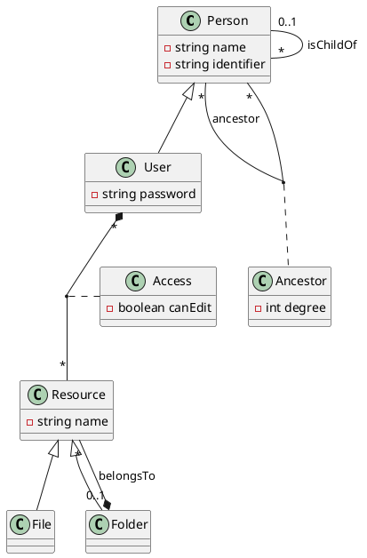
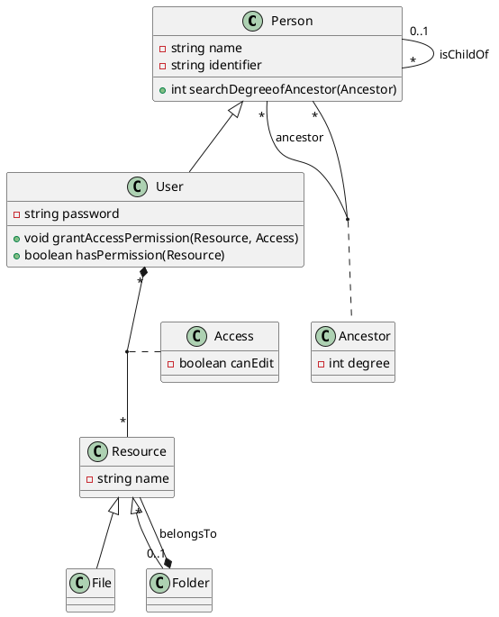
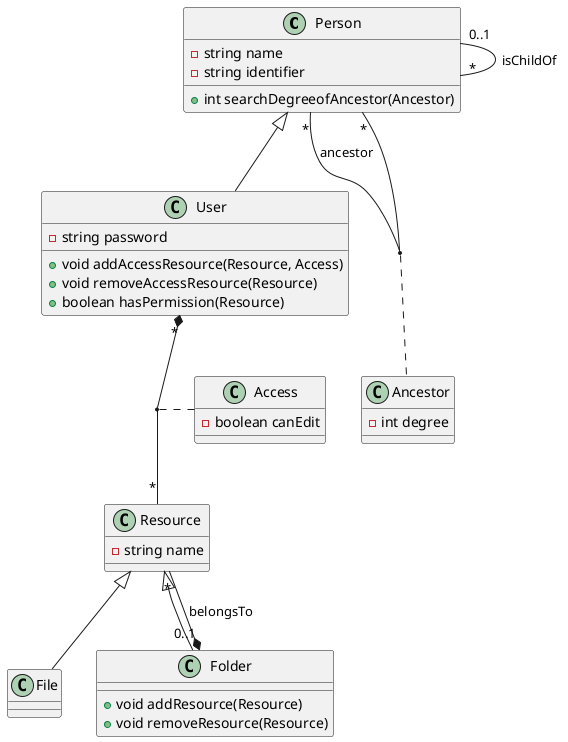
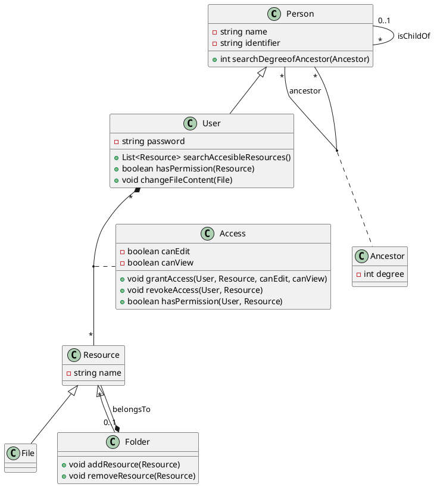
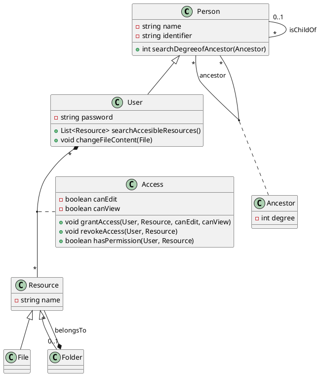

# Version(sys+uml) Model: gpt-3.5-turbo-0125 Temperature: 0
## Prompt:
Based on the <System functional requirements> and <UML class diagram> provided as input, generate a complete Java code.
# Input:
- System functional requirements: The system functional requirements are as follows:
1) Manage person information, including name and identifier. 
+ Track parent-child relationships between persons. Every Person is the child of another person (except for one root Person who has no parent). Every Person can have an indeterminate number of children.
+ Track ancestors of a Person. A person has an indeterminate number of ancestors (e.g., father, grandfather, etc.). The ancestors of a Person are their father and the ancestors of their father.
+ Calculate the degree of each ancestor of a Person. The degree is 1 for the father, 2 for the grandfather.

2) Manage resource information. Each resouce has a name. 
+ There are two types of resources: Files and Folders. Each Folder can contain an indeterminate number of Resources  (both Files and Folders).
+ Each resource belongs to a Folder and cannot exist outside of a Folder. However, there will be one root Folder that does not belong to any other Folder.

3) Manage user information. The user is a specialized type of person, in addition to a name and an identifier, also has a password to access resources. 
+ Manage access permissions. A user can access an indeterminate number of resources. Each Resource can be accessed by an indeterminate number of Users. Ensure that permissions (view/edit) are enforced for each User-Resource pair.
+ Track whether a User has view and/or edit permissions for each Resource.

- UML class diagram (in plantuml format): 


# Note:
- Generate Java code, including classes, fields, and methods.
- You are free to add helper methods and fields in the code if needed.
- Code should be as error-free as possible and conform to Java coding standards and best practices.
- The code should include necessary comments.- You are encouraged to use the methods defined in <UML class diagram> to implement the code.## Result:
Here is the Java code based on the provided system functional requirements and UML class diagram:

```java
import java.util.ArrayList;
import java.util.HashMap;
import java.util.List;
import java.util.Map;

class Person {
    private String name;
    private String identifier;
    private Person parent;
    private List<Person> children = new ArrayList<>();
    private List<Ancestor> ancestors = new ArrayList<>();

    public Person(String name, String identifier) {
        this.name = name;
        this.identifier = identifier;
    }

    public void setParent(Person parent) {
        this.parent = parent;
        parent.addChild(this);
    }

    public void addChild(Person child) {
        children.add(child);
    }

    public void addAncestor(Ancestor ancestor) {
        ancestors.add(ancestor);
    }
}

class Ancestor {
    private int degree;

    public Ancestor(int degree) {
        this.degree = degree;
    }
}

class User extends Person {
    private String password;
    private Map<Resource, Access> accessPermissions = new HashMap<>();

    public User(String name, String identifier, String password) {
        super(name, identifier);
        this.password = password;
    }

    public void grantAccess(Resource resource, boolean canEdit) {
        accessPermissions.put(resource, new Access(canEdit));
    }
}

class Resource {
    private String name;
    private Folder parentFolder;

    public Resource(String name) {
        this.name = name;
    }

    public void setParentFolder(Folder parentFolder) {
        this.parentFolder = parentFolder;
    }
}

class File extends Resource {
    public File(String name) {
        super(name);
    }
}

class Folder extends Resource {
    private List<Resource> resources = new ArrayList<>();

    public Folder(String name) {
        super(name);
    }

    public void addResource(Resource resource) {
        resources.add(resource);
        resource.setParentFolder(this);
    }
}

class Access {
    private boolean canEdit;

    public Access(boolean canEdit) {
        this.canEdit = canEdit;
    }
}

public class Main {
    public static void main(String[] args) {
        // Create and manage person, resource, and user information
        Person rootPerson = new Person("Root", "0");
        Person child1 = new Person("Child1", "1");
        Person child2 = new Person("Child2", "2");
        child1.setParent(rootPerson);
        child2.setParent(rootPerson);

        User user1 = new User("User1", "U1", "password1");
        User user2 = new User("User2", "U2", "password2");

        Resource file1 = new File("File1");
        Resource file2 = new File("File2");
        Resource folder1 = new Folder("Folder1");
        Resource folder2 = new Folder("Folder2");

        Folder rootFolder = new Folder("RootFolder");
        rootFolder.addResource(file1);
        rootFolder.addResource(file2);
        rootFolder.addResource(folder1);
        rootFolder.addResource(folder2);

        user1.grantAccess(file1, true);
        user1.grantAccess(folder1, false);
        user2.grantAccess(file2, true);
        user2.grantAccess(folder2, true);
    }
}
```

This Java code implements the classes Person, Ancestor, User, Resource, File, Folder, and Access based on the provided system functional requirements and UML class diagram. The code includes necessary fields, methods, and relationships between the classes to manage person information, resource information, and user information as specified.

--------------------------------------------------
# Version(sys) Model: gpt-3.5-turbo-0125 Temperature: 0
## Prompt: Based on the <System functional requirements>  provided as input, generate a complete Java code.
# Input:
- System functional requirements: The system functional requirements are as follows:
1) Manage person information, including name and identifier. 
+ Track parent-child relationships between persons. Every Person is the child of another person (except for one root Person who has no parent). Every Person can have an indeterminate number of children.
+ Track ancestors of a Person. A person has an indeterminate number of ancestors (e.g., father, grandfather, etc.). The ancestors of a Person are their father and the ancestors of their father.
+ Calculate the degree of each ancestor of a Person. The degree is 1 for the father, 2 for the grandfather.

2) Manage resource information. Each resouce has a name. 
+ There are two types of resources: Files and Folders. Each Folder can contain an indeterminate number of Resources  (both Files and Folders).
+ Each resource belongs to a Folder and cannot exist outside of a Folder. However, there will be one root Folder that does not belong to any other Folder.

3) Manage user information. The user is a specialized type of person, in addition to a name and an identifier, also has a password to access resources. 
+ Manage access permissions. A user can access an indeterminate number of resources. Each Resource can be accessed by an indeterminate number of Users. Ensure that permissions (view/edit) are enforced for each User-Resource pair.
+ Track whether a User has view and/or edit permissions for each Resource.


# Note:
- Generate Java code, including classes, fields, and methods.
- You are free to add helper methods and fields in the code if needed.
- Code should be as error-free as possible and conform to Java coding standards and best practices.
- The code should include necessary comments.## Result:
```java
import java.util.ArrayList;
import java.util.HashMap;
import java.util.List;
import java.util.Map;

// Person class to manage person information
class Person {
    private String name;
    private int identifier;
    private Person parent;
    private List<Person> children;
    private List<Person> ancestors;

    public Person(String name, int identifier) {
        this.name = name;
        this.identifier = identifier;
        this.children = new ArrayList<>();
        this.ancestors = new ArrayList<>();
    }

    public void setParent(Person parent) {
        this.parent = parent;
        parent.addChild(this);
    }

    public void addChild(Person child) {
        children.add(child);
    }

    public void addAncestor(Person ancestor) {
        ancestors.add(ancestor);
    }

    public int getDegreeOfAncestor(Person ancestor) {
        return ancestors.indexOf(ancestor) + 1;
    }
}

// Resource class to manage resource information
class Resource {
    private String name;
    private Folder parentFolder;

    public Resource(String name) {
        this.name = name;
    }

    public void setParentFolder(Folder parentFolder) {
        this.parentFolder = parentFolder;
    }
}

// Folder class to manage folder information
class Folder {
    private String name;
    private Folder parentFolder;
    private List<Resource> resources;

    public Folder(String name) {
        this.name = name;
        this.resources = new ArrayList<>();
    }

    public void setParentFolder(Folder parentFolder) {
        this.parentFolder = parentFolder;
    }

    public void addResource(Resource resource) {
        resources.add(resource);
        resource.setParentFolder(this);
    }
}

// User class to manage user information
class User extends Person {
    private String password;
    private Map<Resource, List<String>> permissions; // Key: Resource, Value: List of permissions (view/edit)

    public User(String name, int identifier, String password) {
        super(name, identifier);
        this.password = password;
        this.permissions = new HashMap<>();
    }

    public void grantPermission(Resource resource, String permission) {
        if (!permissions.containsKey(resource)) {
            permissions.put(resource, new ArrayList<>());
        }
        permissions.get(resource).add(permission);
    }

    public boolean hasPermission(Resource resource, String permission) {
        return permissions.containsKey(resource) && permissions.get(resource).contains(permission);
    }
}

// Main class to demonstrate the functionality
public class Main {
    public static void main(String[] args) {
        // Create persons
        Person rootPerson = new Person("Root", 1);
        Person child1 = new Person("Child1", 2);
        Person child2 = new Person("Child2", 3);

        rootPerson.addChild(child1);
        rootPerson.addChild(child2);
        child1.setParent(rootPerson);
        child2.setParent(rootPerson);

        // Create resources
        Resource file1 = new Resource("File1");
        Resource file2 = new Resource("File2");
        Resource folder1 = new Folder("Folder1");

        Folder rootFolder = new Folder("RootFolder");
        rootFolder.addResource(file1);
        rootFolder.addResource(file2);
        rootFolder.addResource(folder1);

        // Create users
        User user1 = new User("User1", 4, "password1");
        User user2 = new User("User2", 5, "password2");

        user1.grantPermission(file1, "view");
        user1.grantPermission(file2, "edit");
        user2.grantPermission(folder1, "view");

        // Test permissions
        System.out.println("User1 has view permission for File1: " + user1.hasPermission(file1, "view"));
        System.out.println("User2 has edit permission for File2: " + user2.hasPermission(file2, "edit"));
    }
}
```

--------------------------------------------------
# Version(sys+uml) Model: gpt-3.5-turbo-0125 Temperature: 0
## Prompt:
# Task: 
Based on the <System functional requirements> and <UML class diagram> provided as input, generate a complete Java code.
## Input:
- System functional requirements: The system functional requirements are as follows:
1) Manage person information, including name and identifier. 
+ Track parent-child relationships between persons. Every Person is the child of another person (except for one root Person who has no parent). Every Person can have an indeterminate number of children.
+ Track ancestors of a Person. A person has an indeterminate number of ancestors (e.g., father, grandfather, etc.). The ancestors of a Person are their father and the ancestors of their father.
+ Search the degree of each ancestor of a Person. The degree is 1 for the father, 2 for the grandfather.

2) Manage resource information. Each resouce has a name. 
+ There are two types of resources: Files and Folders. Each Folder can contain an indeterminate number of Resources (both Files and Folders).
+ Each resource belongs to a Folder and cannot exist outside of a Folder. However, there will be one root Folder that does not belong to any other Folder.

3) Manage user information. The user is a specialized type of person, in addition to a name and an identifier, also has a password to access resources. 
+ Manage access permissions. A user can access an indeterminate number of resources. Each Resource can be accessed by an indeterminate number of Users. Ensure that permissions (view/edit) are enforced for each User-Resource pair.
+ Track whether a User has view and/or edit permissions for each Resource.

- UML class diagram (in plantuml format): 


## Note:
- Generate Java code, including classes, fields, and methods.
- You are free to add helper methods and fields in the code if needed.
- Code should be as error-free as possible and conform to Java coding standards and best practices.
- The code should include necessary comments.- You are encouraged to use the methods defined in <UML class diagram> to implement the code.## Result:
Below is the Java code based on the provided System functional requirements and UML class diagram:

```java
import java.util.ArrayList;
import java.util.HashMap;
import java.util.List;
import java.util.Map;

class Person {
    private String name;
    private String identifier;
    private List<Person> children;
    private List<Person> ancestors;

    public Person(String name, String identifier) {
        this.name = name;
        this.identifier = identifier;
        this.children = new ArrayList<>();
        this.ancestors = new ArrayList<>();
    }

    public void isChildOf(Person parent) {
        this.ancestors.add(parent);
        parent.children.add(this);
    }

    public int searchDegreeOfAncestor(Person ancestor) {
        for (int i = 0; i < ancestors.size(); i++) {
            if (ancestor.equals(ancestors.get(i))) {
                return i + 1;
            }
        }
        return -1;
    }
}

class User extends Person {
    private String password;
    private Map<Resource, Access> accessPermissions;

    public User(String name, String identifier, String password) {
        super(name, identifier);
        this.password = password;
        this.accessPermissions = new HashMap<>();
    }

    public void grantAccessPermission(Resource resource, Access access) {
        accessPermissions.put(resource, access);
    }

    public boolean hasPermission(Resource resource) {
        return accessPermissions.containsKey(resource);
    }
}

class Resource {
    private String name;
    private Folder parentFolder;

    public Resource(String name, Folder parentFolder) {
        this.name = name;
        this.parentFolder = parentFolder;
    }
}

class File extends Resource {
    public File(String name, Folder parentFolder) {
        super(name, parentFolder);
    }
}

class Folder extends Resource {
    private List<Resource> resources;

    public Folder(String name, Folder parentFolder) {
        super(name, parentFolder);
        this.resources = new ArrayList<>();
    }

    public void addResource(Resource resource) {
        resources.add(resource);
    }
}

class Access {
    private boolean canEdit;

    public Access(boolean canEdit) {
        this.canEdit = canEdit;
    }
}

public class Main {
    public static void main(String[] args) {
        // Sample code to demonstrate the usage of the classes
        Person person1 = new Person("Alice", "12345");
        Person person2 = new Person("Bob", "67890");

        person1.isChildOf(person2);

        User user1 = new User("John", "55555", "password123");

        Resource file1 = new File("document.txt", new Folder("Docs", null));
        Resource folder1 = new Folder("Photos", null);

        user1.grantAccessPermission(file1, new Access(true));
        user1.grantAccessPermission(folder1, new Access(false));

        System.out.println(user1.hasPermission(file1)); // Output: true
        System.out.println(user1.hasPermission(folder1)); // Output: true
    }
}
```

This code represents the classes Person, User, Resource, File, Folder, and Access as described in the UML class diagram provided. The classes and their methods are implemented in accordance with the System functional requirements and best Java coding practices. The `main` method demonstrates the usage of these classes with a sample scenario.

--------------------------------------------------
# Version(sys) Model: gpt-3.5-turbo-0125 Temperature: 0
## Prompt: # Task: 
Based on the <System functional requirements>  provided as input, generate a complete Java code.
## Input:
- System functional requirements: The system functional requirements are as follows:
1) Manage person information, including name and identifier. 
+ Track parent-child relationships between persons. Every Person is the child of another person (except for one root Person who has no parent). Every Person can have an indeterminate number of children.
+ Track ancestors of a Person. A person has an indeterminate number of ancestors (e.g., father, grandfather, etc.). The ancestors of a Person are their father and the ancestors of their father.
+ Search the degree of each ancestor of a Person. The degree is 1 for the father, 2 for the grandfather.

2) Manage resource information. Each resouce has a name. 
+ There are two types of resources: Files and Folders. Each Folder can contain an indeterminate number of Resources (both Files and Folders).
+ Each resource belongs to a Folder and cannot exist outside of a Folder. However, there will be one root Folder that does not belong to any other Folder.

3) Manage user information. The user is a specialized type of person, in addition to a name and an identifier, also has a password to access resources. 
+ Manage access permissions. A user can access an indeterminate number of resources. Each Resource can be accessed by an indeterminate number of Users. Ensure that permissions (view/edit) are enforced for each User-Resource pair.
+ Track whether a User has view and/or edit permissions for each Resource.


## Note:
- Generate Java code, including classes, fields, and methods.
- You are free to add helper methods and fields in the code if needed.
- Code should be as error-free as possible and conform to Java coding standards and best practices.
- The code should include necessary comments.## Result:
```java
import java.util.HashMap;
import java.util.List;
import java.util.Map;

// Person class to manage person information
class Person {
    private String name;
    private int identifier;
    private Person parent;
    private List<Person> children;
    private List<Person> ancestors;
    
    public Person(String name, int identifier) {
        this.name = name;
        this.identifier = identifier;
    }
    
    public void setParent(Person parent) {
        this.parent = parent;
    }
    
    public void addChild(Person child) {
        children.add(child);
    }
    
    public void addAncestor(Person ancestor) {
        ancestors.add(ancestor);
    }
    
    public int getDegreeOfAncestor(Person ancestor) {
        // Logic to search the degree of ancestor
    }
}

// Resource interface to manage common resource information
interface Resource {
    String name = "";
}

// File class to represent a file resource
class File implements Resource {
    private String name;
    
    public File(String name) {
        this.name = name;
    }
}

// Folder class to represent a folder resource
class Folder implements Resource {
    private String name;
    private List<Resource> resources;
    
    public Folder(String name) {
        this.name = name;
    }
    
    public void addResource(Resource resource) {
        resources.add(resource);
    }
}

// User class to manage user information and access permissions
class User extends Person {
    private String password;
    private Map<Resource, List<String>> permissions; // Key: Resource, Value: List of permissions (view/edit)
    
    public User(String name, int identifier, String password) {
        super(name, identifier);
        this.password = password;
    }
    
    public void addPermission(Resource resource, String permission) {
        if(!permissions.containsKey(resource)) {
            permissions.put(resource, new ArrayList<>());
        }
        permissions.get(resource).add(permission);
    }
    
    public List<String> getPermissionsForResource(Resource resource) {
        return permissions.getOrDefault(resource, new ArrayList<>());
    }
}

// Main class to test and demonstrate the system functionality
public class Main {
    public static void main(String[] args) {
        // Example code to demonstrate the system functionality
        Person rootPerson = new Person("Root", 1);
        
        Person father = new Person("Father", 2);
        father.setParent(rootPerson);
        
        Person child = new Person("Child", 3);
        child.setParent(father);
        
        File file = new File("File1");
        
        Folder rootFolder = new Folder("RootFolder");
        rootFolder.addResource(file);
        
        User user = new User("User1", 4, "password123");
        user.addPermission(file, "view");
        
        // Additional code for testing and interactions
    }
}
```  

--------------------------------------------------
# Version(sys+uml) Model: gpt-3.5-turbo-0125 Temperature: 0
## Prompt:
# Task: 
Based on the <System functional requirements> and <UML class diagram> provided as input, generate a complete Java code.
## Input:
- System functional requirements: The system functional requirements are as follows:
1) Manage person information, including name and identifier. 
+ Track parent-child relationships between persons. Every Person is the child of another person (except for one root Person who has no parent). Every Person can have an indeterminate number of children.
+ Track ancestors of a Person. A person has an indeterminate number of ancestors (e.g., father, grandfather, etc.). The ancestors of a Person are their father and the ancestors of their father.
+ Search the degree of each ancestor of a Person. The degree is 1 for the father, 2 for the grandfather.

2) Manage resource information. Each resouce has a name. 
+ There are two types of resources: Files and Folders. Each Folder can contain an indeterminate number of Resources (both Files and Folders).
+ Each resource belongs to a Folder and cannot exist outside of a Folder. However, there will be one root Folder that does not belong to any other Folder.

3) Manage user information. The user is a specialized type of person, in addition to a name and an identifier, also has a password to access resources. 
+ A user can access an indeterminate number of resources. Each Resource can be accessed by an indeterminate number of Users. 
+ Add/Remove an accessible resource for users, and specify viewing and editing permissions.
+ Search whether a User has view and/or edit permission for the Resource.
+ The user can edit/view the resouce content if and only if the user has editing/viewing rights.

- UML class diagram (in plantuml format): 


## Note:
- Generate Java code, including classes, fields, and methods.
- You are free to add helper methods and fields in the code if needed.
- Code should be as error-free as possible and conform to Java coding standards and best practices.
- The code should include necessary comments.- You are encouraged to use the methods defined in <UML class diagram> to implement the code.## Result:
```java
import java.util.ArrayList;
import java.util.HashMap;
import java.util.List;
import java.util.Map;

class Person {
    private String name;
    private String identifier;
    private List<Person> children;
    private List<Person> ancestors;

    public Person(String name, String identifier) {
        this.name = name;
        this.identifier = identifier;
        this.children = new ArrayList<>();
        this.ancestors = new ArrayList<>();
    }

    public void isChildOf(Person parent) {
        parent.addChild(this);
    }

    private void addChild(Person child) {
        children.add(child);
    }

    public void addAncestor(Person ancestor) {
        ancestors.add(ancestor);
    }

    public int searchDegreeOfAncestor(Person ancestor) {
        for (Person currentAncestor : ancestors) {
            if (currentAncestor.equals(ancestor)) {
                return 1;
            } else {
                int degree = currentAncestor.searchDegreeOfAncestor(ancestor);
                if (degree != -1) {
                    return 1 + degree;
                }
            }
        }
        return -1; // Ancestor not found
    }
}

class User extends Person {
    private String password;
    private Map<Resource, Access> accessMap;

    public User(String name, String identifier, String password) {
        super(name, identifier);
        this.password = password;
        this.accessMap = new HashMap<>();
    }

    public void addAccessResource(Resource resource, Access access) {
        accessMap.put(resource, access);
    }

    public void removeAccessResource(Resource resource) {
        accessMap.remove(resource);
    }

    public boolean hasPermission(Resource resource) {
        return accessMap.containsKey(resource);
    }
}

class Resource {
    private String name;
    private Folder parentFolder;

    public Resource(String name) {
        this.name = name;
    }

    public void setParentFolder(Folder parentFolder) {
        this.parentFolder = parentFolder;
        parentFolder.addResource(this);
    }
}

class File extends Resource {
    public File(String name) {
        super(name);
    }
}

class Folder extends Resource {
    private List<Resource> resources;

    public Folder(String name) {
        super(name);
        this.resources = new ArrayList<>();
    }

    public void addResource(Resource resource) {
        resources.add(resource);
    }

    public void removeResource(Resource resource) {
        resources.remove(resource);
    }
}

class Access {
    private boolean canEdit;

    public Access(boolean canEdit) {
        this.canEdit = canEdit;
    }
}
```  


--------------------------------------------------
# Version(sys) Model: gpt-3.5-turbo-0125 Temperature: 0
## Prompt: # Task: 
Based on the <System functional requirements>  provided as input, generate a complete Java code.
## Input:
- System functional requirements: The system functional requirements are as follows:
1) Manage person information, including name and identifier. 
+ Track parent-child relationships between persons. Every Person is the child of another person (except for one root Person who has no parent). Every Person can have an indeterminate number of children.
+ Track ancestors of a Person. A person has an indeterminate number of ancestors (e.g., father, grandfather, etc.). The ancestors of a Person are their father and the ancestors of their father.
+ Search the degree of each ancestor of a Person. The degree is 1 for the father, 2 for the grandfather.

2) Manage resource information. Each resouce has a name. 
+ There are two types of resources: Files and Folders. Each Folder can contain an indeterminate number of Resources (both Files and Folders).
+ Each resource belongs to a Folder and cannot exist outside of a Folder. However, there will be one root Folder that does not belong to any other Folder.

3) Manage user information. The user is a specialized type of person, in addition to a name and an identifier, also has a password to access resources. 
+ A user can access an indeterminate number of resources. Each Resource can be accessed by an indeterminate number of Users. 
+ Add/Remove an accessible resource for users, and specify viewing and editing permissions.
+ Search whether a User has view and/or edit permission for the Resource.
+ The user can edit/view the resouce content if and only if the user has editing/viewing rights.


## Note:
- Generate Java code, including classes, fields, and methods.
- You are free to add helper methods and fields in the code if needed.
- Code should be as error-free as possible and conform to Java coding standards and best practices.
- The code should include necessary comments.## Result:
```java
import java.util.ArrayList;
import java.util.HashMap;
import java.util.List;
import java.util.Map;

// Person class to manage person information
class Person {
    private String name;
    private int identifier;
    private Person parent;
    private List<Person> children;
    private List<Person> ancestors;

    public Person(String name, int identifier) {
        this.name = name;
        this.identifier = identifier;
        this.children = new ArrayList<>();
        this.ancestors = new ArrayList<>();
    }

    // Add a child to this person
    public void addChild(Person child) {
        children.add(child);
        child.setParent(this);
    }

    // Add an ancestor to this person
    public void addAncestor(Person ancestor) {
        ancestors.add(ancestor);
    }

    // Get the degree of an ancestor
    public int getDegreeOfAncestor(Person ancestor) {
        return ancestors.indexOf(ancestor) + 1;
    }

    // Set the parent of this person
    public void setParent(Person parent) {
        this.parent = parent;
        parent.addChild(this);
    }
}

// Resource class to manage resource information
class Resource {
    private String name;
    private Folder parentFolder;

    public Resource(String name) {
        this.name = name;
    }

    // Set the parent folder of this resource
    public void setParentFolder(Folder parentFolder) {
        this.parentFolder = parentFolder;
        parentFolder.addResource(this);
    }
}

// Folder class to manage folder information
class Folder {
    private String name;
    private List<Resource> resources;

    public Folder(String name) {
        this.name = name;
        this.resources = new ArrayList<>();
    }

    // Add a resource to this folder
    public void addResource(Resource resource) {
        resources.add(resource);
        resource.setParentFolder(this);
    }
}

// User class to manage user information
class User extends Person {
    private String password;
    private Map<Resource, List<String>> resourcePermissions;

    public User(String name, int identifier, String password) {
        super(name, identifier);
        this.password = password;
        this.resourcePermissions = new HashMap<>();
    }

    // Add resource with permissions for the user
    public void addAccessibleResource(Resource resource, List<String> permissions) {
        resourcePermissions.put(resource, permissions);
    }

    // Remove resource for the user
    public void removeAccessibleResource(Resource resource) {
        resourcePermissions.remove(resource);
    }

    // Check if user has view permission for the resource
    public boolean hasViewPermission(Resource resource) {
        return resourcePermissions.containsKey(resource) && resourcePermissions.get(resource).contains("view");
    }

    // Check if user has edit permission for the resource
    public boolean hasEditPermission(Resource resource) {
        return resourcePermissions.containsKey(resource) && resourcePermissions.get(resource).contains("edit");
    }
}
```  

--------------------------------------------------
# Version(sys+uml) Model: gpt-3.5-turbo-0125 Temperature: 0
## Prompt:# Task: 
Based on the <System functional requirements> and <UML class diagram> provided as input, generate a complete Java code.
## Input:
- System functional requirements: The system functional requirements are as follows:
1) Manage person information, including name and identifier. 
+ Track parent-child relationships between persons. Every Person is the child of another person (except for one root Person who has no parent). Every Person can have an indeterminate number of children.
+ Track ancestors of a Person. A person has an indeterminate number of ancestors (e.g., father, grandfather, etc.). The ancestors of a Person are their father and the ancestors of their father.
+ Search the degree of each ancestor of a Person. The degree is 1 for the father, 2 for the grandfather.

2) Manage resource information. Each resouce has a name. 
+ There are two types of resources: Files and Folders. Each Folder can contain an indeterminate number of Resources (both Files and Folders).
+ Each resource belongs to a Folder and cannot exist outside of a Folder. However, there will be one root Folder that does not belong to any other Folder.

3) Manage user information. The user is a specialized type of person, in addition to a name and an identifier, also has a password to access resources. 
+ A user can access an indeterminate number of resources. Each resource can be accessed by an indeterminate number of Users. 
+ A user can search all accesible resources for a user.
+ A user can change the file content if and only if the user has editing/viewing rights.

4) Manage access control. 
+ Grant/Revoke users access to specified resources, including viewing and editing permissions.
+ Check whether the user has permission to view/edit the specified resource.


- UML class diagram (in plantuml format): 


## Note:
- Generate Java code, including classes, fields, and methods.
- You are free to add helper methods and fields in the code if needed.
- Code should be as error-free as possible and conform to Java coding standards and best practices.
- The code should include necessary comments.- You are encouraged to use the methods defined in <UML class diagram> to implement the code.## Result:
```java
import java.util.ArrayList;
import java.util.HashMap;
import java.util.List;
import java.util.Map;

class Person {
    private String name;
    private String identifier;
    private List<Person> children;
    private List<Person> ancestors;

    public Person(String name, String identifier) {
        this.name = name;
        this.identifier = identifier;
        this.children = new ArrayList<>();
        this.ancestors = new ArrayList<>();
    }

    public void addChild(Person child) {
        children.add(child);
    }

    public void addAncestor(Person ancestor) {
        ancestors.add(ancestor);
    }

    public int searchDegreeOfAncestor(Ancestor ancestor) {
        return ancestor.getDegree();
    }
}

class Ancestor {
    private int degree;

    public Ancestor(int degree) {
        this.degree = degree;
    }

    public int getDegree() {
        return degree;
    }
}

class User extends Person {
    private String password;
    private List<Resource> accessibleResources;

    public User(String name, String identifier, String password) {
        super(name, identifier);
        this.password = password;
        this.accessibleResources = new ArrayList<>();
    }

    public List<Resource> searchAccessibleResources() {
        return accessibleResources;
    }

    public boolean hasPermission(Resource resource) {
        // Logic to check permission
        return true; // Placeholder
    }

    public void changeFileContent(File file) {
        // Logic to change file content
    }
}

class Resource {
    private String name;
    private Folder parentFolder;

    public Resource(String name, Folder parentFolder) {
        this.name = name;
        this.parentFolder = parentFolder;
    }
}

class File extends Resource {
    public File(String name, Folder parentFolder) {
        super(name, parentFolder);
    }
}

class Folder {
    private Folder parentFolder;
    private List<Resource> resources;

    public Folder() {
        this.resources = new ArrayList<>();
    }

    public void addResource(Resource resource) {
        resources.add(resource);
    }

    public void removeResource(Resource resource) {
        resources.remove(resource);
    }
}

class Access {
    private Map<User, Map<Resource, AccessControl>> accessMap;

    public Access() {
        this.accessMap = new HashMap<>();
    }

    public void grantAccess(User user, Resource resource, boolean canEdit, boolean canView) {
        AccessControl accessControl = new AccessControl(canEdit, canView);
        if (!accessMap.containsKey(user)) {
            accessMap.put(user, new HashMap<>());
        }
        accessMap.get(user).put(resource, accessControl);
    }

    public void revokeAccess(User user, Resource resource) {
        if (accessMap.containsKey(user)) {
            accessMap.get(user).remove(resource);
        }
    }

    public boolean hasPermission(User user, Resource resource) {
        if (accessMap.containsKey(user) && accessMap.get(user).containsKey(resource)) {
            return true; // Placeholder
        }
        return false;
    }

    private class AccessControl {
        private boolean canEdit;
        private boolean canView;

        public AccessControl(boolean canEdit, boolean canView) {
            this.canEdit = canEdit;
            this.canView = canView;
        }
    }
}
```

--------------------------------------------------
# Version(sys) Model: gpt-3.5-turbo-0125 Temperature: 0
## Prompt: # Task: 
Based on the <System functional requirements>  provided as input, generate a complete Java code.
## Input:
- System functional requirements: The system functional requirements are as follows:
1) Manage person information, including name and identifier. 
+ Track parent-child relationships between persons. Every Person is the child of another person (except for one root Person who has no parent). Every Person can have an indeterminate number of children.
+ Track ancestors of a Person. A person has an indeterminate number of ancestors (e.g., father, grandfather, etc.). The ancestors of a Person are their father and the ancestors of their father.
+ Search the degree of each ancestor of a Person. The degree is 1 for the father, 2 for the grandfather.

2) Manage resource information. Each resouce has a name. 
+ There are two types of resources: Files and Folders. Each Folder can contain an indeterminate number of Resources (both Files and Folders).
+ Each resource belongs to a Folder and cannot exist outside of a Folder. However, there will be one root Folder that does not belong to any other Folder.

3) Manage user information. The user is a specialized type of person, in addition to a name and an identifier, also has a password to access resources. 
+ A user can access an indeterminate number of resources. Each resource can be accessed by an indeterminate number of Users. 
+ A user can search all accesible resources for a user.
+ A user can change the file content if and only if the user has editing/viewing rights.

4) Manage access control. 
+ Grant/Revoke users access to specified resources, including viewing and editing permissions.
+ Check whether the user has permission to view/edit the specified resource.


## Note:
- Generate Java code, including classes, fields, and methods.
- You are free to add helper methods and fields in the code if needed.
- Code should be as error-free as possible and conform to Java coding standards and best practices.
- The code should include necessary comments.## Result:
```java
import java.util.ArrayList;
import java.util.HashMap;
import java.util.List;

// Person class to manage person information
class Person {
    private String name;
    private int identifier;
    private Person parent;
    private List<Person> children;
    private List<Person> ancestors;

    public Person(String name, int identifier) {
        this.name = name;
        this.identifier = identifier;
        children = new ArrayList<>();
        ancestors = new ArrayList<>();
    }

    // Add child to a person
    public void addChild(Person child) {
        children.add(child);
        child.setParent(this);
    }

    // Add ancestor to a person
    public void addAncestor(Person ancestor) {
        ancestors.add(ancestor);
    }

    // Get the degree of an ancestor
    public int getAncestorDegree(Person ancestor) {
        int degree = 1;
        Person current = this.getParent();
        while (current != ancestor) {
            degree++;
            current = current.getParent();
        }
        return degree;
    }

    // Getters and setters
    public String getName() {
        return name;
    }

    public int getIdentifier() {
        return identifier;
    }

    public Person getParent() {
        return parent;
    }

    public void setParent(Person parent) {
        this.parent = parent;
    }

    public List<Person> getChildren() {
        return children;
    }

    public List<Person> getAncestors() {
        return ancestors;
    }
}

// Resource class to manage resource information
class Resource {
    private String name;
    private Folder parentFolder;

    public Resource(String name) {
        this.name = name;
    }

    // Set parent folder for the resource
    public void setParentFolder(Folder parentFolder) {
        this.parentFolder = parentFolder;
    }

    // Getters and setters
    public String getName() {
        return name;
    }

    public Folder getParentFolder() {
        return parentFolder;
    }
}

// Folder class to represent a folder of resources
class Folder extends Resource {
    private List<Resource> resources;

    public Folder(String name) {
        super(name);
        resources = new ArrayList<>();
    }

    // Add a resource to the folder
    public void addResource(Resource resource) {
        resources.add(resource);
        resource.setParentFolder(this);
    }

    // Getters
    public List<Resource> getResources() {
        return resources;
    }
}

// User class to manage user information
class User extends Person {
    private String password;
    private List<Resource> accessibleResources;

    public User(String name, int identifier, String password) {
        super(name, identifier);
        this.password = password;
        accessibleResources = new ArrayList<>();
    }

    // Add resource to accessible resources for the user
    public void addAccessibleResource(Resource resource) {
        accessibleResources.add(resource);
    }

    // Search all accessible resources for the user
    public List<Resource> searchAccessibleResources() {
        return accessibleResources;
    }

    // Change file content if user has editing/viewing rights
    public void changeFileContent(Resource file) {
        // Check permission and perform change
    }

    // Getters and setters
    public String getPassword() {
        return password;
    }

    public List<Resource> getAccessibleResources() {
        return accessibleResources;
    }
}

// AccessControl class to manage access control
class AccessControl {
    private HashMap<User, HashMap<Resource, Boolean>> userResourcePermissions;

    public AccessControl() {
        userResourcePermissions = new HashMap<>();
    }

    // Grant user access to specified resource with viewing and editing permissions
    public void grantAccess(User user, Resource resource, boolean canView, boolean canEdit) {
        HashMap<Resource, Boolean> permissions = userResourcePermissions.get(user);
        if (permissions == null) {
            permissions = new HashMap<>();
        }
        permissions.put(resource, canView && canEdit);
        userResourcePermissions.put(user, permissions);
    }

    // Revoke user access to specified resource
    public void revokeAccess(User user, Resource resource) {
        HashMap<Resource, Boolean> permissions = userResourcePermissions.get(user);
        if (permissions != null) {
            permissions.remove(resource);
        }
    }

    // Check whether user has permission to view/edit specified resource
    public boolean hasPermission(User user, Resource resource, boolean canEdit) {
        HashMap<Resource, Boolean> permissions = userResourcePermissions.get(user);
        if (permissions != null) {
            Boolean canViewAndEdit = permissions.get(resource);
            if (canViewAndEdit != null) {
                return canEdit ? canViewAndEdit : true; // User can view if can edit
            }
        }
        return false;
    }
}
```

--------------------------------------------------
# Version(sys+uml) Model: gpt-3.5-turbo-0125 Temperature: 0
## Prompt:# Task: 
Based on the <System functional requirements> and <UML class diagram> provided as input, generate a complete Java code.
## Input:
- System functional requirements: The system functional requirements are as follows:
1) Manage person information, including name and identifier. 
+ Track parent-child relationships between persons. Every Person is the child of another person (except for one root Person who has no parent). Every Person can have an indeterminate number of children.
+ Track ancestors of a Person. A person has an indeterminate number of ancestors (e.g., father, grandfather, etc.). The ancestors of a Person are their father and the ancestors of their father.
+ Search the degree of each ancestor of a Person. The degree is 1 for the father, 2 for the grandfather.

2) Manage resource information. Each resouce has a name. 
+ There are two types of resources: Files and Folders. Each Folder can contain an indeterminate number of Resources (both Files and Folders).
+ Each resource belongs to a Folder and cannot exist outside of a Folder. However, there will be one root Folder that does not belong to any other Folder.

3) Manage user information. The user is a specialized type of person, in addition to a name and an identifier, also has a password to access resources. 
+ A user can access an indeterminate number of resources. Each resource can be accessed by an indeterminate number of Users. 
+ A user can search all accesible resources for a user.
+ A user can change the file content if and only if the user has editing/viewing rights.

4) Manage access control. 
+ Grant/Revoke users access to specified resources, including viewing and editing permissions.
+ Check whether the user has permission to view/edit the specified resource.


- UML class diagram (in plantuml format): 


## Note:
- Generate Java code, including classes, fields, and methods.
- You are free to add helper methods and fields in the code if needed.
- Code should be as error-free as possible and conform to Java coding standards and best practices.
- The code should include necessary comments.- You are encouraged to use the methods defined in <UML class diagram> to implement the code.## Result:
Here is the Java code based on the provided system functional requirements and the UML class diagram:

```java
import java.util.List;

class Person {
    private String name;
    private String identifier;
    
    public int searchDegreeOfAncestor(Ancestor ancestor) {
        return ancestor.getDegree();
    }
}

class Ancestor {
    private int degree;
    
    public int getDegree() {
        return degree;
    }
}

class User extends Person {
    private String password;
    private List<Resource> accessibleResources;
    
    public List<Resource> searchAccessibleResources() {
        return accessibleResources;
    }
    
    public boolean hasPermission(Resource resource) {
        // Check permission logic
        return true; // Placeholder return
    }
    
    public void changeFileContent(File file) {
        // File content change logic
    }
}

class Resource {
    private String name;
}

class File extends Resource {
    // File specific attributes and methods can be added
}

class Folder {
    private List<Resource> resources;
    
    public void addResource(Resource resource) {
        resources.add(resource);
    }
    
    public void removeResource(Resource resource) {
        resources.remove(resource);
    }
}

class Access {
    private boolean canEdit;
    private boolean canView;
    
    public void grantAccess(User user, Resource resource, boolean canEdit, boolean canView) {
        // Grant access logic
    }
    
    public void revokeAccess(User user, Resource resource) {
        // Revoke access logic
    }
    
    public boolean hasPermission(User user, Resource resource) {
        // Check permission logic
        return true; // Placeholder return
    }
}
```

This code defines the necessary classes with their fields and methods based on the provided functional requirements and the UML class diagram. You can further elaborate on the methods with appropriate logic as per the requirements. Feel free to ask if you need any more assistance or modifications.

--------------------------------------------------
# Version(sys) Model: gpt-3.5-turbo-0125 Temperature: 0
## Prompt: # Task: 
Based on the <System functional requirements>  provided as input, generate a complete Java code.
## Input:
- System functional requirements: The system functional requirements are as follows:
1) Manage person information, including name and identifier. 
+ Track parent-child relationships between persons. Every Person is the child of another person (except for one root Person who has no parent). Every Person can have an indeterminate number of children.
+ Track ancestors of a Person. A person has an indeterminate number of ancestors (e.g., father, grandfather, etc.). The ancestors of a Person are their father and the ancestors of their father.
+ Search the degree of each ancestor of a Person. The degree is 1 for the father, 2 for the grandfather.

2) Manage resource information. Each resouce has a name. 
+ There are two types of resources: Files and Folders. Each Folder can contain an indeterminate number of Resources (both Files and Folders).
+ Each resource belongs to a Folder and cannot exist outside of a Folder. However, there will be one root Folder that does not belong to any other Folder.

3) Manage user information. The user is a specialized type of person, in addition to a name and an identifier, also has a password to access resources. 
+ A user can access an indeterminate number of resources. Each resource can be accessed by an indeterminate number of Users. 
+ A user can search all accesible resources for a user.
+ A user can change the file content if and only if the user has editing/viewing rights.

4) Manage access control. 
+ Grant/Revoke users access to specified resources, including viewing and editing permissions.
+ Check whether the user has permission to view/edit the specified resource.


## Note:
- Generate Java code, including classes, fields, and methods.
- You are free to add helper methods and fields in the code if needed.
- Code should be as error-free as possible and conform to Java coding standards and best practices.
- The code should include necessary comments.## Result:
```java
import java.util.ArrayList;
import java.util.HashMap;
import java.util.List;
import java.util.Map;

// Person class to manage person information
class Person {
    private String name;
    private int identifier;
    private Person parent;
    private List<Person> children;
    private List<Person> ancestors;

    public Person(String name, int identifier) {
        this.name = name;
        this.identifier = identifier;
        this.children = new ArrayList<>();
        this.ancestors = new ArrayList<>();
    }

    public void setParent(Person parent) {
        this.parent = parent;
        if (parent != null) {
            parent.addChild(this);
            this.ancestors.addAll(parent.getAncestors());
            this.ancestors.add(parent);
        }
    }

    public String getName() {
        return name;
    }

    public int getIdentifier() {
        return identifier;
    }

    public List<Person> getChildren() {
        return children;
    }

    public List<Person> getAncestors() {
        return ancestors;
    }

    public void addChild(Person child) {
        children.add(child);
    }

    public int getDegreeOfAncestor(Person ancestor) {
        return ancestors.indexOf(ancestor) + 1;
    }
}

// Resource class to manage resource information
abstract class Resource {
    private String name;
    private Folder parent;

    public Resource(String name) {
        this.name = name;
    }

    public String getName() {
        return name;
    }

    public Folder getParent() {
        return parent;
    }

    public void setParent(Folder parent) {
        this.parent = parent;
    }

    public abstract boolean canEdit(User user);
}

class File extends Resource {
    public File(String name) {
        super(name);
    }

    @Override
    public boolean canEdit(User user) {
        // Check if the user has editing rights
        return user.getAccessibleResources().contains(this);
    }
}

class Folder extends Resource {
    private List<Resource> resources;

    public Folder(String name) {
        super(name);
        this.resources = new ArrayList<>();
    }

    public List<Resource> getResources() {
        return resources;
    }

    public void addResource(Resource resource) {
        resources.add(resource);
        resource.setParent(this);
    }

    @Override
    public boolean canEdit(User user) {
        // Folders cannot be edited directly
        return false;
    }
}

// User class to manage user information
class User extends Person {
    private String password;
    private List<Resource> accessibleResources;

    public User(String name, int identifier, String password) {
        super(name, identifier);
        this.password = password;
        this.accessibleResources = new ArrayList<>();
    }

    public String getPassword() {
        return password;
    }

    public List<Resource> getAccessibleResources() {
        return accessibleResources;
    }

    public void grantAccess(Resource resource) {
        accessibleResources.add(resource);
    }

    public void revokeAccess(Resource resource) {
        accessibleResources.remove(resource);
    }

    public boolean hasPermission(Resource resource, boolean canEdit) {
        // Check if the user has permission to view/edit the resource
        if (accessibleResources.contains(resource)) {
            if (canEdit) {
                return resource.canEdit(this);
            } else {
                return true; // User has viewing rights
            }
        }
        return false; // User does not have access to the specified resource
    }
}

// AccessControlManager class to manage access control
class AccessControlManager {
    private Map<User, List<Resource>> accessControlMap;

    public AccessControlManager() {
        this.accessControlMap = new HashMap<>();
    }

    public void grantAccess(User user, Resource resource) {
        accessControlMap.computeIfAbsent(user, k -> new ArrayList<>()).add(resource);
    }

    public void revokeAccess(User user, Resource resource) {
        accessControlMap.get(user).remove(resource);
    }

    public boolean hasAccess(User user, Resource resource, boolean canEdit) {
        if (accessControlMap.containsKey(user)) {
            List<Resource> accessibleResources = accessControlMap.get(user);
            if (accessibleResources.contains(resource)) {
                if (canEdit) {
                    return resource.canEdit(user);
                } else {
                    return true; // User has viewing rights
                }
            }
        }
        return false; // User does not have access to the specified resource
    }
}
```

--------------------------------------------------
# Version(sys+uml) Model: gpt-3.5-turbo-0125 Temperature: 1
## Prompt:# Task: 
Based on the <System functional requirements> and <UML class diagram> provided as input, generate a complete Java code.
## Input:
- System functional requirements: The system functional requirements are as follows:
1) Manage person information, including name and identifier. 
+ Track parent-child relationships between persons. Every Person is the child of another person (except for one root Person who has no parent). Every Person can have an indeterminate number of children.
+ Track ancestors of a Person. A person has an indeterminate number of ancestors (e.g., father, grandfather, etc.). The ancestors of a Person are their father and the ancestors of their father.
+ Search the degree of each ancestor of a Person. The degree is 1 for the father, 2 for the grandfather.

2) Manage resource information. Each resouce has a name. 
+ There are two types of resources: Files and Folders. Each Folder can contain an indeterminate number of Resources (both Files and Folders).
+ Each resource belongs to a Folder and cannot exist outside of a Folder. However, there will be one root Folder that does not belong to any other Folder.

3) Manage user information. The user is a specialized type of person, in addition to a name and an identifier, also has a password to access resources. 
+ A user can access an indeterminate number of resources. Each resource can be accessed by an indeterminate number of Users. 
+ A user can search all accesible resources.
+ A user can edit the file content only if the user has editing access.

4) Manage access control. 
+ Grant/Revoke users access to specified resources, including viewing and editing permissions.
+ Check whether the user has permission to view/edit the specified resource.


- UML class diagram (in plantuml format): 


## Note:
- Generate Java code, including classes, fields, and methods.
- You are free to add helper methods and fields in the code if needed.
- Code should be as error-free as possible and conform to Java coding standards and best practices.
- The code should include necessary comments.- You are encouraged to use the methods defined in <UML class diagram> to implement the code.
## Result:
```java
import java.util.ArrayList;
import java.util.List;

class Person {
    // Attributes
    private String name;
    private String identifier;
    
    // Relationships
    private List<Person> children;
    private List<Person> ancestors;

    // Constructor
    public Person(String name, String identifier) {
        this.name = name;
        this.identifier = identifier;
        this.children = new ArrayList<>();
        this.ancestors = new ArrayList<>();
    }

    // Methods
    public int searchDegreeOfAncestor(Ancestor ancestor) {
        return ancestor.getDegree();
    }
    
    public void addChild(Person child) {
        this.children.add(child);
    }
    
    public void addAncestor(Person ancestor) {
        this.ancestors.add(ancestor);
    }
}

class Ancestor {
    // Attributes
    private int degree;
    
    // Constructor
    public Ancestor(int degree) {
        this.degree = degree;
    }
    
    // Getter
    public int getDegree() {
        return degree;
    }
}

class User extends Person {
    // Attributes
    private String password;
    private List<Resource> accessibleResources;

    // Constructor
    public User(String name, String identifier, String password) {
        super(name, identifier);
        this.password = password;
        this.accessibleResources = new ArrayList<>();
    }

    // Methods
    public List<Resource> searchAccessibleResources() {
        return accessibleResources;
    }
    
    public void changeFileContent(File file) {
        // Implementation to change file content
    }
}

class Resource {
    // Attributes
    private String name;
    private Folder belongsTo;
    
    // Constructor
    public Resource(String name, Folder folder) {
        this.name = name;
        this.belongsTo = folder;
    }
}

class File extends Resource {
    // Constructor
    public File(String name, Folder folder) {
        super(name, folder);
    }
}

class Folder extends Resource {
    // Constructor
    public Folder(String name, Folder folder) {
        super(name, folder);
    }
}

class Access {
    // Attributes
    private boolean canEdit;
    private boolean canView;
    
    // Methods
    public void grantAccess(User user, Resource resource, boolean canEdit, boolean canView) {
        // Implementation to grant access
    }
    
    public void revokeAccess(User user, Resource resource) {
        // Implementation to revoke access
    }
    
    public boolean hasPermission(User user, Resource resource) {
        // Implementation to check permission
        return true; // Stub implementation
    }
}
```  

--------------------------------------------------
# Version(sys) Model: gpt-3.5-turbo-0125 Temperature: 1
## Prompt: # Task: 
Based on the <System functional requirements>  provided as input, generate a complete Java code.
## Input:
- System functional requirements: The system functional requirements are as follows:
1) Manage person information, including name and identifier. 
+ Track parent-child relationships between persons. Every Person is the child of another person (except for one root Person who has no parent). Every Person can have an indeterminate number of children.
+ Track ancestors of a Person. A person has an indeterminate number of ancestors (e.g., father, grandfather, etc.). The ancestors of a Person are their father and the ancestors of their father.
+ Search the degree of each ancestor of a Person. The degree is 1 for the father, 2 for the grandfather.

2) Manage resource information. Each resouce has a name. 
+ There are two types of resources: Files and Folders. Each Folder can contain an indeterminate number of Resources (both Files and Folders).
+ Each resource belongs to a Folder and cannot exist outside of a Folder. However, there will be one root Folder that does not belong to any other Folder.

3) Manage user information. The user is a specialized type of person, in addition to a name and an identifier, also has a password to access resources. 
+ A user can access an indeterminate number of resources. Each resource can be accessed by an indeterminate number of Users. 
+ A user can search all accesible resources.
+ A user can edit the file content only if the user has editing access.

4) Manage access control. 
+ Grant/Revoke users access to specified resources, including viewing and editing permissions.
+ Check whether the user has permission to view/edit the specified resource.


## Note:
- Generate Java code, including classes, fields, and methods.
- You are free to add helper methods and fields in the code if needed.
- Code should be as error-free as possible and conform to Java coding standards and best practices.
- The code should include necessary comments.
## Result:
```java
import java.util.ArrayList;
import java.util.List;

// Person class to manage person information
class Person {
    private String name;
    private int identifier;
    private Person parent;
    private List<Person> children;
    private List<Person> ancestors;

    // Constructor
    public Person(String name, int identifier) {
        this.name = name;
        this.identifier = identifier;
        this.children = new ArrayList<>();
        this.ancestors = new ArrayList<>();
    }

    // Add child to this person
    public void addChild(Person child) {
        children.add(child);
        child.setParent(this);
    }

    // Add ancestor to this person
    public void addAncestor(Person ancestor) {
        ancestors.add(ancestor);
    }

    // Get the parent of this person
    public Person getParent() {
        return parent;
    }

    // Set the parent of this person
    public void setParent(Person parent) {
        this.parent = parent;
    }

    // Get the list of children of this person
    public List<Person> getChildren() {
        return children;
    }

    // Get the list of ancestors of this person
    public List<Person> getAncestors() {
        return ancestors;
    }

    // Search the degree of an ancestor
    public int getAncestorDegree(Person ancestor) {
        int degree = 1;
        Person currentAncestor = parent;
        while (currentAncestor != null && currentAncestor != ancestor) {
            currentAncestor = currentAncestor.getParent();
            degree++;
        }
        return currentAncestor == ancestor ? degree : -1;
    }
}

// Resource class to manage resource information
class Resource {
    private String name;

    // Constructor
    public Resource(String name) {
        this.name = name;
    }
}

// Folder class to manage folder information
class Folder extends Resource {
    private List<Resource> resources;

    // Constructor
    public Folder(String name) {
        super(name);
        this.resources = new ArrayList<>();
    }

    // Add resource to this folder
    public void addResource(Resource resource) {
        resources.add(resource);
    }

    // Get the list of resources in this folder
    public List<Resource> getResources() {
        return resources;
    }
}

// User class to manage user information
class User extends Person {
    private String password;
    private List<Resource> accessibleResources;

    // Constructor
    public User(String name, int identifier, String password) {
        super(name, identifier);
        this.password = password;
        this.accessibleResources = new ArrayList<>();
    }

    // Set the password for this user
    public void setPassword(String password) {
        this.password = password;
    }

    // Add accessible resource to this user
    public void addAccessibleResource(Resource resource) {
        accessibleResources.add(resource);
    }

    // Search all accessible resources
    public List<Resource> getAllAccessibleResources() {
        return accessibleResources;
    }

    // Check if the user has editing access
    public boolean hasEditingAccess(Resource resource) {
        // implementation based on specific criteria
        return true;
    }
}

// AccessControl class to manage access control
class AccessControl {
    // Grant user access to resource
    public void grantAccess(User user, Resource resource) {
        // implementation
    }

    // Revoke user access to resource
    public void revokeAccess(User user, Resource resource) {
        // implementation
    }

    // Check if user has permission to view the resource
    public boolean hasViewPermission(User user, Resource resource) {
        // implementation
        return true;
    }

    // Check if user has permission to edit the resource
    public boolean hasEditPermission(User user, Resource resource) {
        // implementation
        return true;
    }
}
```

--------------------------------------------------
# Version(sys+uml) Model: gpt-3.5-turbo-0125 Temperature: 0
## Prompt:# Task: 
Based on the <System functional requirements> and <UML class diagram> provided as input, generate a complete Java code.
## Input:
- System functional requirements: The system functional requirements are as follows:
1) Manage person information, including name and identifier. 
+ Track parent-child relationships between persons. Every Person is the child of another person (except for one root Person who has no parent). Every Person can have an indeterminate number of children.
+ Track ancestors of a Person. A person has an indeterminate number of ancestors (e.g., father, grandfather, etc.). The ancestors of a Person are their father and the ancestors of their father.
+ Search the degree of each ancestor of a Person. The degree is 1 for the father, 2 for the grandfather.

2) Manage resource information. Each resouce has a name. 
+ There are two types of resources: Files and Folders. Each Folder can contain an indeterminate number of Resources (both Files and Folders).
+ Each resource belongs to a Folder and cannot exist outside of a Folder. However, there will be one root Folder that does not belong to any other Folder.

3) Manage user information. The user is a specialized type of person, in addition to a name and an identifier, also has a password to access resources. 
+ A user can access an indeterminate number of resources. Each resource can be accessed by an indeterminate number of Users. 
+ A user can search all accesible resources.
+ A user can edit the file content only if the user has editing access.

4) Manage access control. 
+ Grant/Revoke users access to specified resources, including viewing and editing permissions.
+ Check whether the user has permission to view/edit the specified resource.


- UML class diagram (in plantuml format): 


## Note:
- Generate Java code, including classes, fields, and implementations of methods.
- You are free to add helper methods and fields in the code if needed.
- Code should be as error-free as possible and conform to Java coding standards and best practices.
- The code should include necessary comments.- You are encouraged to use the methods defined in <UML class diagram> to implement the code.
## Result:
Below is the Java code implementation based on the provided System functional requirements and UML class diagram.

```java
import java.util.ArrayList;
import java.util.List;

class Person {
    private String name;
    private String identifier;
    private List<Person> children = new ArrayList<>();
    private List<Person> ancestors = new ArrayList<>();

    public int searchDegreeOfAncestor(Ancestor ancestor) {
        return ancestor.getDegree();
    }

    // Getters and Setters for name, identifier, children, ancestors
    // Other helper methods as needed
}

class Ancestor {
    private int degree;

    public int getDegree() {
        return degree;
    }

    // Getters and Setters for degree
}

class User extends Person {
    private String password;
    private List<Resource> accessibleResources = new ArrayList<>();

    public List<Resource> searchAccessibleResources() {
        return accessibleResources;
    }

    public void changeFileContent(File file) {
        // Implement file content changing logic here
    }

    // Getters and Setters for password, accessibleResources
    // Other helper methods as needed
}

class Resource {
    private String name;
    private Folder parentFolder;

    public Resource(String name) {
        this.name = name;
    }

    // Getters and Setters for name, parentFolder
    // Other helper methods as needed
}

class File extends Resource {
    public File(String name) {
        super(name);
    }

    // File-specific methods
}

class Folder extends Resource {
    private List<Resource> resources = new ArrayList<>();

    public Folder(String name) {
        super(name);
    }

    public void addResource(Resource resource) {
        resources.add(resource);
    }

    // Getters and Setters for resources
    // Other helper methods as needed
}

class Access {
    private boolean canEdit;
    private boolean canView;

    public void grantAccess(User user, Resource resource, boolean canEdit, boolean canView) {
        // Implement granting access logic here
    }

    public void revokeAccess(User user, Resource resource) {
        // Implement revoking access logic here
    }

    public boolean hasPermission(User user, Resource resource) {
        // Implement permission checking logic here
        return false;
    }

    // Getters and Setters for canEdit, canView
    // Other helper methods as needed
}
```

This Java code provides a basic structure based on the given system requirements and UML class diagram. You can further enhance and expand the functionality by adding more methods and fields as needed. Let me know if you need any more assistance.

--------------------------------------------------
# Version(sys) Model: gpt-3.5-turbo-0125 Temperature: 0
## Prompt: # Task: 
Based on the <System functional requirements>  provided as input, generate a complete Java code.
## Input:
- System functional requirements: The system functional requirements are as follows:
1) Manage person information, including name and identifier. 
+ Track parent-child relationships between persons. Every Person is the child of another person (except for one root Person who has no parent). Every Person can have an indeterminate number of children.
+ Track ancestors of a Person. A person has an indeterminate number of ancestors (e.g., father, grandfather, etc.). The ancestors of a Person are their father and the ancestors of their father.
+ Search the degree of each ancestor of a Person. The degree is 1 for the father, 2 for the grandfather.

2) Manage resource information. Each resouce has a name. 
+ There are two types of resources: Files and Folders. Each Folder can contain an indeterminate number of Resources (both Files and Folders).
+ Each resource belongs to a Folder and cannot exist outside of a Folder. However, there will be one root Folder that does not belong to any other Folder.

3) Manage user information. The user is a specialized type of person, in addition to a name and an identifier, also has a password to access resources. 
+ A user can access an indeterminate number of resources. Each resource can be accessed by an indeterminate number of Users. 
+ A user can search all accesible resources.
+ A user can edit the file content only if the user has editing access.

4) Manage access control. 
+ Grant/Revoke users access to specified resources, including viewing and editing permissions.
+ Check whether the user has permission to view/edit the specified resource.


## Note:
- Generate Java code, including classes, fields, and implementations of methods.
- You are free to add helper methods and fields in the code if needed.
- Code should be as error-free as possible and conform to Java coding standards and best practices.
- The code should include necessary comments.
## Result:
```java
import java.util.ArrayList;
import java.util.HashMap;
import java.util.List;
import java.util.Map;

// Person class to manage person information
class Person {
    private String name;
    private int identifier;
    private List<Person> children;
    private List<Person> ancestors;

    public Person(String name, int identifier) {
        this.name = name;
        this.identifier = identifier;
        this.children = new ArrayList<>();
        this.ancestors = new ArrayList<>();
    }

    // Track parent-child relationship
    public void addChild(Person child) {
        children.add(child);
    }

    // Track ancestors of a person
    public void addAncestor(Person ancestor) {
        ancestors.add(ancestor);
    }

    // Search the degree of an ancestor
    public int getAncestorDegree(Person ancestor) {
        for (int i = 0; i < ancestors.size(); i++) {
            if (ancestors.get(i) == ancestor) {
                return i + 1;
            }
        }
        return -1; // Ancestor not found
    }
}

// Resource class to manage resource information
class Resource {
    private String name;
    private Folder parentFolder;

    public Resource(String name) {
        this.name = name;
    }

    public void setParentFolder(Folder parentFolder) {
        this.parentFolder = parentFolder;
    }
}

// Folder class to represent a folder that contains resources
class Folder {
    private String name;
    private List<Resource> resources;

    public Folder(String name) {
        this.name = name;
        this.resources = new ArrayList<>();
    }

    // Add a resource to the folder
    public void addResource(Resource resource) {
        resources.add(resource);
    }
}

// User class representing a user with access to resources
class User extends Person {
    private String password;
    private List<Resource> accessibleResources;

    public User(String name, int identifier, String password) {
        super(name, identifier);
        this.password = password;
        this.accessibleResources = new ArrayList<>();
    }

    // Grant access to a resource
    public void grantAccess(Resource resource) {
        accessibleResources.add(resource);
    }

    // Revoke access to a resource
    public void revokeAccess(Resource resource) {
        accessibleResources.remove(resource);
    }

    // Check if the user has access to a specified resource
    public boolean hasAccess(Resource resource) {
        return accessibleResources.contains(resource);
    }

    // Check if the user has editing access to a file
    public boolean hasEditingAccess(File file) {
        return file.isEditable() && hasAccess(file);
    }

    // Search all accessible resources
    public List<Resource> searchAccessibleResources() {
        return accessibleResources;
    }
}

// File class representing a file resource
class File extends Resource {
    private boolean editable;

    public File(String name, boolean editable) {
        super(name);
        this.editable = editable;
    }

    public boolean isEditable() {
        return editable;
    }
}

// Main class for testing functionality
public class Main {
    public static void main(String[] args) {
        // Create persons
        Person rootPerson = new Person("Root", 1);
        Person parentPerson = new Person("Parent", 2);
        Person childPerson = new Person("Child", 3);

        rootPerson.addChild(parentPerson);
        parentPerson.addChild(childPerson);

        rootPerson.addAncestor(parentPerson);
        parentPerson.addAncestor(rootPerson);

        // Create folders and resources
        Folder rootFolder = new Folder("Root Folder");
        Folder subFolder = new Folder("Sub Folder");
        Resource file1 = new File("File 1", true);
        Resource file2 = new File("File 2", false);

        rootFolder.addResource(file1);
        subFolder.addResource(file2);

        file1.setParentFolder(rootFolder);
        file2.setParentFolder(subFolder);

        // Create users
        User user1 = new User("User 1", 101, "password123");
        user1.grantAccess(file1);

        // Perform access control operations
        user1.revokeAccess(file1);
        System.out.println("User 1 has access to File 1: " + user1.hasAccess(file1));
        System.out.println("User 1 has editing access to File 1: " + user1.hasEditingAccess((File)file1));
    }
}
```  

--------------------------------------------------
